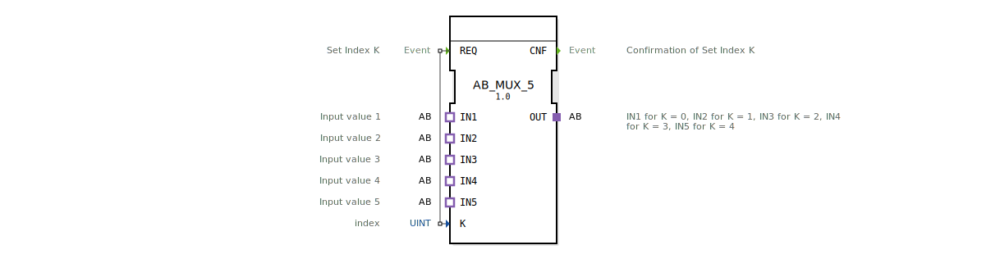

# AB_MUX_5

* * * * * * * * * *
## Einleitung
Der Funktionsbaustein **AB_MUX_5** realisiert einen generischen Multiplexer für Adapter-Schnittstellen des Typs `adapter::types::unidirectional::AB`. Er wählt aus fünf eingehenden Adapterverbindungen (IN1–IN5) eine einzige aus und leitet sie an den Ausgangs-Adapter (OUT) weiter. Die Auswahl erfolgt über einen ganzzahligen Index `K`, der bei einer steigenden Flanke am Ereigniseingang `REQ` ausgewertet wird.

## Schnittstellenstruktur

### **Ereignis-Eingänge**

| Ereignis | Kommentar |
|----------|-----------|
| REQ      | Setzt den Index K und aktiviert die Weiterleitung zur entsprechenden Eingangsverbindung |

### **Ereignis-Ausgänge**

| Ereignis | Kommentar |
|----------|-----------|
| CNF      | Bestätigung der erfolgten Index-Setzung und der Aktualisierung des Ausgangs |

### **Daten-Eingänge**

| Variable | Typ  | Kommentar |
|----------|------|-----------|
| K        | UINT | Index des auszuwählenden Eingangs (0 = IN1, 1 = IN2, …, 4 = IN5) |

### **Daten-Ausgänge**
*Keine direkten Datenausgänge vorhanden. Die Ausgabe erfolgt ausschließlich über den Adapter-Plug `OUT`.*

### **Adapter**

| Richtung | Adapter | Typ                                   | Kommentar |
|----------|---------|---------------------------------------|-----------|
| Plug     | OUT     | adapter::types::unidirectional::AB   | Ausgangsadapter, der die Werte des gewählten Eingangs bereitstellt |
| Socket   | IN1     | adapter::types::unidirectional::AB   | Erster Eingang (Index 0) |
| Socket   | IN2     | adapter::types::unidirectional::AB   | Zweiter Eingang (Index 1) |
| Socket   | IN3     | adapter::types::unidirectional::AB   | Dritter Eingang (Index 2) |
| Socket   | IN4     | adapter::types::unidirectional::AB   | Vierter Eingang (Index 3) |
| Socket   | IN5     | adapter::types::unidirectional::AB   | Fünfter Eingang (Index 4) |

## Funktionsweise
Der Baustein arbeitet als **1‑aus‑5‑Multiplexer** auf der Adapter-Ebene. Bei einem Ereignis am Eingang `REQ` wird der aktuelle Wert von `K` ausgewertet. Gültige Werte sind 0 bis 4. Der entsprechende Adapter-Socket (IN1 bei K=0, IN2 bei K=1, … IN5 bei K=4) wird mit dem Ausgangs-Adapter `OUT` verbunden. Nach erfolgter Umschaltung wird der Ereignisausgang `CNF` gesendet.

Werden Werte außerhalb des Bereichs 0..4 an `K` angelegt, ist das Verhalten undefiniert – typischerweise wird kein Eingang ausgewählt oder der letzte gültige Zustand beibehalten. Der Baustein selbst führt keine Bereichsprüfung durch.

## Technische Besonderheiten
- **Adapter-basiert**: Der FB nutzt den unidirektionalen Adapter `adapter::types::unidirectional::AB`, der für den Austausch von Daten in einer Richtung (hier: Eingang → Ausgang) ausgelegt ist.
- **Generische Parametrierung**: Der Baustein ist als generischer FB mit dem Klassennamen `GEN_AB_MUX` ausgelegt. Dies ermöglicht eine Typprüfung sowie eine Optimierung der Laufzeitumgebung (z. B. Eclipse 4diac).
- **Keine Daten-Mapping-Logik**: Die Datenübergabe erfolgt implizit durch die Adapterverbindung; der FB selbst enthält keine zusätzlichen Daten-Ein- oder Ausgänge.
- **Copyright und Lizenz**: Der Baustein unterliegt der Eclipse Public License 2.0, was eine freie Nutzung, Modifikation und Weitergabe erlaubt.

## Zustandsübersicht
Der FB besitzt keine explizite Zustandsmaschine (ECC). Sein Verhalten ist ereignisgesteuert:
1. **Ruhezustand**: Es liegt kein Ereignis vor. Der Ausgangsadapter `OUT` zeigt die zuletzt ausgewählte Eingangsverbindung.
2. **Umschaltphase**: Bei einem `REQ`-Ereignis wird der Index `K` ausgelesen, die Adapterverbindung umgeschaltet und anschließend `CNF` ausgegeben.

Damit ist der FB deterministisch und arbeitet ohne Verzögerungen außer der internen Propagationszeit.

## Anwendungsszenarien
- **Signalauswahl in der Landtechnik**: (Entsprechend dem Ursprung des Bausteins) Auswahl zwischen verschiedenen Sensorwerten (z. B. fünf unterschiedliche Messstellen für Temperatur oder Druck).
- **Datenselektion in Automatisierungssystemen**: Umschaltung zwischen mehreren Datenquellen (z. B. fünf Förderbänder oder fünf Maschinenzustände).
- **Test- und Simulationsumgebungen**: Gezielte Wahl eines Eingangsadapter-Signals für Prüfzwecke.

## Vergleich mit ähnlichen Bausteinen

| Baustein        | Anzahl Eingänge | Auswahlmechanismus | Unterschiede |
|-----------------|-----------------|---------------------|--------------|
| AB_MUX_5        | 5               | Index K (UINT)      | Dieser FB; reiner Adapter-Multiplexer |
| AB_MUX_2        | 2               | Index K (BOOL)      | Weniger Eingänge, einfachere Auswahl |
| MUX (Daten-Typ) | 2, 4, 8 …       | Index (UINT)        | Oft für elementare Datentypen (INT, REAL) ausgelegt, nicht für Adapter |
| SELECT          | 2               | G (BOOL)            | Standard-FB nach IEC 61499 für binäre Auswahl von Daten |

Der AB_MUX_5 ist speziell für Adapterverbindungen optimiert und bietet eine klare Trennung von Ereignissteuerung und Datenpfad.

## Fazit
Der **AB_MUX_5** ist ein kompakter und wiederverwendbarer Funktionsbaustein zur Adapter-Multiplexierung. Er ermöglicht die Auswahl eines von fünf eingehenden Adapterkanälen über einen numerischen Index und eignet sich ideal für Systeme, die mehrere gleichartige Schnittstellen dynamisch umschalten müssen. Dank seiner generischen Implementierung und der Lizenz unter EPL 2.0 kann er in verschiedenen Automatisierungsumgebungen eingesetzt werden.