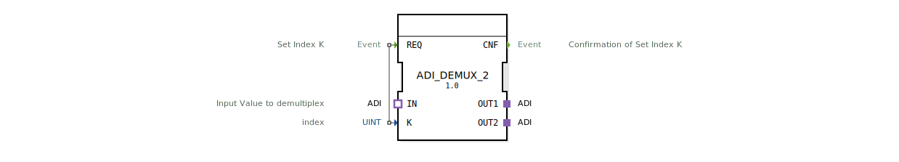

# ADI_DEMUX_2

* * * * * * * * * *
## Einleitung
Der ADI_DEMUX_2 ist ein generischer Demultiplexer-Funktionsbaustein, der ein über einen ADI-Adapter (unidirektional) ankommendes Datensignal auf einen von zwei Ausgangsadaptern umschaltet. Die Auswahl des Zielausgangs erfolgt über einen Index.

## Schnittstellenstruktur
### **Ereignis-Eingänge**

| Ereignis | Beschreibung |
|----------|--------------|
| REQ      | Trigger zum Setzen des Index K; löst die Umschaltung aus |

### **Ereignis-Ausgänge**

| Ereignis | Beschreibung |
|----------|--------------|
| CNF      | Bestätigung der erfolgreichen Indexauswahl und Weiterleitung |

### **Daten-Eingänge**

| Variable | Typ  | Beschreibung         |
|----------|------|----------------------|
| K        | UINT | Index (1 oder 2) zur Auswahl des Zielausgangs |

### **Daten-Ausgänge**
Keine Datenausgänge – die Ausgabe erfolgt ausschließlich über die Adapter.

### **Adapter**

| Richtung | Name | Typ                                           | Beschreibung                              |
|----------|------|-----------------------------------------------|-------------------------------------------|
| Socket   | IN   | adapter::types::unidirectional::ADI           | Eingangssignal, das demultiplext wird      |
| Plug     | OUT1 | adapter::types::unidirectional::ADI           | Erster Ausgangskanal                      |
| Plug     | OUT2 | adapter::types::unidirectional::ADI           | Zweiter Ausgangskanal                     |

## Funktionsweise
Der Baustein arbeitet nach folgendem Prinzip:
1. Ein ankommendes REQ-Ereignis aktiviert die Verarbeitung.
2. Der aktuelle Wert des Eingangs K (ganzzahlig, UINT) wird ausgelesen.
3. Abhängig von K wird die Verbindung zwischen dem Eingangsadapter `IN` und einem der beiden Ausgangsadapter hergestellt:
   - Für `K = 1` wird `IN` an `OUT1` weitergeleitet.
   - Für `K = 2` wird `IN` an `OUT2` weitergeleitet.
   - Andere Werte von K führen zu keiner Verbindung oder bleiben undefiniert (je nach Implementierung).
4. Nach der Umschaltung wird das Ereignis `CNF` ausgegeben, um den Vorgang zu bestätigen.

Die Daten über den ADI-Adapter werden unidirektional übertragen – der Datenfluss erfolgt nur vom Eingang zum ausgewählten Ausgang.

## Technische Besonderheiten
- **Generischer Baustein**: Der ADI_DEMUX_2 ist als generischer FB ausgeführt (GenericClassName: `GEN_ADI_DEMUX`). Das ermöglicht eine Anpassung des internen Typs über ein Typ-Hash-Attribut.
- **Adapterbasiert**: Die gesamte Datenkommunikation erfolgt über ADI-Adapter, nicht über einzelne Datenports. Dies vereinfacht die Integration in komplexe Adapterstrukturen.
- **Unidirektional**: Alle verwendeten ADI-Adapter sind unidirektional, d.h. Daten fließen nur in einer Richtung – vom Socket (IN) zu den Plugs (OUT).
- **Keine Datenausgänge**: Die Ausgabe erfolgt ausschließlich über die Ausgangsadapter, sodass keine zusätzlichen Datenvariablen erforderlich sind.

## Zustandsübersicht
Da der Baustein kein explizites ECC (Execution Control Chart) aus der XML ableitet, wird das Verhalten ereignisgesteuert modelliert:
- **Ruhezustand**: Der Baustein wartet auf ein `REQ`-Ereignis.
- **Auswahlzustand**: Nach Empfang von `REQ` wird der Index K verarbeitet und die entsprechende Verbindung geschaltet.
- **Bestätigungszustand**: Nach erfolgreicher Umschaltung wird `CNF` gesendet, und der Baustein kehrt in den Ruhezustand zurück.

## Anwendungsszenarien
- **Automatisierungstechnik**: Verteilung eines Sensorsignals auf verschiedene Aktoren oder Steuerungskanäle.
- **Signalrouting**: Umschaltung zwischen mehreren Zielgeräten oder Subsystemen in industriellen Steuerungen.
- **Test- und Simulationssysteme**: Gezielte Weiterleitung von Testdaten an unterschiedliche Prüflinge.
- **Datenvorverarbeitung**: Selektive Zuführung von Daten zu unterschiedlichen Verarbeitungspfaden.

## Vergleich mit ähnlichen Bausteinen
- **ADI_MUX** (Multiplexer): Führt mehrere Eingänge auf einen Ausgang zusammen – die umgekehrte Funktion.
- **ADI_DEMUX_3 / ADI_DEMUX_N**: Erweiterte Varianten mit mehr als zwei Ausgängen; ADI_DEMUX_2 beschränkt sich auf zwei Kanäle.
- **DEMUX mit Einzeldatenports**: Herkömmliche Demultiplexer arbeiten mit einzelnen Input- und Output-Variablen; ADI_DEMUX_2 nutzt dagegen Adapter für strukturierte Datenübertragung.

## Fazit
Der ADI_DEMUX_2 ist ein spezialisierter, generischer Funktionsbaustein für das Routing von ADI-Datenströmen. Er bietet eine einfache, ereignisgesteuerte Umschaltung zwischen zwei Ausgangsadaptern und eignet sich besonders für modulare Automatisierungslösungen, die auf Adaptern basieren. Durch die generische Auslegung kann er flexibel an unterschiedliche Datentypen angepasst werden.