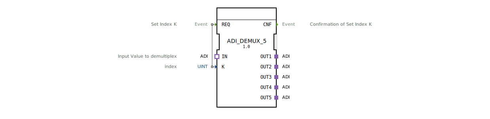

# ADI_DEMUX_5

* * * * * * * * * *
## Einleitung
Der Funktionsblock **ADI_DEMUX_5** ist ein generischer Demultiplexer für den adapternbasierten Datentransport (ADI). Er leitet einen an seinem Socket IN anliegenden Wert auf einen von fünf Ausgangsadaptern (OUT1 bis OUT5) weiter. Die Auswahl des Zielports erfolgt über den ganzzahligen Index K.

## Schnittstellenstruktur

### **Ereignis-Eingänge**

| Ereignis | Beschreibung |
|----------|--------------|
| `REQ`    | Startet die Demultiplex-Operation. Der aktuelle Wert von K bestimmt den Zielausgang. |

### **Ereignis-Ausgänge**

| Ereignis | Beschreibung |
|----------|--------------|
| `CNF`    | Wird gesendet, sobald die Übertragung des Wertes an den gewählten Ausgang abgeschlossen ist. |

### **Daten-Eingänge**

| Variable | Typ   | Beschreibung |
|----------|-------|--------------|
| `K`      | UINT  | Index des Zielausgangs (1‑basiert: 1 → OUT1, …, 5 → OUT5). |

### **Daten-Ausgänge**
Keine direkten Datenausgänge vorhanden. Die Ausgabe erfolgt ausschließlich über die Adapter.

### **Adapter**

| Rolle | Name  | Typ (Adapter) | Beschreibung |
|-------|-------|---------------|--------------|
| Socket | `IN`   | ADI (unidirektional) | Eingangswert, der demultiplext werden soll. |
| Plug  | `OUT1` | ADI (unidirektional) | Erster Ausgangszieladapter. |
| Plug  | `OUT2` | ADI (unidirektional) | Zweiter Ausgangszieladapter. |
| Plug  | `OUT3` | ADI (unidirektional) | Dritter Ausgangszieladapter. |
| Plug  | `OUT4` | ADI (unidirektional) | Vierter Ausgangszieladapter. |
| Plug  | `OUT5` | ADI (unidirektional) | Fünfter Ausgangszieladapter. |

## Funktionsweise
Beim Eintreffen eines Ereignisses am Eingang `REQ` wird der aktuelle Wert des Index `K` ausgewertet. Der FB kopiert den am Socket `IN` anliegenden ADI‑Wert auf denjenigen Plug, dessen Nummer dem Wert von `K` entspricht (OUT1 bei K=1, OUT2 bei K=2, … OUT5 bei K=5). Nach erfolgreicher Übertragung wird ein Bestätigungsereignis am Ausgang `CNF` ausgegeben. Für K‑Werte außerhalb des Bereichs 1‑5 wird kein Ausgang aktiviert und dennoch ein `CNF` gesendet, um das Protokoll abzuschließen.

## Technische Besonderheiten
- **Generischer Basisblock**: Der FB ist als generischer Typ `GEN_ADI_DEMUX` implementiert, der zur Laufzeit mit der konkreten Adapter‑Schnittstelle parametrisiert wird.
- **Unidirektional**: Sowohl Eingang als auch Ausgänge nutzen den unidirektionalen ADI‑Adapter, d.h. es findet nur eine Datenweiterleitung vom Socket zu einem Plug statt; keine Rückmeldung.
- **Keine eigenen Datenausgänge**: Die Ausgabe erfolgt ausschließlich über die Adapter‑Schnittstellen, was eine enge Kopplung mit anderen ADI‑fähigen Bausteinen ermöglicht.

## Zustandsübersicht
Der Baustein besitzt keinen expliziten internen Zustandsautomaten. Er ist zustandslos: Jeder Aufruf des Ereignisses `REQ` führt unabhängig von vorherigen Aufrufen zur beschriebenen Demultiplex‑Operation. Das Verhalten ist deterministisch und rein durch die aktuellen Werte von `K` und `IN` bestimmt.

## Anwendungsszenarien
- **Signalweiterleitung in modularen Steuerungen**: Ein Sensorwert (z.B. über ADI‑Bus) soll je nach Betriebsmodus auf verschiedene Steuerungseinheiten verteilt werden.
- **Kanalauswahl in Messsystemen**: Mehrere Messwertaufnehmer werden über einen gemeinsamen ADI‑Pfad angefahren, die Umschaltung erfolgt über den Index K.
- **Prototyp‑Erweiterung**: Aufgrund der generischen Natur kann der FB in Adapter‑basierten Frameworks für flexible Datenpfade eingesetzt werden.

## Vergleich mit ähnlichen Bausteinen
- **ADI_MUX_5** (Multiplexer): Führt die umgekehrte Operation aus – wählt einen von fünf Eingängen und leitet ihn an einen gemeinsamen Ausgang weiter.
- **STATIC_ROUTER**: Leitet Daten immer an einen fest vorgegebenen Port weiter, ohne dynamischen Index.
- **CASE_Selector**: Realisiert eine logische Verzweigung mit mehreren Ausgängen, jedoch oft über boolesche Bedingungen und nicht über einen numerischen Index.

Im Gegensatz zu diesen Bausteinen zeichnet sich der ADI_DEMUX_5 durch die direkte Adapter‑Anbindung und die einfache Index‑gesteuerte Verteilung aus.

## Fazit
Der **ADI_DEMUX_5** ist ein spezialisierter Demultiplexer für ADI‑Adapter, der mit minimalem Aufwand eine saubere, indexbasierte Signalverteilung auf bis zu fünf Ausgänge ermöglicht. Seine generische Implementierung und die klare Ereignissteuerung machen ihn zu einem vielseitigen Werkzeug in modularen Automatisierungssystemen, die auf dem Eclipse 4diac‑Framework basieren.