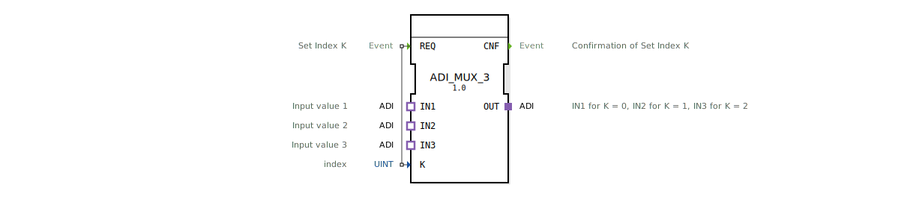

# ADI_MUX_3

* * * * * * * * * *
## Einleitung
Der Funktionsblock **ADI_MUX_3** ist ein generischer Multiplexer (MUX) für drei Eingangssignale. Er wurde für den Einsatz in Automatisierungssystemen entwickelt und wählt basierend auf einem Indexwert einen der drei angeschlossenen Adapter-Eingänge aus und leitet dessen Signal über den Ausgang weiter. Der Baustein ist als generischer FB realisiert und eignet sich insbesondere für die flexible Signalumschaltung in Steuerungsanwendungen. Das Copyright liegt bei der HR Agrartechnik GmbH (2026).

## Schnittstellenstruktur
### **Ereignis-Eingänge**

| Name | Typ | Kommentar |
|------|-----|-----------|
| REQ  | Event | Signalisiert eine neue Indexanforderung. Wird mit dem Daten-Eingang **K** ausgewertet. |

### **Ereignis-Ausgänge**

| Name | Typ | Kommentar |
|------|-----|-----------|
| CNF  | Event | Bestätigung, dass der ausgewählte Eingang auf den Ausgang geschaltet wurde. |

### **Daten-Eingänge**

| Name | Typ | Kommentar |
|------|-----|-----------|
| K    | UINT | Index (0, 1, 2) zur Auswahl des aktiven Eingangs. |

### **Daten-Ausgänge**
– (keine)

### **Adapter**

| Name | Richtung | Typ | Kommentar |
|------|----------|-----|-----------|
| OUT  | Plug     | adapter::types::unidirectional::ADI | Ausgangssignal; entspricht IN1 bei K=0, IN2 bei K=1, IN3 bei K=2. |
| IN1  | Socket   | adapter::types::unidirectional::ADI | Erster Eingangswert (K=0). |
| IN2  | Socket   | adapter::types::unidirectional::ADI | Zweiter Eingangswert (K=1). |
| IN3  | Socket   | adapter::types::unidirectional::ADI | Dritter Eingangswert (K=2). |

## Funktionsweise
Der FB arbeitet als 3‑zu‑1‑Multiplexer. Beim Eintreffen eines **REQ**-Ereignisses wird der aktuelle Wert des Daten-Eingangs **K** ausgelesen. Ausgehend von diesem Index (0, 1 oder 2) wird das Signal des entsprechenden Socket-Adapters (IN1, IN2 oder IN3) auf den Plug-Adapter **OUT** durchgeschaltet. Anschließend wird das **CNF**-Ereignis ausgelöst, um den erfolgreichen Vorgang zu quittieren.

Die Eingangs- und Ausgangssignale werden über den standardisierten **ADI**-Adapter (unidirektional) übertragen, der für beliebige analoge oder digitale Werte ausgelegt sein kann.

## Technische Besonderheiten
- **Generischer FB**: Der Baustein ist als generischer Funktionsblock (GenericClassName `'GEN_ADI_MUX'`) realisiert und kann bei der Instanziierung an unterschiedliche Datentypen angepasst werden.
- **Reine Adapterbasierte Kommunikation**: Es werden keine separaten Daten-Ein-/Ausgänge verwendet; alle Signale werden über die ADI-Adapter übertragen.
- **Einfaches Indexhandling**: Der Index **K** vom Typ UINT erlaubt die Auswahl aus drei möglichen Quellen; Werte größer 2 werden nicht spezifiziert und sollten in der Anwendung vermieden werden.

## Zustandsübersicht
Da die XML keine explizite Zustandsmaschine (ECC) enthält, arbeitet der FB ereignisgesteuert nach folgendem einfachen Ablauf:

1. **IDLE** – Warten auf ein **REQ**-Ereignis.
2. **SELECT** – Beim Eintreffen von **REQ** wird der Index **K** ausgewertet und der entsprechende Eingang auf **OUT** geschaltet.
3. **CONFIRM** – Senden des **CNF**-Ereignisses und Rückkehr in den IDLE-Zustand.

Diese Abfolge wiederholt sich bei jedem neuen **REQ**-Ereignis.

## Anwendungsszenarien
- **Sensormultiplexing**: Auswahl zwischen drei unterschiedlichen Sensoren (z. B. Temperatur, Druck, Drehzahl) über einen gemeinsamen Messadapter.
- **Signalumschaltung in der Landtechnik**: Umschalten zwischen verschiedenen analogen Eingangskanälen in Steuergeräten für Traktoren oder Erntemaschinen.
- **Parametrierbare Kanalselektion**: Flexibles Routing von Steuerungsdaten in modularen Automatisierungssystemen.

## Vergleich mit ähnlichen Bausteinen

| Baustein | Anzahl Eingänge | Besonderheit |
|----------|-----------------|--------------|
| ADI_MUX_2 | 2 | Einfachere 2‑zu‑1‑Multiplexer-Funktion. |
| ADI_MUX_3 | 3 | Der hier beschriebene Baustein. |
| ADI_MUX_4 | 4 | Erweiterte Version mit vier Eingängen. |

Gegenüber einem generischen `MUX`-Baustein (mit Standard-Datentypen) bietet die Adapter‑Variante eine klarere Schnittstellendefinition und erleichtert die Wiederverwendung von Signalkonfigurationen.

## Fazit
Der **ADI_MUX_3** ist ein kompakter, generischer Multiplexer für drei Adapter-Eingänge. Durch die klare ereignisgesteuerte Arbeitsweise und die Verwendung von ADI-Adaptern eignet er sich hervorragend für modulare Automatisierungslösungen, bei denen Signale effizient umgeschaltet werden müssen. Die einfache Schnittstelle und die generische Natur erlauben eine flexible Anpassung an verschiedene Applikationen.