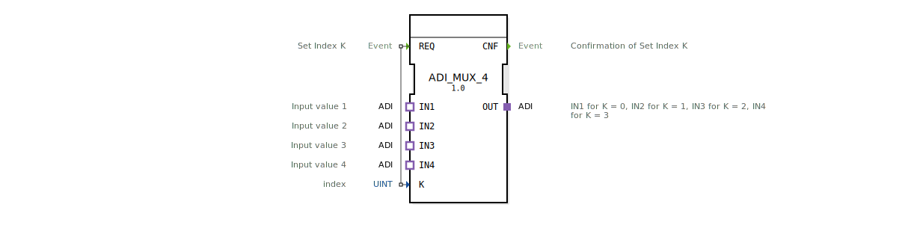

# ADI_MUX_4

* * * * * * * * * *
## Einleitung
Der Funktionsblock **ADI_MUX_4** ist ein generischer Multiplexer, der über den Index **K** einen von vier gleichartigen ADI-Eingangsadaptern (IN1…IN4) auswählt und an den Ausgangsadapter **OUT** durchschaltet. Er ermöglicht das dynamische Routing von Signalen, ohne dass die Daten über klassische Variablen-Ein-/Ausgänge fließen müssen.

## Schnittstellenstruktur
### **Ereignis-Eingänge**

| Name | Typ | Kommentar |
|------|-----|-----------|
| REQ  | Event | Lösen die Auswahl des Index **K** aus. |

### **Ereignis-Ausgänge**

| Name | Typ | Kommentar |
|------|-----|-----------|
| CNF  | Event | Bestätigung, dass der Index **K** gesetzt und der entsprechende Eingang auf den Ausgang geschaltet wurde. |

### **Daten-Eingänge**

| Name | Typ | Wertebereich | Kommentar |
|------|-----|--------------|-----------|
| K    | UINT | 0 … 3       | Index für die Auswahl des gewünschten Eingangsadapters. |

### **Daten-Ausgänge**
*Keine klassischen Datenausgänge vorhanden.* Die Ausgangsdaten werden ausschließlich über den Adapter **OUT** transportiert.

### **Adapter**

| Typ | Name | Richtung | Kommentar |
|-----|------|----------|-----------|
| Adapter (Socket) | IN1 | Eingang | Wert für K = 0 |
| Adapter (Socket) | IN2 | Eingang | Wert für K = 1 |
| Adapter (Socket) | IN3 | Eingang | Wert für K = 2 |
| Adapter (Socket) | IN4 | Eingang | Wert für K = 3 |
| Adapter (Plug)   | OUT | Ausgang | Der ausgewählte Wert wird hier bereitgestellt. |

*Alle Adapter sind vom Typ `adapter::types::unidirectional::ADI` (unidirektionale Datenverbindung).*

## Funktionsweise
Der Baustein arbeitet ereignisgesteuert:
1. Ein Ereignis am **REQ**-Eingang triggert die Verarbeitung.
2. Der aktuelle Wert des Index **K** wird ausgewertet (gültige Werte 0 … 3).
3. Entsprechend dem Index wird der Datenstrom des zugehörigen Socket-Adapters (IN1 für K=0, IN2 für K=1, usw.) auf den Plug-Adapter **OUT** durchverbunden.
4. Nach erfolgter Umschaltung wird das **CNF**-Ereignis ausgegeben, um den Abschluss zu signalisieren.

Eine nicht definierte Index (K > 3) führt zu keinem gültigen Durchschaltvorgang – das Verhalten ist implementierungsabhängig.

## Technische Besonderheiten
- **Adapterbasierte Datenübertragung:** Der FB besitzt keine konventionellen Datenausgänge; die Ausgangsdaten werden ausschließlich über den **OUT**-Adapter bereitgestellt.
- **Generischer Typ:** Der FB ist als generischer Baustein (`generic FB`) deklariert und kann mit unterschiedlichen ADI-Adapterkonfigurationen verwendet werden.
- **Unidirektional:** Der Datenaustausch erfolgt nur in eine Richtung – von den Sockets (Eingänge) zum Plug (Ausgang).

## Zustandsübersicht
Da der FB keine explizite Zustandsmaschine in der XML‑Definition besitzt, ergibt sich ein implizites Verhalten:
- **Inaktiv:** Wartet auf REQ-Ereignis.
- **Verarbeitung:** Nach dem REQ wird der Index K ausgelesen, die Durchschaltung durchgeführt und unmittelbar das **CNF**‑Ereignis gesendet. Danach kehrt der FB in den inaktiven Zustand zurück.

## Anwendungsszenarien
- **Sensordatenauswahl:** Mehrere Messwertgeber (z. B. Temperatur, Druck, Füllstand) werden über ADI‑Adapter angeschlossen; ein Steuersystem wählt über den Index **K** den aktuell benötigten Sensor aus.
- **Signalrouting:** In einer modularen Steuerung können verschiedene Signalquellen dynamisch auf einen gemeinsamen Ausgang geschaltet werden.
- **Test- und Simulationsumgebungen:** Einfaches Umschalten zwischen realen und simulierten Adaptern zur Laufzeit.

## Vergleich mit ähnlichen Bausteinen
- **ADI_MUX_2:** Einfacher Multiplexer mit nur zwei Eingängen, entsprechend geringerer Indexbereich (0‑1).
- **Standard‑Multiplexer (z. B. MUX4):** Verwenden meist klassische Daten‑I/Os statt Adapter. Der ADI_MUX_4 integriert die Adapter‑Schnittstelle direkt und ist daher nahtlos in adapterbasierte Architekturen einbindbar.
- **Demultiplexer (z. B. DEMUX):** Verteilt ein Eingangssignal auf mehrere Ausgänge – gegenteilige Funktionsrichtung.

## Fazit
Der **ADI_MUX_4** ist ein kompakter, generischer Multiplexer‑Baustein mit adapterbasierter Schnittstelle. Er eignet sich besonders für modulare, adapterorientierte Steuerungssysteme, bei denen eine dynamische Auswahl von Datenquellen benötigt wird. Dank der klaren Struktur und der einfachen Ereignissteuerung ist er leicht zu parametrieren und zu erweitern.