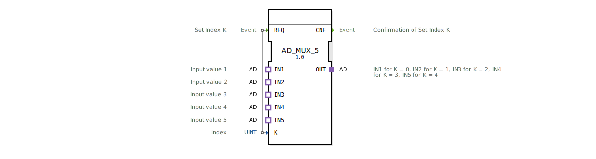

# AD_MUX_5

* * * * * * * * * *
## Einleitung

Der **AD_MUX_5** ist ein generischer Multiplexer-Baustein für Adapter-Schnittstellen. Er ermöglicht die Auswahl eines von fünf Adapter-Eingängen (IN1 bis IN5) und leitet dessen Daten über den Adapter-Ausgang OUT weiter. Die Auswahl erfolgt über den Index K, der bei einem REQ-Ereignis gelesen wird.

## Schnittstellenstruktur

### **Ereignis-Eingänge**

| Name | Typ | Kommentar |
|------|-----|-----------|
| REQ  | Event | Set Index K (ausgelöst mit Dateneingang K) |

### **Ereignis-Ausgänge**

| Name | Typ | Kommentar |
|------|-----|-----------|
| CNF  | Event | Confirmation of Set Index K |

### **Daten-Eingänge**

| Name | Typ | Kommentar |
|------|-----|-----------|
| K    | UINT | index (0..4, entspricht IN1..IN5) |

### **Daten-Ausgänge**

Keine.

### **Adapter**

- **Plugs (Ausgangsadapter):** OUT – Typ `adapter::types::unidirectional::AD`
- **Sockets (Eingangsadapter):** IN1, IN2, IN3, IN4, IN5 – jeweils Typ `adapter::types::unidirectional::AD`

## Funktionsweise

1. Der Baustein befindet sich zunächst im Ruhezustand und wartet auf ein REQ-Ereignis.
2. Bei Eintreffen von **REQ** wird der aktuelle Wert des Dateneingangs **K** ausgelesen.
3. Abhängig von **K** (0 bis 4) wird der entsprechende Eingangsadapter auf den Ausgangsadapter **OUT** durchgeschaltet:
   - K = 0 → IN1
   - K = 1 → IN2
   - K = 2 → IN3
   - K = 3 → IN4
   - K = 4 → IN5
4. Nach erfolgreichem Durchschalten wird das Ereignis **CNF** gesendet, um den Abschluss der Auswahl zu bestätigen.
5. Der Baustein kehrt in den Ruhezustand zurück und wartet auf den nächsten REQ.

Die Adapter sind unidirektional ausgelegt, d.h. die Daten fließen nur vom ausgewählten Eingang zum Ausgang.

## Technische Besonderheiten

- **Generischer Baustein:** Der FB ist als generischer Typ (`GEN_AD_MUX`) deklariert und kann in verschiedenen Instanzen mit dem gleichen Adaptertyp verwendet werden.
- **Reine Adapter-Schnittstellen:** Es werden keine Datenausgänge im klassischen Sinne verwendet; die Signalübertragung erfolgt ausschließlich über Adapter.
- **Typsicherheit:** Alle Adapter sind vom gleichen Typ `adapter::types::unidirectional::AD`, was eine konsistente Datenstruktur gewährleistet.
- **Kein internes Verhalten außer dem Durchschalten:** Der Baustein führt keine Datenmanipulation durch, sondern leitet die Daten lediglich weiter.

## Zustandsübersicht

Der Baustein besitzt einen einfachen Zustandsautomaten:

- **IDLE:** Warten auf REQ.
- **PROCESS:** Bei REQ: K auswerten, gewünschten Adapter verbinden, CNF ausgeben.
- **Rückkehr zu IDLE** nach Abschluss.

(Die genaue Implementierung hängt von der Zielumgebung ab, das Prinzip bleibt jedoch gleich.)

## Anwendungsszenarien

- **Sensorauswahl:** Anschluss mehrerer analoger oder digitaler Sensoren über Adapter und Auswahl des aktuell benötigten Sensors über einen Index.
- **Signalumschaltung:** In Steuerungssystemen, bei denen je nach Betriebsmodus unterschiedliche Signalquellen an denselben Verbraucher (z. B. eine Anzeige oder einen Regler) geschaltet werden müssen.
- **Test- und Simulationsaufbauten:** Umschalten zwischen verschiedenen Testsignalen in industriellen Automatisierungslösungen.

## Vergleich mit ähnlichen Bausteinen

Im Vergleich zu klassischen Multiplexern (z. B. `MUX_2` oder `MUX_4`), die meist auf Dateneingänge (INT, REAL, etc.) ausgelegt sind, arbeitet der **AD_MUX_5** ausschließlich mit Adapter-Schnittstellen. Dies ermöglicht eine modulare und typsichere Verkabelung in einem Komponentenbasierten System. Der Baustein ist speziell für Fälle optimiert, in denen die zu multiplexenden Signale selbst komplexe Datenstrukturen (Adressen, Kanäle, Zustände) enthalten, die durch einen Adapter gekapselt werden.

## Fazit

Der `AD_MUX_5` ist ein kleiner, aber nützlicher generischer Baustein zur Adapter-basierten Signalauswahl. Er reduziert den Verdrahtungsaufwand und erhöht die Übersichtlichkeit in Steuerungssystemen, bei denen aus mehreren gleichartigen Schnittstellen eine ausgewählt werden muss. Dank seiner einfachen Ereignissteuerung und der klaren Schnittstelle lässt er sich leicht in bestehende Projekte integrieren.