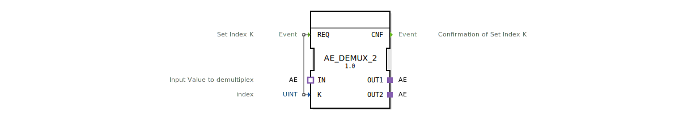

# AE_DEMUX_2

* * * * * * * * * *

## Einleitung
Der Funktionsblock **AE_DEMUX_2** ist ein generischer Adapter-Demultiplexer. Er verteilt einen eingehenden Wert über einen Adapter-Socket wahlweise an einen von zwei Adapter-Plugs, gesteuert durch einen numerischen Index.

## Schnittstellenstruktur

### **Ereignis-Eingänge**
| Ereignis | Beschreibung |
|----------|--------------|
| `REQ`    | Setzt den Index `K` und löst die Demultiplex-Funktion aus. |

### **Ereignis-Ausgänge**
| Ereignis | Beschreibung |
|----------|--------------|
| `CNF`    | Bestätigt die erfolgreiche Ausführung des Index-Setzens. |

### **Daten-Eingänge**
| Variable | Typ   | Beschreibung               |
|----------|-------|----------------------------|
| `K`      | UINT  | Index des Zielausgangs (1 oder 2). |

### **Daten-Ausgänge**
Keine direkten Daten-Ausgänge, da die Ausgabe über die Adapter-Plugs erfolgt.

### **Adapter**
| Richtung | Name  | Typ des Adapters                | Beschreibung                                          |
|----------|-------|---------------------------------|-------------------------------------------------------|
| Socket   | `IN`  | `adapter::types::unidirectional::AE` | Eingangswert, der je nach Index weitergeleitet wird. |
| Plug     | `OUT1`| `adapter::types::unidirectional::AE` | Erster Ausgangskanal.                                 |
| Plug     | `OUT2`| `adapter::types::unidirectional::AE` | Zweiter Ausgangskanal.                                |

## Funktionsweise
Bei Eintreffen eines Ereignisses auf `REQ` wird der aktuelle Wert von `K` ausgelesen. Der Demultiplexer kopiert den am Socket `IN` anliegenden Wert auf den Plug, der durch den Index bestimmt wird:
- **K = 1** → Wert wird auf `OUT1` übertragen.
- **K = 2** → Wert wird auf `OUT2` übertragen.

Nach der Übertragung wird das Bestätigungsereignis `CNF` ausgegeben. Der Baustein arbeitet ereignisgesteuert und speichert keinen internen Zustand über mehrere Aufrufe hinweg.

## Technische Besonderheiten
- **Generische Auslegung**: Der Baustein ist als generischer Funktionsblock (`GenericClassName = 'GEN_AE_DEMUX'`) deklariert. In dieser konkreten Ausprägung (`AE_DEMUX_2`) sind genau zwei Ausgänge festgelegt.
- **Adapterbasierte Kommunikation**: Alle Ein- und Ausgänge sind als unidirektionale Adapter (Typ `AE`) realisiert, was eine lose Kopplung und Wiederverwendbarkeit in verschiedenen Anwendungskontexten ermöglicht.
- **Keine Zustandsautomaten**: Die Funktionalität wird rein durch die Ereignisverarbeitung realisiert; es existiert keine explizite Zustandsmaschine.

## Zustandsübersicht
Der Baustein besitzt keine dokumentierten internen Zustände. Die Verarbeitung erfolgt streng getriggert durch das `REQ`-Ereignis. Nach Abschluss der Umschaltoperation wird `CNF` gesendet.

## Anwendungsszenarien
- **Signalverteilung**: In Steuerungssystemen, die einen eingehenden analogen oder digitalen Wert (via Adapter) auf einen von mehreren Ausgängen umschalten müssen.
- **Kanalumschaltung**: Wenn zwischen zwei Datenpfaden (z. B. Sensoren oder Aktoren) gewählt werden soll.
- **Generische Routing-Logik**: Als Baustein in einer Bibliothek für flexible Signalweiterleitungen.

## Vergleich mit ähnlichen Bausteinen
- **AE_DEMUX_N**: Ein Demultiplexer mit variabler Ausgangsanzahl, der generisch konfiguriert werden kann. `AE_DEMUX_2` ist eine konkrete Instanz mit zwei Ausgängen.
- **Multiplexer (MUX)**: Im Gegensatz zum Demultiplexer wählt ein Multiplexer einen von mehreren Eingängen aus.
- **Fachblöcke mit Zuständen**: Andere Demultiplexer-Implementierungen nutzen oft endliche Zustandsautomaten, um zusätzliche Logik wie Rücksetzverhalten oder Fehlerbehandlung zu integrieren.

## Fazit
Der **AE_DEMUX_2** ist ein kompakter, ereignisgesteuerter Adapter-Demultiplexer für zwei Ausgänge. Er eignet sich besonders für flexible Signalverteilungen in industriellen Automatisierungslösungen, bei denen Werte über Adapter-Schnittstellen dynamisch umgeschaltet werden müssen. Die generische Basis ermöglicht eine einfache Anpassung an unterschiedliche Projektanforderungen.