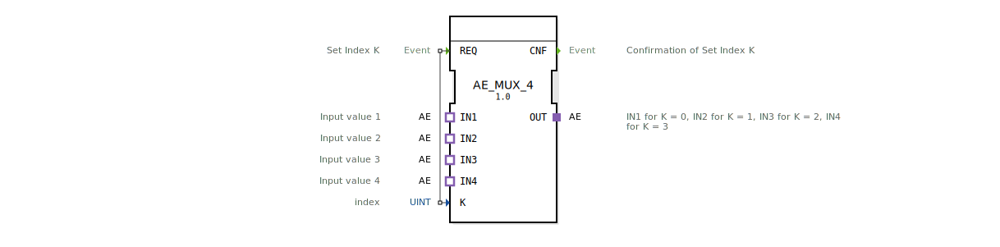

# AE_MUX_4

* * * * * * * * * *

## Einleitung

Der Funktionsblock **AE_MUX_4** realisiert einen 4‑fach Multiplexer für AE‑Adapter („Analog Events“). Er wählt abhängig von einem Index **K** genau einen der vier Eingangsadapter (IN1..IN4) aus und leitet dessen Signal an den Ausgangsadapter **OUT** weiter. Der FB ist als generischer Baustein (template‑basiert) ausgelegt und wird bei der Instanziierung als `GEN_AE_MUX` geführt.

## Schnittstellenstruktur

### **Ereignis-Eingänge**

| Ereignis | Beschreibung |
|----------|-------------|
| **REQ** | Anforderung zur Umschaltung auf den durch **K** bestimmten Eingang |

### **Ereignis-Ausgänge**

| Ereignis | Beschreibung |
|----------|-------------|
| **CNF** | Bestätigung, dass der Index **K** übernommen und der entsprechende Eingang auf **OUT** gelegt wurde |

### **Daten-Eingänge**

| Name | Typ | Beschreibung |
|------|-----|-------------|
| **K** | UINT | Index für die Auswahl des aktiven Eingangs (Werte 0…3) |

### **Daten-Ausgänge**

Keine Datenausgänge. Die Weiterleitung der Werte erfolgt ausschließlich über die Adapter‑Schnittstellen.

### **Adapter**

| Adapter | Richtung | Typ | Beschreibung |
|---------|----------|-----|-------------|
| **OUT** | Plug | `adapter::types::unidirectional::AE` | Ausgangsadapter – liefert das Signal des ausgewählten Eingangs |
| **IN1** | Socket | `adapter::types::unidirectional::AE` | Eingang 1 (K = 0) |
| **IN2** | Socket | `adapter::types::unidirectional::AE` | Eingang 2 (K = 1) |
| **IN3** | Socket | `adapter::types::unidirectional::AE` | Eingang 3 (K = 2) |
| **IN4** | Socket | `adapter::types::unidirectional::AE` | Eingang 4 (K = 3) |

## Funktionsweise

Der Baustein arbeitet ereignisgesteuert:

1. Nach dem Start (oder Zurücksetzen) liegt kein spezifischer Eingang auf dem Ausgang.
2. Mit einem **REQ**‑Ereignis wird der aktuelle Wert des Daten‑Eingangs **K** eingelesen (erlaubte Werte: 0,1,2,3).
3. Abhängig von **K** wird der entsprechende Socket‑Adapter auf den Plug‑Adapter **OUT** durchgeschaltet:
   - K = 0 → IN1
   - K = 1 → IN2
   - K = 2 → IN3
   - K = 3 → IN4
4. Nach erfolgreicher Umschaltung wird das **CNF**‑Ereignis ausgegeben. Der Ausgangsadapter führt nun alle weiteren Signal‑Updates des ausgewählten Eingangs fortlaufend mit.

Der Baustein selbst führt keine Signalverarbeitung durch – er fungiert ausschließlich als selektive Verbindung.

## Technische Besonderheiten

- **Generischer Typ**: Der FB ist als generische Klasse (`eclipse4diac::core::GenericClassName = 'GEN_AE_MUX'`) realisiert. Bei der Deklaration kann ein benutzerdefinierter Typ‑Hash angegeben werden.
- **Keine Zustandsautomaten‑Implementierung** sichtbar: Die Logik wird vermutlich durch die 4diac‑IDE auf Basis der Schnittstellen automatisch generiert oder durch eine separate ECC‑Datei bereitgestellt.
- **Komponentenbasierte Nutzung**: Die Ein‑ und Ausgänge sind als Adapter definiert, sodass der Baustein in standardisierten AE‑Übertragungsstrecken eingefügt werden kann.
- **Wertebereich von K**: Der Index wird als `UINT` deklariert; Werte außerhalb 0..3 sind nicht definiert und können zu undefiniertem Verhalten führen.

## Zustandsübersicht

Da keine explizite Zustandsmaschine (ECC) in der XML vorliegt, wird das Verhalten vereinfacht als:

- **IDLE** – Warten auf ein REQ‑Ereignis.
- **ACTIVE** – Nach Eintreffen von REQ: Umschaltung des Multiplexers, Ausgabe von CNF, Rückkehr zu IDLE.

Es gibt keine dauerhaften Zustände, die von außen beobachtet werden können.

## Anwendungsszenarien

- **Auswahl eines Analogsignals** aus bis zu vier Quellen (z. B. Sensoren) zur Weiterverarbeitung in einer folgenden AE‑Komponente.
- **Umschaltung von Messbereichen** in einer steuerungstechnischen Applikation ohne Signalverlust.
- **Redundanz‑Umschaltung** auf ein Ersatzsignal, wenn der aktuelle Eingang ausfällt (durch Änderung von K).

## Vergleich mit ähnlichen Bausteinen

- **MUX‑Bausteine für einfache Datentypen** (z. B. `MUX` für `INT`, `REAL`) arbeiten analog, jedoch mit Daten‑Ein‑/-Ausgängen anstelle von Adaptern.
- **`AE_MUX_2` / `AE_MUX_8`** wären Erweiterungen mit geringerer oder größerer Anzahl an Eingängen – der vorliegende FB deckt vier Kanäle ab.
- Gegenüber einem **Daten‑Multiplexer** erlaubt der Adapter‑Ansatz die Weitergabe komplexer, ereignisgebundener Signalstrukturen (Events + Daten), wie sie in der IEC 61499 üblich sind.

## Fazit

Der **AE_MUX_4** ist ein kompakter, generischer Multiplexer für AE‑Adapter. Er ermöglicht eine saubere, ereignisgesteuerte Umschaltung zwischen vier analogen Signalquellen und lässt sich nahtlos in eine 61499‑Steuerungsumgebung integrieren. Seine einfache Schnittstelle und die Verwendung von Adaptern machen ihn zu einem flexiblen Baustein für Selektionsaufgaben in industriellen Automatisierungslösungen.