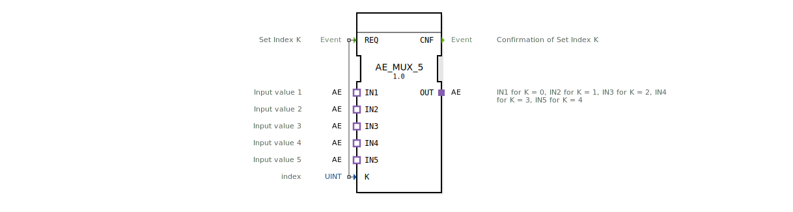

# AE_MUX_5

* * * * * * * * * *

## Einleitung

Der Funktionsblock **AE_MUX_5** ist ein generischer 5‑fach Multiplexer für AE‑Adapter (unidirektional). Er wählt anhand eines ganzzahligen Index `K` einen von fünf Eingängen (`IN1` … `IN5`) aus und schaltet dessen Daten auf den Ausgang `OUT` durch. Der Block arbeitet ereignisgesteuert: Nach Erhalt eines `REQ`-Signals wird der aktuelle Index ausgewertet und die Durchschaltung vorgenommen, anschließend wird eine Bestätigung (`CNF`) gesendet.

## Schnittstellenstruktur

### **Ereignis-Eingänge**

| Ereignis | Kommentar |
|----------|-----------|
| **REQ**  | Neuen Index `K` übernehmen und die entsprechende Verbindung zwischen dem ausgewählten `IN`-Adapter und dem `OUT`-Adapter herstellen. |

### **Ereignis-Ausgänge**

| Ereignis | Kommentar |
|----------|-----------|
| **CNF**  | Bestätigung, dass die Umschaltung gemäß dem angeforderten Index `K` erfolgt ist. |

### **Daten-Eingänge**

| Variable | Typ   | Kommentar           |
|----------|-------|---------------------|
| **K**    | UINT  | Index (0 … 4) des gewünschten Eingangs. |

### **Daten-Ausgänge**

Keine eigenen Daten-Ausgänge – die Datenweitergabe erfolgt ausschließlich über den Adapter `OUT`.

### **Adapter**

| Adapter (Sockets) | Typ                                           | Kommentar                        |
|-------------------|-----------------------------------------------|----------------------------------|
| **IN1** … **IN5** | `adapter::types::unidirectional::AE`         | Die fünf zu multiplexenden Eingänge. |
| **OUT**           | `adapter::types::unidirectional::AE` (Plug)  | Der ausgewählte Ausgang.          |

## Funktionsweise

1. Der Block wartet im Ruhezustand auf ein `REQ`-Ereignis.
2. Bei Eintreffen von `REQ` wird der Wert des Daten-Eingangs `K` gelesen.
3. Anhand von `K` wird der entsprechende Adapter-Eingang auf den Ausgangs-Adapter `OUT` durchgeschaltet:
   - `K = 0` → Verbindung von `IN1` zu `OUT`
   - `K = 1` → Verbindung von `IN2` zu `OUT`
   - `K = 2` → Verbindung von `IN3` zu `OUT`
   - `K = 3` → Verbindung von `IN4` zu `OUT`
   - `K = 4` → Verbindung von `IN5` zu `OUT`
4. Nach erfolgreicher Durchschaltung wird das Ereignis `CNF` gesendet.
5. Liegt `K` außerhalb des gültigen Bereichs (0…4), bleibt die letzte gültige Verbindung bestehen oder es wird keine neue Schaltung vorgenommen (je nach Implementierung; im Standardfall wird der Wert nicht verarbeitet).

## Technische Besonderheiten

- **Generischer Baustein**: Der FB wird als `GEN_AE_MUX` instanziiert und ist für beliebige AE‑Adapter des Typs `adapter::types::unidirectional::AE` ausgelegt.
- **Reine Adapter‑Schnittstelle**: Es gibt keine direkten Daten‑Ein‑/Ausgänge – die Daten fließen vollständig über Adapter, was eine typsichere und flexible Kopplung in IEC‑61499‑Systemen ermöglicht.
- **Einfaches Ereignismodell**: Mit nur einem Ereigniseingang und einem Ereignisausgang ist das Verhalten deterministisch und leicht analysierbar.

## Zustandsübersicht

Der FB besitzt keine explizite Zustandsmaschine. Sein Verhalten ist rein kombinatorisch (nach Eintreffen von `REQ` wird sofort die Auswahl getroffen und `CNF` gesendet). Man kann sich das Arbeiten als einen einzelnen Zustand „aktiv“ vorstellen, der nur während der Durchschaltung besteht.

## Anwendungsszenarien

- **Sensormultiplexing**: In einer landwirtschaftlichen oder industriellen Steuerung werden mehrere analoge oder digitale AE‑Schnittstellen (z. B. von Sensoren) über einen gemeinsamen Ausgang an eine übergeordnete Logik weitergegeben, wobei die Auswahl durch einen Index erfolgt.
- **Modusumschaltung**: Je nach Betriebsmodus (Index) wird ein anderer Datenstrom verwendet – z. B. unterschiedliche Messkanäle oder Konfigurationsdaten.
- **Redundanzumschaltung**: Fünf redundante AE‑Quellen stehen zur Verfügung, und bei Bedarf wird auf eine bestimmte Quelle umgeschaltet.

## Vergleich mit ähnlichen Bausteinen

| Baustein | Besonderheit |
|----------|--------------|
| **AE_MUX_5** | Fester 5‑Eingang‑Multiplexer, speziell für AE‑Adapter. |
| **MUX** (IEC‑61499‑Standard) | Arbeitet meist mit Daten‑Ein‑/Ausgängen, nicht mit Adaptern. |
| **SELECT** | Oft generischer, kann aber auch auf Adapter‑Ebene arbeiten; erfordert zusätzliche Konfiguration. |
| **E_MUX** (ereignisbasiert) | Ähnliches Prinzip, aber auf Daten‑Ebene; AE_MUX_5 ist speziell für unidirektionale AE‑Schnittstellen optimiert. |

## Fazit

Der `AE_MUX_5` ist ein klar definierter, leistungsfähiger Funktionsblock zur Auswahl eines von fünf AE‑Datenströmen. Seine Adapter‑Schnittstelle macht ihn in IEC‑61499‑Umgebungen flexibel einsetzbar, und die einfache Ereignissteuerung erlaubt eine effiziente Integration in zeitkritische Automatisierungslösungen. Für Anwendungen, die eine feste Anzahl von 5 AE‑Eingängen erfordern, stellt er eine optimale, vorgefertigte Komponente dar.