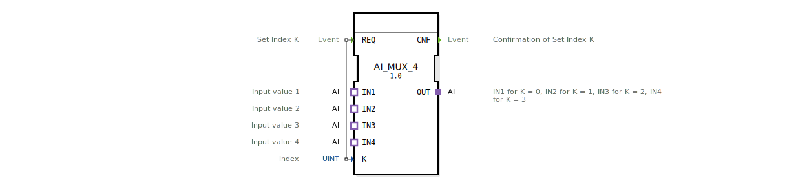

# AI_MUX_4

* * * * * * * * * *

## Einleitung

Der Funktionsbaustein **AI_MUX_4** realisiert einen generischen Multiplexer für analoge Eingangssignale (Adaptertyp `AI`). Er wählt anhand eines ganzzahligen Index `K` einen von vier analogen Eingängen aus und gibt dessen Wert über den Ausgangsadapter `OUT` weiter. Der Baustein dient zur flexiblen Umschaltung analoger Mess- oder Steuersignale in Automatisierungssystemen.

## Schnittstellenstruktur

### **Ereignis-Eingänge**

| Name | Typ   | Kommentar                     |
|------|-------|-------------------------------|
| REQ  | Event | Startet die Auswahl anhand `K` |

### **Ereignis-Ausgänge**

| Name | Typ   | Kommentar                               |
|------|-------|-----------------------------------------|
| CNF  | Event | Bestätigung, dass die Auswahl erfolgt ist |

### **Daten-Eingänge**

| Name | Typ  | Kommentar      |
|------|------|----------------|
| K    | UINT | Index (0..3) des zu selektierenden Eingangs |

### **Daten-Ausgänge**

*(keine)*

### **Adapter**

**Ausgangsadapter (Plug):**

| Name | Typ                              | Kommentar                                                                 |
|------|----------------------------------|---------------------------------------------------------------------------|
| OUT  | adapter::types::unidirectional::AI | Ausgangssignal – entspricht dem durch `K` ausgewählten Eingang IN1..IN4 |

**Eingangsadapter (Sockets):**

| Name | Typ                              | Kommentar                    |
|------|----------------------------------|------------------------------|
| IN1  | adapter::types::unidirectional::AI | Analoger Eingang 1 (K = 0)  |
| IN2  | adapter::types::unidirectional::AI | Analoger Eingang 2 (K = 1)  |
| IN3  | adapter::types::unidirectional::AI | Analoger Eingang 3 (K = 2)  |
| IN4  | adapter::types::unidirectional::AI | Analoger Eingang 4 (K = 3)  |

## Funktionsweise

Der Baustein verarbeitet ein Ereignis `REQ`. Bei Eintreffen von `REQ` wird der Wert des Dateneingangs `K` ausgewertet. Da `K` vom Typ `UINT` ist, werden nur die Werte 0, 1, 2 oder 3 sinnvoll genutzt. Der entsprechende `IN`‑Adapter (`IN1` bei `K = 0`, `IN2` bei `K = 1` usw.) wird auf den Ausgangsadapter `OUT` durchgeschaltet. Sobald die Umschaltung abgeschlossen ist, wird das Ereignis `CNF` ausgelöst. Eine mehrmalige Bearbeitung ist jederzeit durch erneutes Senden von `REQ` möglich.

## Technische Besonderheiten

- **Generischer Baustein**: Der FB ist als generischer Typ deklariert (`GenericClassName = 'GEN_AI_MUX'`), was eine Wiederverwendung mit unterschiedlichen konkreten Adaptertypen erlaubt.
- **Adapter-Kommunikation**: Alle Schnittstellen (IN1..IN4, OUT) sind als unidirektionale Adapter des Typs `adapter::types::unidirectional::AI` ausgeführt. Dies ermöglicht eine lose Kopplung zwischen den verbundenen Bausteinen und eine saubere Trennung von Daten- und Ereignisflüssen.
- **Keine eigenen Datenausgänge**: Die Weiterleitung des analogen Signals erfolgt ausschließlich über den Adapter `OUT`, nicht über separate Datenausgänge.

## Zustandsübersicht

Der Baustein besitzt keine explizit modellierten Zustände (keine ECC‑Beschreibung). Das Verhalten ist rein ereignisgesteuert:

1. Warten auf `REQ`.
2. Bei `REQ`: Auslesen von `K`, Selektieren des passenden Eingangsadapterwerts und Zuweisen an `OUT`.
3. Ausgeben von `CNF`.
4. Rückkehr in den Wartezustand.

## Anwendungsszenarien

- **Analog-Multiplexing**: Auswahl eines von vier analogen Sensoren (z. B. Temperatur, Druck, Füllstand) zur weiteren Verarbeitung in einer SPS oder einem Leitsystem.
- **Umschaltung von Steuersignalen**: Dynamische Wahl zwischen verschiedenen analogen Stellsignalen (z. B. Sollwerten) für eine Regelung.
- **Test- und Diagnosefunktionen**: Umschalten zwischen normalen und Testeingängen ohne Änderung der Topologie.

## Vergleich mit ähnlichen Bausteinen

- **AI_MUX_2**: Ein Multiplexer mit nur zwei Eingängen. `AI_MUX_4` erweitert die Anzahl auf vier und ist damit für Systeme mit mehreren analogen Quellen geeignet.
- **DI_MUX_4**: Digitaler Multiplexer für binäre Signale. Der vorliegende FB verarbeitet analoge Adapterdaten, die typischerweise Gleitkomma‑ oder Ganzzahlwerte enthalten.
- **Manuelle Umschaltung**: Ohne Multiplexer müsste die Verbindung zwischen Quelle und Senke durch Programm- oder Verdrahtungsänderungen erfolgen; der FB bietet eine flexible, indexbasierte Auswahl zur Laufzeit.

## Fazit

Der **AI_MUX_4** ist ein kompakter, generischer Funktionsbaustein zur Auswahl eines von vier analogen Signalen über einen Index. Er vereinfacht die Umschaltung analoger Pfade in 4diac‑basierten Automatisierungslösungen und lässt sich durch seine Adapterschnittstellen nahtlos in bestehende Projekte einbinden. Die fehlende Zustandsautomaten-Beschreibung macht ihn besonders einfach und schnell ausführbar.