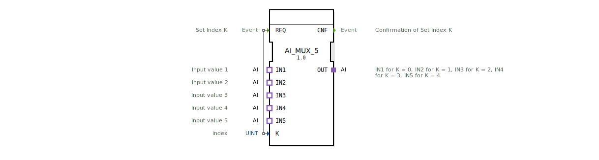

# AI_MUX_5

* * * * * * * * * *
## Einleitung
Der **AI_MUX_5** ist ein generischer Analog-Eingangs-Multiplexer, der es ermöglicht, aus fünf analogen Eingangssignalen (IN1 bis IN5) ein einzelnes Ausgangssignal (OUT) auszuwählen. Die Auswahl erfolgt über einen Indexwert **K**, der über das Ereignis **REQ** gesetzt wird. Der Baustein ist als Adapter-basierter Funktionblock nach IEC 61499-2 realisiert und stellt eine flexible, wiederverwendbare Komponente für die Auswahl analoger Signale in Automatisierungssystemen dar.

## Schnittstellenstruktur
### **Ereignis-Eingänge**
| Name | Typ | Beschreibung |
|------|-----|--------------|
| REQ  | Event | Löst die Auswahl des Eingangs aus. Das Ereignis übernimmt den aktuellen Wert von **K** und setzt den entsprechenden Eingang auf den Ausgang. |

### **Ereignis-Ausgänge**
| Name | Typ | Beschreibung |
|------|-----|--------------|
| CNF  | Event | Bestätigt die erfolgreiche Auswahl. Wird nach dem Durchschalten des Multiplexers ausgegeben. |

### **Daten-Eingänge**
| Name | Typ | Beschreibung |
|------|-----|--------------|
| K    | UINT | Auswahlindex (0…4). Legt fest, welcher der fünf Eingänge (IN1 bis IN5) auf den Ausgang OUT geschaltet wird. |

### **Daten-Ausgänge**
Der Baustein besitzt keine direkten Datenausgänge. Die Ausgabe erfolgt über den **Adapter-Ausgang OUT**, der die analogen Werte des gewählten Eingangs weitergibt.

### **Adapter**
| Richtung | Name | Typ | Beschreibung |
|----------|------|-----|--------------|
| Plug     | OUT  | adapter::types::unidirectional::AI | Ausgangsadapter, der den Wert des ausgewählten analogen Eingangs bereitstellt. |
| Socket   | IN1  | adapter::types::unidirectional::AI | Erster analoger Eingang (K=0). |
| Socket   | IN2  | adapter::types::unidirectional::AI | Zweiter analoger Eingang (K=1). |
| Socket   | IN3  | adapter::types::unidirectional::AI | Dritter analoger Eingang (K=2). |
| Socket   | IN4  | adapter::types::unidirectional::AI | Vierter analoger Eingang (K=3). |
| Socket   | IN5  | adapter::types::unidirectional::AI | Fünfter analoger Eingang (K=4). |

Die Adapter verwenden den Typ `adapter::types::unidirectional::AI`, der für analoge Eingangssignale ausgelegt ist.

## Funktionsweise
Bei jedem **REQ**-Ereignis wird der aktuelle Wert des Dateneingangs **K** (ganzzahliger Index 0…4) ausgelesen. Der Baustein leitet daraufhin das analoge Signal des entsprechenden Socket-Adapters (IN1 für K=0, IN2 für K=1, …, IN5 für K=4) auf den Plug-Adapter **OUT** durch. Nach erfolgreicher Umschaltung wird das Bestätigungsereignis **CNF** gesendet. Der Multiplexer arbeitet als reiner Durchschalter – es findet keine Signalverarbeitung oder Wandlung statt.

## Technische Besonderheiten
- **Generischer Baustein**: Der FB ist als generischer Typ (`GEN_AI_MUX`) deklariert und kann durch die Angabe eines konkreten Typparameters (TypeHash) instanziiert werden.
- **Adapterbasiert**: Die Ein- und Ausgabe erfolgt ausschließlich über Adapter – es werden keine direkten Datenausgänge verwendet. Dies ermöglicht eine flexible Kopplung mit anderen analogen Adapterbausteinen.
- **Kein Zustandsautomat**: Der FB besitzt keine explizite Zustandsmaschine (ECC). Die Funktion wird direkt bei jedem REQ-Ereignis ausgeführt.
- **Feste Anzahl Eingänge**: Fest integriert für fünf Kanäle (IN1…IN5). Eine Erweiterung wäre durch baugleiche Bausteine oder andere Multiplexer-Varianten möglich.

## Zustandsübersicht
Da der Baustein keine explizite Zustandsmaschine (ECC) enthält, existiert nur ein impliziter Zustand, der beim Empfang von **REQ** die Multiplex-Funktion ausführt und sofort **CNF** ausgibt. Der FB ist jederzeit bereit, ein neues REQ zu verarbeiten.

## Anwendungsszenarien
- **Messstellenumschaltung**: Auswahl eines von fünf analogen Sensoren (z. B. Temperatur, Druck) zur Weiterverarbeitung in einem Regelkreis.
- **Signalrouting**: Weiterleitung unterschiedlicher analoger Signale an einen nachfolgenden Analog-Digital-Wandler oder eine übergeordnete Steuerung.
- **Test- und Prüfstände**: Dynamic Umschaltung zwischen verschiedenen Messkanälen während eines Testablaufs.

## Vergleich mit ähnlichen Bausteinen
- **AI_MUX_2 / AI_MUX_10**: Bausteine mit zwei bzw. zehn analogen Eingängen – hier ist die Zahl der Kanäle fest vorgegeben. AI_MUX_5 stellt eine mittlere Kanalzahl für Anwendungen mit fünf Signalen bereit.
- **Allgemeine MUX-Bausteine (z. B. MUX)**: Diese verwenden oft direkte Datenports anstelle von Adaptern. Der adapterbasierte Ansatz von AI_MUX_5 ermöglicht eine engere Integration in adapterorientierte Architekturen und erleichtert den Austausch von Ein- und Ausgangsschnittstellen.
- **Bit-Multiplexer**: Für binäre Signale existieren separate Multiplexer – AI_MUX_5 ist speziell für analoge (kontinuierliche) Signale ausgelegt.

## Fazit
Der **AI_MUX_5** ist ein kompakter, adapterbasierter Analog-Multiplexer für fünf Eingänge. Er eignet sich besonders für den Einsatz in modularen Automatisierungslösungen, bei denen analoge Signale flexibel umgeschaltet werden müssen. Dank seiner generischen Natur und der klaren Schnittstellenstruktur lässt er sich leicht in bestehende Projekte integrieren und erweitern.