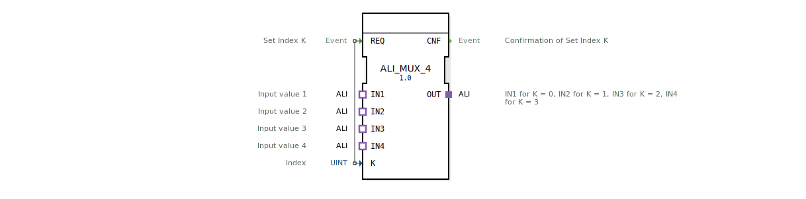

# ALI_MUX_4

* * * * * * * * * *
## Einleitung
Der Funktionsblock **ALI_MUX_4** ist ein generischer Multiplexer für ALI-Adapter. Er wählt abhängig von einem Indexwert *K* einen von vier ALI-Eingängen (IN1, IN2, IN3, IN4) aus und leitet dessen Daten über den ALI-Ausgang OUT weiter. Der Baustein wird über das Ereignis REQ gesteuert und quittiert die Umschaltung mit CNF.

## Schnittstellenstruktur
### **Ereignis-Eingänge**

| Ereignis | Beschreibung |
|----------|--------------|
| REQ      | Übernahme des Index K und Durchschaltung des gewählten Eingangs auf den Ausgang. Gekoppelt mit dem Daten-Eingang K. |

### **Ereignis-Ausgänge**

| Ereignis | Beschreibung |
|----------|--------------|
| CNF      | Bestätigung, dass die Umschaltung gemäß Index K erfolgt ist. |

### **Daten-Eingänge**

| Variable | Typ   | Beschreibung |
|----------|-------|--------------|
| K        | UINT  | Index für die Auswahl des aktiven Eingangs (0 = IN1, 1 = IN2, 2 = IN3, 3 = IN4). |

### **Daten-Ausgänge**
Keine Daten-Ausgänge vorhanden; die Ausgabe erfolgt ausschließlich über den Adapter OUT.

### **Adapter**

| Adapter | Typ                              | Richtung | Beschreibung |
|---------|----------------------------------|----------|--------------|
| IN1     | adapter::types::unidirectional::ALI | Eingang (Socket) | Erster ALI-Eingang (ausgewählt bei K=0). |
| IN2     | adapter::types::unidirectional::ALI | Eingang (Socket) | Zweiter ALI-Eingang (ausgewählt bei K=1). |
| IN3     | adapter::types::unidirectional::ALI | Eingang (Socket) | Dritter ALI-Eingang (ausgewählt bei K=2). |
| IN4     | adapter::types::unidirectional::ALI | Eingang (Socket) | Vierter ALI-Eingang (ausgewählt bei K=3). |
| OUT     | adapter::types::unidirectional::ALI | Ausgang (Plug)   | Ausgewählter ALI-Ausgang, der den Datenstrom des aktiven Eingangs bereitstellt. |

## Funktionsweise
Der Baustein arbeitet als **1-aus-4-Selektor** auf Basis von ALI-Adapterverbindungen. Ein gültiger Zyklus beginnt mit einem REQ-Ereignis, das den aktuellen Wert des Index *K* übernimmt. Anschließend wird der zugehörige ALI-Eingang (IN1 für K=0, IN2 für K=1, IN3 für K=2, IN4 für K=3) auf den Ausgang OUT durchgeschaltet. Nach erfolgreicher Umschaltung wird das Ereignis CNF ausgegeben. Es können nur die in der Spezifikation angegebenen Indexwerte 0 bis 3 verarbeitet werden; Werte außerhalb dieses Bereichs führen zu undefiniertem Verhalten.

## Technische Besonderheiten
- **Generischer Aufbau**: Der FB ist als generischer Baustein (Generic FB) realisiert, kann aber nur mit ALI-Adaptern des Typs `unidirectional` verwendet werden.
- **Keine eigenen Datenausgänge**: Die Informationsweitergabe erfolgt ausschließlich über die ALI-Adapter-Schnittstelle, nicht über elementare Datenports.
- **Ereignisgesteuerte Auswahl**: Die Umschaltung erfolgt nur auf ein explizites REQ-Ereignis hin, nicht kontinuierlich.
- **Typ-Hash**: Der FB enthält ein Attribut `eclipse4diac::core::TypeHash` zur Laufzeit-Identifikation.

## Zustandsübersicht
Der Baustein besitzt im Wesentlichen einen einzigen operativen Zustand. Auf ein REQ-Ereignis hin wird die Auswahl durchgeführt und unmittelbar CNF gesendet. Es gibt keine Zustandsspeicherung oder Verzögerung; der FB ist funktional als **kombinatorische Schaltung mit Ereignis-Tor** zu verstehen.

## Anwendungsszenarien
- **Umschaltung zwischen mehreren ALI-Datenquellen**, z. B. Sensordaten verschiedener Maschinenmodule.
- **Kanalwahl in einem ALI-basierten Bussystem**, bei dem je nach Betriebsmodus unterschiedliche Datenströme verwendet werden.
- **Test- und Diagnoseanwendungen**, bei denen verschiedene ALI-Signale nacheinander an eine Analyse-Station gelegt werden.

## Vergleich mit ähnlichen Bausteinen
- Gegenüber herkömmlichen Multiplexern für elementare Datentypen (z. B. `MUX` für `INT` oder `BOOL`) arbeitet `ALI_MUX_4` ausschließlich mit dem ALI-Adapter-Protokoll und tauscht daher komplexe, strukturierte Daten aus.
- Im Unterschied zu einem einfachen Daten-Multiplexer, der die Werte direkt kopiert, leitet der Adapter-Multiplexer die gesamte Verbindung (inklusive Ereignis- und Datenpfade) weiter.
- Ein Adapter-Demultiplexer (`ALI_DEMUX_4`) würde einen Eingang auf mehrere Ausgänge verteilen – hier genau die umgekehrte Funktion.

## Fazit
`ALI_MUX_4` ist ein spezialisierter, ereignisgesteuerter Multiplexer für ALI-Adapter mit vier Eingängen. Er eignet sich ideal für Anwendungen, bei denen aus mehreren ALI-Datenquellen eine ausgewählt werden muss. Die einfache Schnittstelle (ein Index und ein Steuerereignis) macht ihn leicht integrierbar, erfordert aber die Einhaltung des gültigen Indexbereichs 0–3. Der Baustein ergänzt die ALI-Adapter-Familie um eine grundlegende Selektionsfunktion.