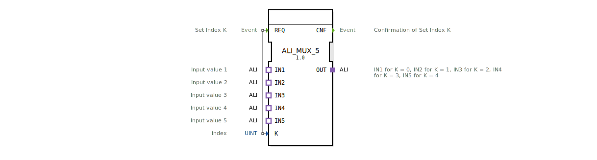

# ALI_MUX_5

* * * * * * * * * *

## Einleitung

Der Funktionsbaustein **ALI_MUX_5** realisiert einen generischen Multiplexer für fünf ALI-Adapterschnittstellen. Er wählt anhand eines Indexwertes **K** (0…4) einen der fünf Eingänge **IN1** bis **IN5** aus und leitet dessen Daten an den Ausgang **OUT** weiter. Die Auswahl wird durch das Ereignis **REQ** angestoßen und mit **CNF** quittiert.

## Schnittstellenstruktur

### **Ereignis-Eingänge**

| Ereignis | Beschreibung | Mit Dateneingang |
|----------|--------------|-----------------|
| **REQ** | Startet die Auswahl des Index **K** und überträgt die Werte des ausgewählten Adaptereingangs an den Ausgang | K |

### **Ereignis-Ausgänge**

| Ereignis | Beschreibung |
|----------|--------------|
| **CNF** | Bestätigt die erfolgreiche Übertragung nach Verarbeitung von **REQ** |

### **Daten-Eingänge**

| Name | Typ | Beschreibung |
|------|-----|--------------|
| **K** | UINT | Index des zu multiplexenden Eingangs (0 = IN1, 1 = IN2, …, 4 = IN5) |

### **Daten-Ausgänge**

Keine direkten Datenausgänge vorhanden. Die Ausgangsdaten werden über den Adapter **OUT** bereitgestellt.

### **Adapter**

| Richtung | Name | Typ | Beschreibung |
|----------|------|-----|--------------|
| Plug (Ausgang) | **OUT** | `adapter::types::unidirectional::ALI` | Aktivierter Ausgang, der die Daten des durch **K** gewählten Eingangs liefert |
| Socket (Eingang) | **IN1** | `adapter::types::unidirectional::ALI` | Erster Eingangswert (K = 0) |
| Socket (Eingang) | **IN2** | `adapter::types::unidirectional::ALI` | Zweiter Eingangswert (K = 1) |
| Socket (Eingang) | **IN3** | `adapter::types::unidirectional::ALI` | Dritter Eingangswert (K = 2) |
| Socket (Eingang) | **IN4** | `adapter::types::unidirectional::ALI` | Vierter Eingangswert (K = 3) |
| Socket (Eingang) | **IN5** | `adapter::types::unidirectional::ALI` | Fünfter Eingangswert (K = 4) |

## Funktionsweise

1. Der Baustein wartet auf das Ereignis **REQ**.
2. Beim Eintreffen von **REQ** wird der aktuelle Wert des Dateneingangs **K** ausgelesen.
3. Der Multiplexer verbindet den Adaptereingang **IN1** … **IN5** entsprechend des Index **K** mit dem Ausgangsadapter **OUT**.
4. Sobald die Verbindung hergestellt und die Daten weitergeleitet sind, wird das Ereignis **CNF** gesendet.
5. Für ungültige Indexwerte (z. B. K ≥ 5) ist das Verhalten undefiniert; der Baustein setzt auf korrekte Indexbereiche voraus.

## Technische Besonderheiten

- **Generischer Typ**: Der FB ist als generischer Funktionsbaustein deklariert (GenericClassName `GEN_ALI_MUX`) und kann in Projekten für unterschiedliche ALI-Datentypen instanziiert werden.
- **Adapterbasiert**: Die Ein‑ und Ausgänge sind als unidirektionale ALI-Adapter realisiert, was eine flexible Kopplung an andere ALI-kompatible Bausteine ermöglicht.
- **Typ-Hash**: Ein `TypeHash`-Attribut ist vorhanden, wird aber als leerer String übergeben und kann zur Laufzeit durch das Framework ergänzt werden.
- **Paketstruktur**: Der Baustein verwendet das Paket `adapter::selection::unidirectional` und importiert den `TypeHash` aus dem `eclipse4diac`-Kern.

## Zustandsübersicht

Der Baustein besitzt keine expliziten Zustandsautomaten (keine ECC‑Zustände definiert). Die Ablaufsteuerung erfolgt rein ereignisgesteuert:
- **IDLE**: Warten auf **REQ**.
- **Busy**: Nach Empfang von **REQ** wird die Adapterverbindung umgeschaltet und **CNF** ausgelöst. Danach kehrt der FB sofort in den IDLE‑Zustand zurück.

## Anwendungsszenarien

- **Datenquellenumschaltung**: Auswahl zwischen fünf verschiedenen Sensoren oder Datenquellen, die alle über den ALI‑Adapter angebunden sind.
- **Redundanzmanagement**: Ein System mit mehreren identischen Messstellen kann durch den Multiplexer auf eine gemeinsame Auswertung umschalten.
- **Parametrierbare Signalpfade**: In Steuerungsanwendungen, bei denen je nach Betriebsart unterschiedliche Eingänge aktiv sein müssen.

## Vergleich mit ähnlichen Bausteinen

- **ALI_MUX_2 / ALI_MUX_4**: Diese Bausteine bieten die gleiche Funktionalität für zwei bzw. vier Eingänge. Der ALI_MUX_5 erweitert die Auswahl auf fünf Kanäle.
- **ALI_DEMUX**: Der Demultiplexer verteilt ein Eingangssignal auf mehrere Ausgänge; der ALI_MUX_5 arbeitet genau umgekehrt.
- **SCALE/CLAMP‑Bausteine**: Diese führen Signalverarbeitung durch, während der ALI_MUX_5 eine reine Durchschaltfunktion ohne Datenmanipulation bietet.

## Fazit

Der **ALI_MUX_5** ist ein kompakter, generischer Multiplexer für fünf ALI‑Adapterkanäle. Durch die rein adapterbasierte Kommunikation und die einfache Ereignissteuerung eignet er sich ideal für modulare Automatisierungslösungen mit wechselnden Datenquellen. Seine generische Natur erlaubt den Einsatz mit verschiedenen ALI‑Datentypen und erleichtert die Wiederverwendung in unterschiedlichen Projekten.