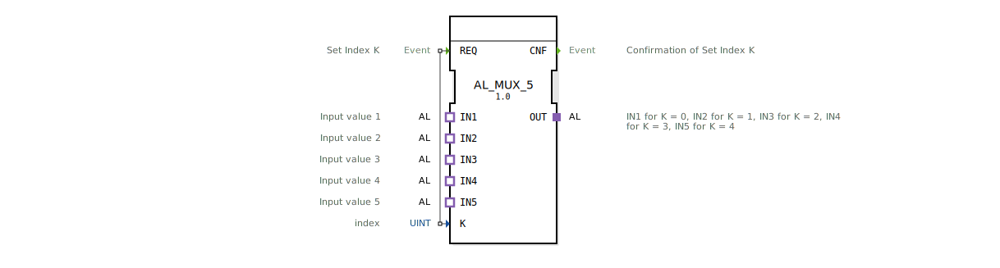

# AL_MUX_5

* * * * * * * * * *
## Einleitung

Der **AL_MUX_5** ist ein generischer Multiplexer-Funktionsbaustein, der es ermöglicht, einen von fünf analogen oder logischen Adaptereingängen (IN1 bis IN5) auf einen gemeinsamen Ausgang (OUT) zu schalten. Die Auswahl des aktiven Kanals erfolgt über den Indexparameter K. Der Baustein ist für den Einsatz in industriellen Steuerungssystemen konzipiert und basiert auf dem IEC 61499-2 Standard.

## Schnittstellenstruktur

### **Ereignis-Eingänge**

| Name  | Typ    | Kommentar                     |
|-------|--------|-------------------------------|
| `REQ` | Event  | Set Index K – übernimmt den aktuellen Wert von K und schaltet den entsprechenden Eingang durch. |

### **Ereignis-Ausgänge**

| Name  | Typ    | Kommentar                               |
|-------|--------|-----------------------------------------|
| `CNF` | Event  | Bestätigung der erfolgten Kanalumschaltung. |

### **Daten-Eingänge**

| Name | Typ    | Kommentar                             |
|------|--------|---------------------------------------|
| `K`  | UINT   | Index des zu aktivierenden Eingangs (0..4). |

### **Daten-Ausgänge**

Keine Datenausgänge vorhanden. Die Signalweiterleitung erfolgt über den Adapter.

### **Adapter**

| Name  | Typ                                | Kommentar                                                                 |
|-------|------------------------------------|---------------------------------------------------------------------------|
| `OUT` | `adapter::types::unidirectional::AL` (Plug) | Ausgang – leitet die Daten des durch K ausgewählten Eingangs weiter.      |
| `IN1` | `adapter::types::unidirectional::AL` (Socket) | Eingangswert 1 (wird bei K=0 aktiv).                                     |
| `IN2` | `adapter::types::unidirectional::AL` (Socket) | Eingangswert 2 (wird bei K=1 aktiv).                                     |
| `IN3` | `adapter::types::unidirectional::AL` (Socket) | Eingangswert 3 (wird bei K=2 aktiv).                                     |
| `IN4` | `adapter::types::unidirectional::AL` (Socket) | Eingangswert 4 (wird bei K=3 aktiv).                                     |
| `IN5` | `adapter::types::unidirectional::AL` (Socket) | Eingangswert 5 (wird bei K=4 aktiv).                                     |

## Funktionsweise

Beim Eintreffen eines Ereignisses am **REQ**-Eingang liest der Baustein den aktuellen Wert des Dateninputs **K** (Datentyp UINT). Anschließend wird der dem Index entsprechende Socket-Eingang (IN1 für K=0, IN2 für K=1, …, IN5 für K=4) auf den Plug-Ausgang **OUT** durchgeschaltet. Der Baustein gibt daraufhin ein Bestätigungsereignis auf **CNF** aus. Ist K größer als 4, wird kein Eingang aktiv geschaltet (keine definierte Reaktion). Die Umschaltung erfolgt asynchron zum Datenfluss und muss durch das REQ-Ereignis getriggert werden.

## Technische Besonderheiten

- **Generischer Baustein**: Der AL_MUX_5 ist als generischer Funktionsbaustein deklariert (GenericClassName `GEN_AL_MUX`). Er kann in verschiedenen Projekten wiederverwendet und konfiguriert werden.
- **Adapterbasierte Schnittstelle**: Sowohl Eingänge als auch Ausgang nutzen den unidirektionalen Adaptertyp `AL`, der eine standardisierte Verbindung für analoge oder logische Signale ermöglicht.
- **Keine Zustandsmaschine**: Der Baustein besitzt kein explizites ECC (Execution Control Chart). Die Funktionalität wird rein ereignisgesteuert umgesetzt – jede REQ-Operation führt direkt zur Kanalumschaltung und Bestätigung.

## Zustandsübersicht

Der Funktionsbaustein ist zustandslos (kombinatorisch). Es gibt keinen internen Zustandsautomaten. Die Auswahl des Kanals erfolgt streng ereignisgesteuert und ohne Speicher vergangener Zustände.

## Anwendungsszenarien

- **Signalselektion**: Auswahl eines Sensorsignals aus mehreren Quellen in einer übergeordneten Steuerung.
- **Datenrouting**: Weiterleitung unterschiedlicher Datenströme an einen gemeinsamen Verarbeitungsknoten.
- **Test- und Diagnosesysteme**: Umschalten zwischen verschiedenen Prüfsignalen auf eine Analyseeinheit.
- **Redundanzumschaltung**: Übernahme eines Ersatzsignals bei Fehlererkennung durch Änderung des Indexes K.

## Vergleich mit ähnlichen Bausteinen

| Baustein            | Eingänge | Ausgänge | Auswahlmechanismus | Besonderheit                    |
|---------------------|----------|----------|---------------------|---------------------------------|
| AL_MUX_5            | 5        | 1        | Index K (UINT)       | Adapterbasierte Schnittstelle   |
| Standard MUX (z.B. SEL) | variabel | 1        | Boolescher Select   | Auf IEC 61131-3 Basis, oft elementar |
| FB_Alarm_MUX        | 4        | 1        | Bitmasken/Auswahl   | Speziell für Alarmsignale       |

Der AL_MUX_5 zeichnet sich durch seine adressierbare Indexsteuerung (0 bis 4) und die Verwendung von Adaptern aus, was eine flexible Anbindung an andere 4diac-Komponenten ermöglicht.

## Fazit

Der **AL_MUX_5** ist ein kompakter, generischer Multiplexer für bis zu fünf Eingangskanäle. Er eignet sich besonders für Anwendungen, bei denen eine ereignisgesteuerte Umschaltung von Adaptersignalen (z.B. analoge Messwerte) erforderlich ist. Durch die einfache Schnittstellenstruktur und die fehlende Zustandslogik lässt er sich leicht in bestehende IEC 61499-2 Projekte integrieren und anpassen.