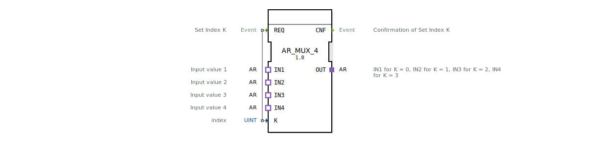

# AR_MUX_4

* * * * * * * * * *

## Einleitung
Der **AR_MUX_4** ist ein generischer AR-Multiplexer, der einen von vier Eingangsadaptern (IN1 bis IN4) auf einen Ausgangsadapter (OUT) schaltet. Die Auswahl erfolgt über einen Indexwert K (0–3). Der Baustein ist als generischer Typ (`GEN_AR_MUX`) implementiert und basiert auf unidirektionalen AR-Adaptern.

## Schnittstellenstruktur

### Ereignis-Eingänge

| Ereignis | Beschreibung |
|----------|--------------|
| **REQ**  | Steuert die Umschaltung anhand des Index K. |

### Ereignis-Ausgänge

| Ereignis | Beschreibung |
|----------|--------------|
| **CNF**  | Bestätigt die erfolgte Umschaltung. |

### Daten-Eingänge

| Variable | Typ   | Beschreibung |
|----------|-------|--------------|
| **K**    | UINT  | Index (0–3) zur Auswahl des aktiven Eingangs. |

### Daten-Ausgänge
Keine Daten-Ausgänge vorhanden.

### Adapter

| Typ | Name | Richtung | Beschreibung |
|-----|------|----------|--------------|
| Plug (Ausgang) | **OUT** | Ausgang | Liefert den Signalpfad des ausgewählten Eingangs. |
| Socket (Eingang) | **IN1** | Eingang | Eingangswert für K = 0. |
| Socket (Eingang) | **IN2** | Eingang | Eingangswert für K = 1. |
| Socket (Eingang) | **IN3** | Eingang | Eingangswert für K = 2. |
| Socket (Eingang) | **IN4** | Eingang | Eingangswert für K = 3. |

## Funktionsweise
Beim Eintreffen eines **REQ**-Ereignisses wird der aktuelle Wert des Daten-Eingangs **K** ausgewertet. Der Baustein verbindet den Ausgangsadapter **OUT** mit demjenigen Eingangsadapter, dessen Index dem Wert von K entspricht:
- K = 0 → **IN1** wird auf OUT durchgeschaltet.
- K = 1 → **IN2** wird auf OUT durchgeschaltet.
- K = 2 → **IN3** wird auf OUT durchgeschaltet.
- K = 3 → **IN4** wird auf OUT durchgeschaltet.

Anschließend wird das Bestätigungsereignis **CNF** ausgegeben. Ist K außerhalb des Bereichs 0–3, bleibt die Verbindung unverändert (keine Umschaltung).

## Technische Besonderheiten
- **Generischer Typ**: Der FB wird als generischer `GEN_AR_MUX` deklariert, was eine flexible Wiederverwendung in verschiedenen Applikationen ermöglicht.
- **Adapterbasiert**: Alle Schnittstellen (Eingänge und Ausgang) sind unidirektionale AR-Adapter (`adapter::types::unidirectional::AR`). Dadurch eignet er sich für die Übertragung von Aktor-/Referenzsignalen.
- **Einfache Ereignissteuerung**: Keine komplexe Zustandsmaschine – die Umschaltung erfolgt direkt bei jedem REQ-Ereignis.

## Zustandsübersicht
Der Baustein besitzt keine explizite Zustandsmaschine. Das Verhalten ist rein ereignisgesteuert: Nach jedem REQ wird sofort CNF ausgegeben, sobald die Adapterverbindung hergestellt wurde.

## Anwendungsszenarien
- **Signal-Routing in Steuerungsanwendungen**: Auswahl eines von vier Aktor- oder Referenzsignalen, z. B. zur Ansteuerung unterschiedlicher Verbraucher.
- **Flexible Konfiguration**: Dynamische Umschaltung zwischen verschiedenen Signalquellen je nach Betriebsmodus.

## Vergleich mit ähnlichen Bausteinen
- **Standard-MUX (für Daten)**: Herkömmliche Multiplexer arbeiten mit Datentypen (z. B. INT, BOOL) und Datenausgängen. Der AR_MUX_4 arbeitet dagegen mit Adaptern, was die direkte Weiterleitung komplexer Signalpfade (z. B. Aktor-Ansteuerung) ermöglicht.
- **AR_SWITCH (Weiche)**: Ein ähnlicher Baustein, der jedoch oft einen Umschaltbefehl auf ein Ereignis hin ausführt, aber mit anderer Anzahl von Ein-/Ausgängen oder allgemeinerer Konfiguration.

## Fazit
Der AR_MUX_4 ist ein spezialisierter Multiplexer für AR-Adapter, der eine einfache und schnelle Umschaltung zwischen vier Eingangssignalen erlaubt. Dank seiner generischen Implementierung und der sauberen ereignisgesteuerten Schnittstelle eignet er sich ideal für Anwendungen, die eine flexible Signalweiterschaltung in der Automatisierungstechnik erfordern.