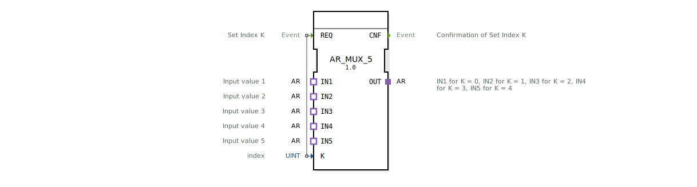

# AR_MUX_5

* * * * * * * * * *

## Einleitung

Der Funktionsblock **AR_MUX_5** ist ein generischer 5‑Kanal‑Multiplexer auf Basis des Adaptertyps `adapter::types::unidirectional::AR`. Er ermöglicht die Auswahl eines von fünf AR‑Adapter‑Eingängen (IN1 … IN5) und leitet diesen auf den einzigen Ausgangs‑Adapter (OUT) weiter. Die Auswahl erfolgt über den ganzzahligen Index K, der über den Ereigniseingang `REQ` gesetzt wird. Der Baustein ist nach IEC 61499‑2 spezifiziert und wird als generischer Funktionsblock (`GEN_AR_MUX`) eingesetzt.

## Schnittstellenstruktur

### **Ereignis‑Eingänge**

| Name | Typ | Beschreibung |
|------|-----|--------------|
| `REQ` | Event | Signalisiert die Übernahme des neuen Index K und löst die Umschaltung aus. Verbunden mit Daten‑Eingang `K`. |

### **Ereignis‑Ausgänge**

| Name | Typ | Beschreibung |
|------|-----|--------------|
| `CNF` | Event | Bestätigung, dass der Multiplexer den Index K übernommen und die entsprechende Verbindung hergestellt hat. |

### **Daten‑Eingänge**

| Name | Typ | Beschreibung |
|------|-----|--------------|
| `K` | UINT | Index des zu wählenden Eingangs (0 … 4). K = 0 → IN1, K = 1 → IN2, …, K = 4 → IN5. |

### **Daten‑Ausgänge**

Keine expliziten Datenausgänge. Die Ausgabe erfolgt vollständig über den Adapter `OUT`.

### **Adapter**

**Plugs (Ausgangsseite)**

| Name | Typ | Beschreibung |
|------|-----|--------------|
| `OUT` | `adapter::types::unidirectional::AR` | Ausgangsadapter, der den gewählten Eingang weitergibt. |

**Sockets (Eingangsseite)**

| Name | Typ | Beschreibung |
|------|-----|--------------|
| `IN1` | `adapter::types::unidirectional::AR` | Erster Eingang (K = 0) |
| `IN2` | `adapter::types::unidirectional::AR` | Zweiter Eingang (K = 1) |
| `IN3` | `adapter::types::unidirectional::AR` | Dritter Eingang (K = 2) |
| `IN4` | `adapter::types::unidirectional::AR` | Vierter Eingang (K = 3) |
| `IN5` | `adapter::types::unidirectional::AR` | Fünfter Eingang (K = 4) |

## Funktionsweise

Nach Empfang eines `REQ`‑Ereignisses wird der aktuelle Wert des Dateneingangs `K` ausgewertet. Der Baustein schaltet daraufhin den entsprechenden Socket‑Adapter (IN1 … IN5) auf den Plug‑Adapter `OUT`. Der ausgegebene Adapter `OUT` entspricht somit dem Inhalt des durch K bestimmten Eingangs. Nach erfolgreicher Umschaltung wird das Ereignis `CNF` gesendet. Ändert sich K nicht zwischen zwei Aufrufen, wird die Verbindung nicht verändert, dennoch wird ein `CNF` ausgelöst.

## Technische Besonderheiten

- **Generischer Typ**: Der Baustein ist als generischer FB (`GEN_AR_MUX`) deklariert und kann durch die 4diac‑IDE für konkrete Anwendungen instantiiert werden.
- **Adapterbasierte Kommunikation**: Alle Ein‑ und Ausgänge nutzen den unidirektionalen AR‑Adapter. Dadurch können komplexe Datenstrukturen und kontinuierliche Signale effizient übertragen werden, ohne dass einzelne Datenpunkte aufgelöst werden müssen.
- **Fest definierte Anzahl**: Der Baustein unterstützt exakt 5 Eingänge (0 bis 4). Für andere Anzahlen sind abgewandelte Versionen (z. B. `AR_MUX_2`, `AR_MUX_8`) notwendig.
- **Keine Zwischenspeicherung**: Die Umschaltung erfolgt direkt und ohne zusätzliche Pufferung; der Ausgang `OUT` reflektiert unmittelbar den gewählten Eingang.

## Zustandsübersicht

Der Baustein besitzt keinen expliziten Zustandsautomaten, arbeitet aber ereignisgesteuert:

1. **Bereit (Idle)**: Warten auf ein `REQ`‑Ereignis.
2. **Umschaltung**: Bei Eintreffen von `REQ` wird der neue Index K übernommen und der zugehörige Eingang auf `OUT` durchgeschaltet.
3. **Bestätigung**: Senden des `CNF`‑Ereignisses, um die erfolgreiche Umschaltung zu signalisieren.

Danach kehrt der Baustein in den Bereit‑Zustand zurück.

## Anwendungsszenarien

- **Signalumschaltung in der Automatisierung**: Auswahl eines von fünf analogen oder digitalen Sensoren (über AR‑Adapter) in einer Steuerung.
- **Fehlerumschaltung**: Bei Erkennung eines defekten Kanals kann auf einen Reservesensor umgeschaltet werden, ohne die gesamte Struktur neu zu verdrahten.
- **Test- und Diagnoseumgebungen**: Sequentielles Einlesen verschiedener AR‑Datenquellen für Überprüfungszwecke.
- **Konfigurierbare Datenpfade**: In modularen Anlagen zur Realisierung flexibler Verbindungen zwischen Geräten.

## Vergleich mit ähnlichen Bausteinen

- **AR_MUX_2, AR_MUX_3, AR_MUX_8**: Diese Bausteine unterscheiden sich lediglich in der Anzahl der Eingänge und dem Wertebereich von K. Alle nutzen denselben Adaptertyp und eine identische Ereignissteuerung.
- **Standard‑Multiplexer mit Datenelementen**: Im Gegensatz zu klassischen IEC‑61499‑Bausteinen, die einzelne Variablen (z. B. BOOL, REAL) multiplexen, arbeitet der `AR_MUX_5` auf Adapterebene und kann somit komplexe, zusammengesetzte Informationen als Ganzes weiterleiten.
- **Buskoppler / Schalter**: Während Buskoppler oft bidirektionale oder adressierbare Kommunikation unterstützen, ist der `AR_MUX_5` ein einfacher, ereignisgesteuerter Selektor ohne Rückmeldung des Schaltzustands.

## Fazit

Der `AR_MUX_5` ist ein übersichtlicher, generischer Funktionsblock zur Auswahl eines von fünf AR‑Adapter‑Eingängen. Dank der adapterbasierten Schnittstelle eignet er sich besonders für modulare Automatisierungslösungen, bei denen Daten in strukturierter Form weitergereicht werden. Die einfache Ereignissteuerung mit `REQ`/`CNF` ermöglicht eine unkomplizierte Integration in vorhandene Steuerungsabläufe. Für Anwendungen mit mehr oder weniger Kanälen stehen entsprechende Varianten zur Verfügung.