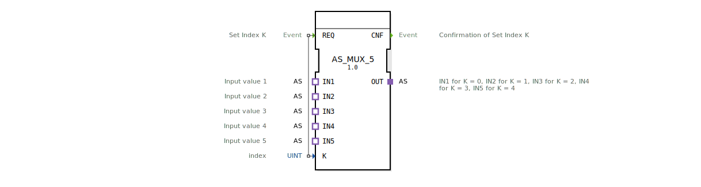

# AS_MUX_5

* * * * * * * * * *
## Einleitung

Der Funktionsbaustein **AS_MUX_5** implementiert einen generischen Multiplexer für die Adapter‑Schnittstelle `adapter::types::unidirectional::AS`. Er wählt anhand eines ganzzahligen Index `K` (Werte 0–4) einen der fünf Eingangsadapter (`IN1` bis `IN5`) aus und leitet dessen Datenverbindung an den Ausgangsadapter `OUT` weiter. Der Baustein wird über das Ereignis `REQ` gesteuert und quittiert die Umschaltung mit `CNF`.

## Schnittstellenstruktur

### **Ereignis-Eingänge**

| Name | Typ   | Kommentar                    |
|------|-------|------------------------------|
| REQ  | Event | Set Index K                  |

### **Ereignis-Ausgänge**

| Name | Typ   | Kommentar                           |
|------|-------|-------------------------------------|
| CNF  | Event | Confirmation of Set Index K         |

### **Daten-Eingänge**

| Name | Typ  | Kommentar |
|------|------|-----------|
| K    | UINT | index     |

### **Daten-Ausgänge**

Keine.

### **Adapter**

**Plug (Ausgang):**

| Name | Typ                                     | Kommentar                                                     |
|------|-----------------------------------------|---------------------------------------------------------------|
| OUT  | adapter::types::unidirectional::AS      | IN1 for K = 0, IN2 for K = 1, IN3 for K = 2, IN4 for K = 3, IN5 for K = 4 |

**Sockets (Eingänge):**

| Name | Typ                                     | Kommentar            |
|------|-----------------------------------------|----------------------|
| IN1  | adapter::types::unidirectional::AS      | Input value 1       |
| IN2  | adapter::types::unidirectional::AS      | Input value 2       |
| IN3  | adapter::types::unidirectional::AS      | Input value 3       |
| IN4  | adapter::types::unidirectional::AS      | Input value 4       |
| IN5  | adapter::types::unidirectional::AS      | Input value 5       |

## Funktionsweise

Der Baustein arbeitet als 1‑aus‑5‑Multiplexer auf Adapterebene. Ein interner Selektor wertet den am Daten‑Eingang `K` anliegenden Index (0 bis 4) aus. Mit Eintreffen des Ereignisses `REQ` wird die Verbindung zwischen dem ausgewählten Socket (IN1…IN5) und dem Plug `OUT` hergestellt. Nach erfolgreicher Umschaltung wird das Ereignis `CNF` ausgegeben. Jeder Socket und der Plug sind vom Typ `adapter::types::unidirectional::AS`, sodass ausschließlich unidirektionale Datenflüsse über die Adapter‑Schnittstelle unterstützt werden.

## Technische Besonderheiten

- **Generischer Baustein:** Der FB ist als generischer Multiplexer deklariert (`eclipse4diac::core::GenericClassName = 'GEN_AS_MUX'`). Er kann in unterschiedlichen Projekten mit dem gleichen Adapter‑Typ wiederverwendet werden.
- **Keine eigenen Daten‑Ausgänge:** Die selektierte Adapterverbindung transportiert alle Daten direkt; der FB selbst verarbeitet oder puffert keine Datenwerte.
- **Indexbegrenzung:** Der Index `K` sollte im gültigen Bereich 0…4 liegen. Werte außerhalb dieses Bereichs führen zu undefiniertem Verhalten (keine Fehlerbehandlung in der XML‑Definition).
- **Urhebervermerk:** Der Baustein ist unter der Eclipse Public License 2.0 lizenziert und wurde von HR Agrartechnik GmbH entwickelt.

## Zustandsübersicht

Der FB besitzt keinen expliziten Zustandsautomaten in der XML‑Darstellung. Das Verhalten ist ereignisgesteuert:
- Im Ruhezustand bleibt die aktuelle Verbindung bestehen.
- Bei `REQ` wird die neue Verbindung gemäß `K` aktiviert und anschließend `CNF` gesendet.

## Anwendungsszenarien

- **Sensorauswahl:** In einer Steuerung mit fünf identischen Sensoren (z. B. Abstandssensoren) kann mit `AS_MUX_5` dynamisch der gewünschte Sensor an die Auswerteeinheit geschaltet werden.
- **Konfigurierbare Signalquellen:** In Automatisierungssystemen, die zwischen verschiedenen Messstellen umschalten müssen.
- **Test‑ und Simulationsumgebungen:** Einfaches Umschalten zwischen verschiedenen Testdatensätzen oder Simulationsmodellen, die über Adapter angebunden sind.

## Vergleich mit ähnlichen Bausteinen

- **Standard‑Multiplexer (z. B. MUX – Daten‑Multiplexer):** Arbeiten meist mit Daten‑Eingängen (BOOL, INT, REAL) und geben einen einzelnen Datenwert aus. `AS_MUX_5` hingegen arbeitet auf der Adapter‑Ebene und selektiert komplette Verbindungen.
- **Adapter‑Selektor‑Bausteine:** Ähnliche Bausteine existieren für andere Adapter‑Typen (z. B. bidirektional). `AS_MUX_5` ist auf den unidirektionalen Typ `AS` spezialisiert und auf fünf Eingänge festgelegt.
- **Generische Varianten:** Der Einsatz des `GenericClassName` Attributs erlaubt eine einfache Anpassung auf andere Adapter‑Typen durch Wiederverwendung der gleichen Logik.

## Fazit

`AS_MUX_5` ist ein spezialisierter Multiplexer für unidirektionale Adapterverbindungen des Typs `AS`. Er ermöglicht eine flexible und saubere Umschaltung zwischen fünf Quellen ohne Datenkonvertierung. Durch seine generische Natur und einfache Ereignissteuerung eignet er sich besonders für modulare Automatisierungslösungen, bei denen die Auswahl verschiedener Sensor‑ oder Aktorverbindungen zur Laufzeit erforderlich ist.