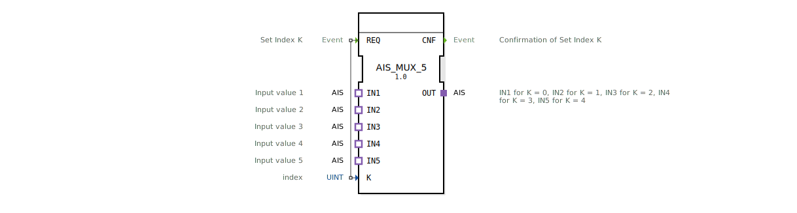

# AIS_MUX_5

* * * * * * * * * *

## Einleitung

Der Funktionsblock **AIS_MUX_5** realisiert einen 5‑Kanal‑Multiplexer für Adapter des Typs `adapter::types::unidirectional::AIS`.  
Über einen Index-Eingang (K) wird einer der fünf Eingangsadapter (IN1 … IN5) ausgewählt und dessen Daten auf den Ausgangsadapter (OUT) durchgeschaltet.  
Der Baustein ist generisch ausgelegt und kann durch Parametrierung des Klassennamens an konkrete Anwendungen angepasst werden.

## Schnittstellenstruktur

### **Ereignis-Eingänge**

| Ereignis | Beschreibung |
|----------|--------------|
| `REQ`   | Setzt den Index K und löst die Auswahl des entsprechenden Eingangsadapters aus. |

### **Ereignis-Ausgänge**

| Ereignis | Beschreibung |
|----------|--------------|
| `CNF`   | Bestätigung, dass der Index K übernommen und der Ausgangsadapter aktualisiert wurde. |

### **Daten-Eingänge**

| Variable | Typ   | Beschreibung                |
|----------|-------|-----------------------------|
| `K`      | UINT  | Index des zu wählenden Eingangs (Wertebereich 0 … 4). |

### **Daten-Ausgänge**

Es sind keine klassischen Daten‑Ausgänge vorhanden. Die Ausgabe erfolgt ausschließlich über den Adapter‑Plug.

### **Adapter**

| Adapter   | Richtung | Typ                                        | Beschreibung                                      |
|-----------|----------|--------------------------------------------|---------------------------------------------------|
| `IN1`     | Socket   | `adapter::types::unidirectional::AIS`      | Eingangswert für Index K = 0                      |
| `IN2`     | Socket   | `adapter::types::unidirectional::AIS`      | Eingangswert für Index K = 1                      |
| `IN3`     | Socket   | `adapter::types::unidirectional::AIS`      | Eingangswert für Index K = 2                      |
| `IN4`     | Socket   | `adapter::types::unidirectional::AIS`      | Eingangswert für Index K = 3                      |
| `IN5`     | Socket   | `adapter::types::unidirectional::AIS`      | Eingangswert für Index K = 4                      |
| `OUT`     | Plug     | `adapter::types::unidirectional::AIS`      | Ausgangsadapter, der den gewählten Eingang spiegelt. |

## Funktionsweise

Nach einem Ereignis am Eingang **REQ** wird der Wert des Daten‑Eingangs **K** ausgelesen.  
Der Baustein leitet daraufhin den Datenstrom des Adapters **INi** (mit i = K) auf den Ausgangsadapter **OUT** weiter.  
Sobald die Umschaltung abgeschlossen ist, wird das Bestätigungsereignis **CNF** gesendet.  

Wird beispielsweise `K = 2` gesetzt, so werden die am Adapter **IN3** anliegenden Daten über **OUT** bereitgestellt.

## Technische Besonderheiten

- **Generischer Baustein**: Der FB ist als generischer Funktionsblock deklariert (`GEN_AIS_MUX`). Das erlaubt die Verwendung in typisierten Bibliotheken und die Erzeugung spezialisierter Instanzen.
- **Adapter‑basierte Kommunikation**: Die Datenübertragung erfolgt über unidirektionale Adapter (`adapter::types::unidirectional::AIS`). Dadurch lassen sich komplexe Datenstrukturen kapseln und der Baustein bleibt flexibel einsetzbar.
- **Keine Zusatzlogik**: Der Multiplexer führt keine Datenmanipulation durch; er leitet die Daten des ausgewählten Eingangs unverändert an den Ausgang weiter.

## Zustandsübersicht

Der Baustein besitzt keine explizite Zustandsmaschine (ECC). Das Verhalten ist rein ereignisgesteuert:  
- Im Ruhezustand wartet er auf ein `REQ`‑Ereignis.  
- Bei Eintreffen von `REQ` wird der Index ausgewertet, die Umschaltung vorgenommen und unmittelbar `CNF` ausgegeben.

## Anwendungsszenarien

- **Datenquellen‑Umschaltung**: Auswahl einer von fünf Sensoren oder Datenquellen, die über denselben Adaptertyp kommunizieren.
- **Flexible Routing‑Einheit**: In Automatisierungssystemen, bei denen je nach Betriebsmodus unterschiedliche Eingabedaten an eine nachgeschaltete Verarbeitungslogik weitergeleitet werden müssen.
- **Parametrierbare Testumgebungen**: Umschaltung zwischen verschiedenen Testsignalen ohne Änderung der Verdrahtung.

## Vergleich mit ähnlichen Bausteinen

Im Gegensatz zu einfachen Multiplexern mit einzelnen Daten‑Ein‑ und Ausgängen arbeitet `AIS_MUX_5` auf Adapter‑Ebene. Das ermöglicht die Weitergabe kompletter Datenpakete oder komplexer Zustände, ohne dass der Anwender die interne Datenstruktur kennen muss.  
Vergleichbare Bausteine existieren für andere Adaptertypen (z. B. `AIS_MUX_2`, `AIS_MUX_10`), die sich lediglich in der Anzahl der Eingänge unterscheiden.

## Fazit

Der **AIS_MUX_5** ist ein einfacher und dennoch leistungsfähiger Adapter‑Multiplexer für fünf Eingänge. Seine generische Natur und die reine Adapter‑Schnittstelle machen ihn zu einer universellen Komponente für die flexible Kopplung von AIS‑basierten Datenströmen in IEC‑61499‑Applikationen.