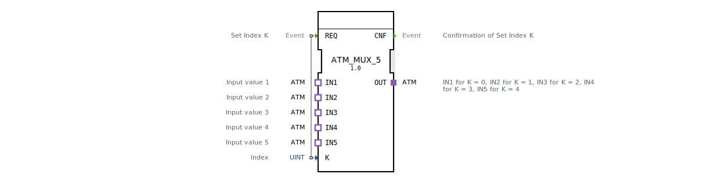

# ATM_MUX_5

* * * * * * * * * *
## Einleitung
Der Funktionsblock **ATM_MUX_5** dient als universeller Multiplexer für fünf unidirektionale ATM‑Datenströme. Er wählt anhand eines über den Dateneingang `K` vorgegebenen Index einen der fünf Eingänge (`IN1` … `IN5`) aus und leitet dessen Daten an den Ausgang `OUT` weiter. Die Auswahl wird durch ein Ereignis am Eingang `REQ` ausgelöst und mit einem Ereignis am Ausgang `CNF` quittiert.

## Schnittstellenstruktur
### **Ereignis-Eingänge**

| Name | Typ   | Kommentar                |
|------|-------|--------------------------|
| REQ  | Event | Set Index K und ausführen |

### **Ereignis-Ausgänge**

| Name | Typ   | Kommentar                        |
|------|-------|----------------------------------|
| CNF  | Event | Bestätigung der Indexumschaltung |

### **Daten-Eingänge**

| Name | Typ  | Kommentar       |
|------|------|-----------------|
| K    | UINT | Auswahlindex (0..4) |

### **Daten-Ausgänge**
Keine Datenausgänge vorhanden. Die Ausgabe erfolgt ausschließlich über den Adapter‑Plug `OUT`.

### **Adapter**

| Richtung | Name | Typ                                   | Kommentar                                               |
|----------|------|---------------------------------------|---------------------------------------------------------|
| Plug     | OUT  | adapter::types::unidirectional::ATM   | Ausgang: bei `K=0` = IN1, `K=1` = IN2, …, `K=4` = IN5 |
| Socket   | IN1  | adapter::types::unidirectional::ATM   | Eingang 1                                                |
| Socket   | IN2  | adapter::types::unidirectional::ATM   | Eingang 2                                                |
| Socket   | IN3  | adapter::types::unidirectional::ATM   | Eingang 3                                                |
| Socket   | IN4  | adapter::types::unidirectional::ATM   | Eingang 4                                                |
| Socket   | IN5  | adapter::types::unidirectional::ATM   | Eingang 5                                                |

## Funktionsweise
1. An den Sockets `IN1` … `IN5` liegen kontinuierlich ATM‑Datenströme an.
2. Der Dateneingang `K` bestimmt, welcher dieser Ströme auf den Plug `OUT` durchgeschaltet werden soll. Zugelassene Werte sind 0 bis 4 (entsprechend IN1 bis IN5). Werte außerhalb dieses Bereichs führen zu undefiniertem Verhalten.
3. Ein Ereignis am Eingang `REQ` löst die Umschaltung aus. Unmittelbar danach wird die Verbindung zwischen dem ausgewählten Eingang und dem Ausgang hergestellt.
4. Nach erfolgreicher Umschaltung wird das Ereignis `CNF` gesendet, um dem aufrufenden Baustein die Fertigstellung zu signalisieren.

## Technische Besonderheiten
- **Generischer Baustein**: Die XML‑Definition enthält ein Attribut `GenericClassName`, das auf `'GEN_ATM_MUX'` verweist. Der FB kann daher in Entwicklungsumgebungen als Vorlage für Multiplexer mit beliebiger Anzahl von Eingängen verwendet werden.
- **Adapter‑Kopplung**: Die gesamte Datenübertragung erfolgt über den standardisierten Adapter `adapter::types::unidirectional::ATM`. Dadurch wird eine enge Kopplung zwischen Sender und Empfänger vermieden – die Implementierung der Adapterlogik liegt beim Anwender.
- **Ereignisgesteuert**: Ohne Auslöseereignis am `REQ`‑Eingang findet keine Umschaltung statt. Der Baustein verhält sich statisch, bis ein neues `REQ` eintrifft.

## Zustandsübersicht
Der FB besitzt keinen expliziten Zustandsautomaten. Er arbeitet als reaktiver Baustein:
- **Ruhezustand**: Es liegt kein Ereignis an `REQ` an. Der zuletzt gewählte Eingang bleibt aktiv.
- **Umschaltphase**: Nach Eintreffen von `REQ` wird der neue Index übernommen und `CNF` ausgegeben.

## Anwendungsszenarien
- **Kanalumschaltung** in einem Kommunikationssystem, das mehrere ATM‑Quellen verwaltet (z. B. in der Agrartechnik zur Datenstromauswahl).
- **Testumgebungen**, bei denen nacheinander verschiedene Datenquellen an einen gemeinsamen Verbraucher geschaltet werden sollen.
- **Redundanzlösungen**, bei denen bei Ausfall eines Datenstroms manuell oder automatisch auf einen Reservespeicher umgeschaltet wird.

## Vergleich mit ähnlichen Bausteinen
- **ATM_MUX_2 / ATM_MUX_4**: Bausteine mit gleicher Funktionalität, aber nur zwei oder vier Eingängen. Der vorliegende ATM_MUX_5 bietet die maximale Anzahl von fünf Kanälen.
- **Allgemeine MUX‑Bausteine (z. B. Daten‑MUX)**: Diese arbeiten oft mit skalaren Daten (z. B. INT, REAL) und nicht mit Adaptern. Der ATM_MUX_5 ist speziell für den Austausch komplexer, über Adapter definierter Datentypen ausgelegt.

## Fazit
Der **ATM_MUX_5** ist ein flexibler, ereignisgesteuerter Multiplexer für fünf unidirektionale ATM‑Datenströme. Seine Adapter‑Schnittstelle ermöglicht eine lose Kopplung der Komponenten und erlaubt die einfache Wiederverwendung in verschiedenen Automatisierungs‑ und Kommunikationssystemen. Die generische Auslegung macht ihn zu einer praktischen Grundlage für individuelle Multiplexer‑Varianten.