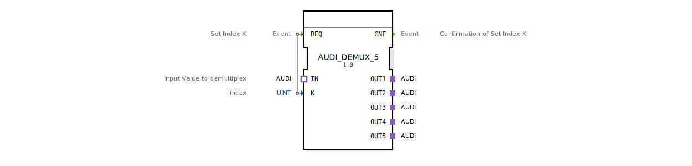

# AUDI_DEMUX_5

* * * * * * * * * *
## Einleitung

Der Funktionsbaustein `AUDI_DEMUX_5` ist ein generischer Demultiplexer für den unidirektionalen `AUDI`-Adapter. Er leitet einen an seinem Eingangsadapter `IN` anliegenden Adapterwert gezielt an einen von fünf Ausgangsadaptern (`OUT1` bis `OUT5`) weiter. Die Auswahl des Zieladapters erfolgt über den Daten-Eingang `K`.

## Schnittstellenstruktur

### **Ereignis-Eingänge**

| Name | Typ | Kommentar |
|------|-----|-----------|
| REQ  | Event | Set Index K (löst Verarbeitung aus) |

### **Ereignis-Ausgänge**

| Name | Typ | Kommentar |
|------|-----|-----------|
| CNF  | Event | Confirmation of Set Index K |

### **Daten-Eingänge**

| Name | Typ | Kommentar |
|------|-----|-----------|
| K    | UINT | Index (1..5) für die Auswahl des Ausgangsadapters |

### **Daten-Ausgänge**

Keine Daten-Ausgänge vorhanden.

### **Adapter**

**Plugs (Ausgangsadapter)**

| Name | Typ | Kommentar |
|------|-----|-----------|
| OUT1 | Adapter `AUDI` (unidirectional) | Erster Ausgang |
| OUT2 | Adapter `AUDI` (unidirectional) | Zweiter Ausgang |
| OUT3 | Adapter `AUDI` (unidirectional) | Dritter Ausgang |
| OUT4 | Adapter `AUDI` (unidirectional) | Vierter Ausgang |
| OUT5 | Adapter `AUDI` (unidirectional) | Fünfter Ausgang |

**Socket (Eingangsadapter)**

| Name | Typ | Kommentar |
|------|-----|-----------|
| IN   | Adapter `AUDI` (unidirectional) | Input Value to demultiplex |

## Funktionsweise

Der Baustein arbeitet als 1-zu-5-Demultiplexer. Sobald am Ereignis-Eingang `REQ` ein Signal eintrifft, wird der aktuelle Wert des Eingangs `K` ausgewertet (erwartet wird ein ganzzahliger Wert zwischen 1 und 5). Der am `IN`-Adaptersocket anliegende Adapterwert wird dann auf den durch `K` bestimmten Ausgangsadapter (`OUT1`..`OUT5`) durchgeschaltet. Nach erfolgreicher Umschaltung wird der Ereignis-Ausgang `CNF` gesendet, um die Verarbeitung zu bestätigen.

## Technische Besonderheiten

- Der Baustein ist als **generischer FB** implementiert, gekennzeichnet durch das Attribut `GenericClassName` mit dem Wert `'GEN_AUDI_DEMUX'`. Dies erlaubt eine einfache Anpassung auf andere Anzahl von Ausgängen.
- Es sind keine Zeitverzögerungen oder Zustandsautomaten im FB definiert; die Umschaltung erfolgt ereignisgesteuert und unverzögert.
- Alle verwendeten Adapter sind vom Typ `adapter::types::unidirectional::AUDI`, der für eine gerichtete Datenübertragung ausgelegt ist.

## Zustandsübersicht

Der Baustein besitzt keine explizite Zustandsmaschine. Sein Verhalten lässt sich auf einen einfachen Ablauf reduzieren:

1. Warten auf Ereignis `REQ`.
2. Auslesen von `K`.
3. Durchschalten von `IN` auf den entsprechenden Ausgangsadapter.
4. Senden von `CNF`.

## Anwendungsszenarien

- **Audio-/Signalverteilung:** Ein ankommender Audio-Stream (über den `AUDI`-Adapter) soll je nach Auswahl eines Index an einen von fünf verschiedenen Verarbeitungspfaden oder Ausgabegeräten weitergeleitet werden.
- **Routingsysteme:** In modularen Automatisierungslösungen kann der Baustein verwendet werden, um Datenflüsse dynamisch umzuschalten.
- **Testumgebungen:** Umschalten zwischen verschiedenen Testquellen auf ein gemeinsames Ziel oder umgekehrt.

## Vergleich mit ähnlichen Bausteinen

`AUDI_DEMUX_5` ähnelt anderen Demultiplexern wie `AUDI_DEMUX_2` oder `MUX_4`, unterscheidet sich jedoch durch die Anzahl der Ausgänge und die spezifische Nutzung des `AUDI`-Adaptertyps. Im Gegensatz zu Multiplexern (die mehrere Eingänge auf einen Ausgang zusammenführen) arbeitet dieser Baustein als Verteiler von einem Eingang auf mehrere Ausgänge. Generische Varianten lassen sich durch einfaches Ändern der Anzahl der Adapterports erzeugen.

## Fazit

Der `AUDI_DEMUX_5` stellt eine kompakte, generische Lösung zur gezielten Weiterleitung von `AUDI`-Adapterdaten dar. Dank seiner klaren Schnittstelle und ereignisgesteuerten Verarbeitung ist er einfach in übergeordnete Steuerungslogiken integrierbar und eignet sich besonders für Anwendungen, die eine dynamische Umschaltung von Signalpfaden erfordern.