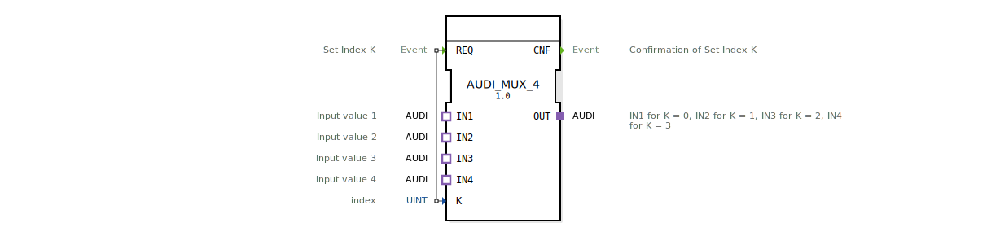

# AUDI_MUX_4

* * * * * * * * * *
## Einleitung
Der AUDI_MUX_4 ist ein generischer Multiplexer-Funktionsblock gemäß IEC 61499-2. Er wählt anhand eines Index K einen von vier Eingängen (IN1 bis IN4) aus und leitet diesen an den Ausgang OUT weiter. Der Baustein ist für die Verwendung in adapterbasierten Systemen konzipiert.

## Schnittstellenstruktur
### **Ereignis-Eingänge**
- **REQ**: Ereignis zum Auslösen der Multiplexer-Aktion. Der Index K wird beim Eintreffen von REQ ausgewertet.

### **Ereignis-Ausgänge**
- **CNF**: Bestätigungsereignis, das signalisiert, dass die Index-Setzung (Auswahl) abgeschlossen ist.

### **Daten-Eingänge**
- **K** (UINT): Index-Wert (0, 1, 2, 3) zur Auswahl des aktiven Eingangs.

### **Daten-Ausgänge**
Keine direkten Datenausgänge vorhanden. Der Ausgang erfolgt über den Adapter.

### **Adapter**
- **OUT** (Plugs, Typ: adapter::types::unidirectional::AUDI): Ausgabeadapter, der den ausgewählten Eingangswert bereitstellt.
- **IN1** (Sockets, Typ: adapter::types::unidirectional::AUDI): Erster Eingangswert (Index K=0).
- **IN2** (Sockets, Typ: adapter::types::unidirectional::AUDI): Zweiter Eingangswert (Index K=1).
- **IN3** (Sockets, Typ: adapter::types::unidirectional::AUDI): Dritter Eingangswert (Index K=2).
- **IN4** (Sockets, Typ: adapter::types::unidirectional::AUDI): Vierter Eingangswert (Index K=3).

## Funktionsweise
Beim Eintreffen eines REQ-Ereignisses wird der aktuelle Wert des Index K gelesen. Abhängig von K (0–3) wird der entsprechende Socket (IN1..IN4) auf den Plug OUT durchgeschaltet. Nach erfolgreicher Durchschaltung wird das CNF-Ereignis ausgegeben. Der Baustein ist generisch und kann auch als „GEN_AUDI_MUX“ bezeichnet werden.

## Technische Besonderheiten
- Verwendung von Adaptern des Typs „AUDI“ (unidirektional), die eine standardisierte Schnittstelle für die Datenweitergabe definieren.
- Der Baustein ist vollständig ereignisgesteuert; die Indexänderung erfolgt nur bei REQ.
- Der Index K wird als UINT erwartet, gültige Werte sind 0–3. Werte außerhalb dieses Bereichs führen zu undefiniertem Verhalten.
- Als generischer FB ist er mit dem Attribut `GenericClassName = 'GEN_AUDI_MUX'` gekennzeichnet und kann durch Type-Hash-Mechanismen weiter spezifiziert werden.

## Zustandsübersicht
Der FB besitzt keinen expliziten Zustandsautomaten. Es liegt ein impliziter Zustand vor: Warten auf REQ; bei REQ wird entsprechend dem Index der passende Eingang ausgewählt und CNF gesendet.

## Anwendungsszenarien
- Auswahl eines von vier analogen oder digitalen Messwerten zur weiteren Verarbeitung.
- Umschaltung zwischen verschiedenen Signalquellen in Automatisierungssystemen.
- Parametrierbare Signalweiterleitung in modularen Steuerungsanwendungen.

## Vergleich mit ähnlichen Bausteinen
Standard IEC 61499 bietet oft Multiplexer-FBs mit direkten Dateneingängen. Der AUDI_MUX_4 nutzt hingegen Adapter, was eine flexible Kopplung mit anderen Bausteinen ermöglicht, die das AUDI-Adapterinterface unterstützen. Dies erhöht die Wiederverwendbarkeit und erlaubt eine einheitliche Datenübertragung über Adapter hinweg.

## Fazit
Der AUDI_MUX_4 ist ein nützlicher generischer Multiplexer für Adapter-basierte Systeme. Er ermöglicht die Auswahl eines von vier Eingängen über einen Index und eignet sich besonders für modulare Automatisierungslösungen, bei denen eine klare Trennung von Ereignis- und Datenflüssen erwünscht ist.