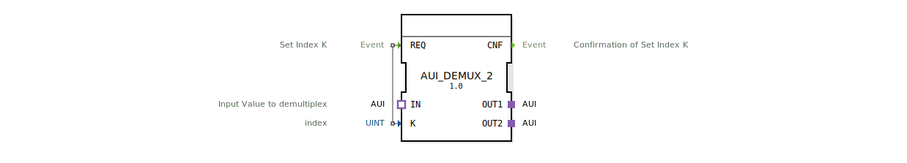

# AUI_DEMUX_2

* * * * * * * * * *

## Einleitung
Der Funktionsbaustein `AUI_DEMUX_2` realisiert einen generischen Demultiplexer für zwei Ausgangsadapter. Er leitet eingehende AUI-Daten (unidirectional) über einen Index selektiv an einen von zwei Ausgängen weiter. Der Baustein ist als Generic FB ausgelegt und kann für verschiedene AUI-Typen instanziiert werden.

## Schnittstellenstruktur

### **Ereignis-Eingänge**
| Ereignis | Kommentar |
|----------|-----------|
| `REQ`    | Setzt den Index `K` und löst die Demultiplexer-Operation aus. |

### **Ereignis-Ausgänge**
| Ereignis | Kommentar |
|----------|-----------|
| `CNF`    | Bestätigt die erfolgreiche Ausführung der Indexsetzung und Datenweitergabe. |

### **Daten-Eingänge**
| Variable | Typ   | Kommentar |
|----------|-------|-----------|
| `K`      | UINT  | Index für die Auswahl des Ziel-Ausgangs (1 = OUT1, 2 = OUT2). |

### **Daten-Ausgänge**
Keine Datenausgänge vorhanden.

### **Adapter**
| Richtung | Bezeichnung | Typ                              | Kommentar                     |
|----------|-------------|----------------------------------|-------------------------------|
| Ausgang  | `OUT1`      | `adapter::types::unidirectional::AUI` | Erster Demultiplexer-Ausgang. |
| Ausgang  | `OUT2`      | `adapter::types::unidirectional::AUI` | Zweiter Demultiplexer-Ausgang.|
| Eingang  | `IN`        | `adapter::types::unidirectional::AUI` | Eingang, der auf einen Ausgang umgeleitet wird. |

## Funktionsweise
Bei Anliegen eines Ereignisses am Eingang `REQ` wird der Wert des Dateneingangs `K` ausgewertet:
- Ist `K = 1`, werden die Daten des Adaptereingangs `IN` auf den Adapterausgang `OUT1` weitergeleitet.
- Ist `K = 2`, erfolgt die Weiterleitung auf `OUT2`.
- Für andere Werte von `K` findet keine Weiterleitung statt.
Nach der Verarbeitung wird das Ereignis `CNF` ausgegeben, um die erfolgreiche Ausführung zu quittieren.

## Technische Besonderheiten
- **Generischer FB**: Über `GenericClassName = 'GEN_AUI_DEMUX'` kann der Baustein für verschiedene AUI-Adaptervarianten parametrisiert werden.
- **Unidirektionale Adapter**: Sowohl Eingang als auch Ausgänge nutzen den AUI-Adaptertyp, der eine gerichtete Datenübertragung unterstützt.
- **Keine Zustandsmaschine**: Der FB arbeitet ereignisgesteuert ohne internen Zustandsspeicher.

## Zustandsübersicht
Der Funktionsbaustein besitzt keinen expliziten Zustandsautomaten. Die Reaktion erfolgt unmittelbar bei jedem `REQ`-Ereignis.

## Anwendungsszenarien
- **Signalverteilung**: Aufteilung eines AUI-Datenstroms auf zwei verschiedene Verarbeitungspfade.
- **Kanalumschaltung**: Dynamische Auswahl eines Ausgangskanals basierend auf einem Index, z. B. für Umschaltlogiken oder Routing.
- **Prototypische Demultiplexer**: Als Grundlage für ähnliche Bausteine mit mehr Ausgängen (z. B. `AUI_DEMUX_4`).

## Vergleich mit ähnlichen Bausteinen
- **Standard IEC 61499 Demultiplexer (z. B. `DEMUX`)** arbeiten meist mit beliebigen Datentypen, während `AUI_DEMUX_2` speziell für den AUI-Adaptertyp optimiert ist.
- **Generische Varianten** wie `AUI_DEMUX_n` (mit n > 2) erweitern die Anzahl der Ausgänge, behalten aber die gleiche Logik bei.
- **Adapterbasierte Alternativen** erfordern ggf. eine aufwändigere Verkabelung, bieten jedoch mehr Flexibilität bei der Datenhaltung.

## Fazit
Der `AUI_DEMUX_2` ist ein kompakter, generischer Demultiplexer für zwei AUI-Ausgänge. Er eignet sich besonders für Anwendungen, bei denen ein eingehender AUI-Datenstrom indexgesteuert auf einen von zwei Pfaden geleitet werden muss. Dank seiner generischen Natur kann er ohne Codeänderung für unterschiedliche AUI-Typen verwendet werden.