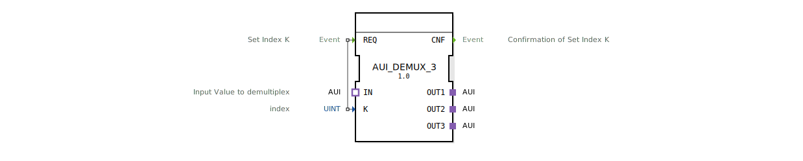

# AUI\_DEMUX\_3

* * * * * * * * * *
## Einleitung
Der Funktionsbaustein AUI\_DEMUX\_3 realisiert einen generischen Demultiplexer für das AUI-Adapterprotokoll. Er verteilt einen eingehenden, unidirektionalen Datenstrom auf einen von drei Ausgangskanälen. Die Auswahl des aktiven Ausgangs erfolgt über einen Index-Parameter, der durch ein Ereignis gesetzt wird.

## Schnittstellenstruktur
### **Ereignis-Eingänge**
| Ereignis | Datentyp | Beschreibung |
| :--- | :--- | :--- |
| REQ | Event | Setzt den aktiven Ausgangskanal K. Ausgelöst durch das anliegende Indexsignal. |

### **Ereignis-Ausgänge**
| Ereignis | Datentyp | Beschreibung |
| :--- | :--- | :--- |
| CNF | Event | Bestätigt, dass der Index K übernommen und der Multiplex umgeschaltet wurde. |

### **Daten-Eingänge**
| Name | Datentyp | Beschreibung |
| :--- | :--- | :--- |
| K | UINT | Index des gewünschten Ausgangskanals (Wertebereich: 0…2, entspricht OUT1…OUT3). |

### **Daten-Ausgänge**
_Keine direkten Datenausgänge vorhanden. Die Ausgabe erfolgt ausschließlich über die Adapter-Plugs._

### **Adapter**
| Richtung | Name | Typ | Beschreibung |
| :--- | :--- | :--- | :--- |
| Socket | IN | `adapter::types::unidirectional::AUI` | Eingangsschnittstelle – empfängt den zu multiplexenden Datenstrom. |
| Plug | OUT1 | `adapter::types::unidirectional::AUI` | Erster Ausgangskanal. |
| Plug | OUT2 | `adapter::types::unidirectional::AUI` | Zweiter Ausgangskanal. |
| Plug | OUT3 | `adapter::types::unidirectional::AUI` | Dritter Ausgangskanal. |

## Funktionsweise
Der Baustein arbeitet als 1-zu-3-Demultiplexer auf Basis der AUI-Adapter-Schnittstelle. Standardmäßig ist kein Ausgang aktiv – erst nach dem ersten Ereignis REQ wird der über K ausgewählte Ausgangskanal mit dem Eingang IN verbunden.  
Sobald das Ereignis REQ eintrifft, wird der Wert von K ausgelesen und der entsprechende Ausgang (OUT1 für K=0, OUT2 für K=1, OUT3 für K=2) aktiv geschaltet. Anschließend wird das Bestätigungsereignis CNF gesendet. Während der Verbindung werden alle über IN eintreffenden Adapterdaten an den aktiven Ausgang weitergeleitet. Ein erneutes REQ kann den Index ändern und damit den aktiven Ausgang umschalten.

## Technische Besonderheiten
- **Generischer Aufbau** – Der Baustein ist als generischer FB (`GEN\_AUI\_DEMUX`) implementiert, sodass die Anzahl der Ausgänge durch Anpassung des generischen Typs erweitert werden kann.  
- **Unidirektionaler Datenfluss** – Alle Adapter (IN, OUT1…OUT3) sind vom Typ `unidirectional::AUI`, d. h. die Daten fließen nur vom Socket zum Plug. Eine Rückmeldung vom Ausgang zum Eingang ist nicht vorgesehen.  
- **Indexprüfung** – Wird ein Wert außerhalb des gültigen Bereichs (0…2) angelegt, verhält sich der Baustein undefiniert oder ignoriert den Wert (abhängig von der konkreten Implementierung).  
- **Synchronisation** – Der Baustein arbeitet ereignisgesteuert; eine dauerhafte Verbindung ohne erneutes REQ bleibt bestehen.

## Zustandsübersicht
Eine explizite Zustandsmaschine ist in der XML nicht definiert. Das Verhalten kann konzeptionell wie folgt beschrieben werden:

- **IDLE** – Warten auf das erste REQ. Kein Ausgang aktiv.  
- **ACTIVE\_OUT1 / ACTIVE\_OUT2 / ACTIVE\_OUT3** – Der entsprechende Ausgang ist mit IN verbunden. Ein erneutes REQ wechselt in einen anderen ACTIVE-Zustand.  
- Nach dem Umschalten wird immer CNF ausgegeben.

## Anwendungsszenarien
- **Multipoint-Datenverteilung** – Ein Sensor oder eine Datenquelle (z. B. AUI-kompatibler Feldbusmaster) soll abwechselnd an verschiedene Aktoren oder Subsysteme angebunden werden.  
- **Kanalumschaltung** – In einer Steuerungsanwendung, die je nach Betriebsmodus unterschiedliche Ausgabepfade benötigt (z. B. Diagnose, Normalbetrieb, Wartung).  
- **Test- und Simulationsumgebungen** – Zum gezielten Ansprechen einzelner Komponenten eines Verbunds.

## Vergleich mit ähnlichen Bausteinen
- **AUI\_DEMUX\_1 / AUI\_DEMUX\_2** – Einfache Demultiplexer mit nur einem oder zwei Ausgängen. AUI\_DEMUX\_3 bietet genau drei Kanäle.  
- **AUI\_MUX** – Der zugehörige Multiplexer, der mehrere Eingänge auf einen Ausgang zusammenführt. Beide ergänzen sich in symmetrischen Datenpfaden.  
- **Standard IEC 61499-Demultiplexer (z. B. SELECT)** – Diese nutzen meist einfache Datentypen, während AUI\_DEMUX\_3 speziell für das Adapterprotokoll AUI ausgelegt ist und so komplexe strukturierte Datenübertragung ermöglicht.

## Fazit
Der AUI\_DEMUX\_3 ist ein spezialisierter Funktionsbaustein zur unidirektionalen Demultiplexierung von AUI-Datenströmen auf drei Kanäle. Seine klare ereignisgesteuerte Schnittstelle und der generische Aufbau machen ihn zu einer flexiblen Komponente in IEC-61499-basierten Steuerungssystemen, die eine dynamische Weiterschaltung von Adapterverbindungen erfordern.