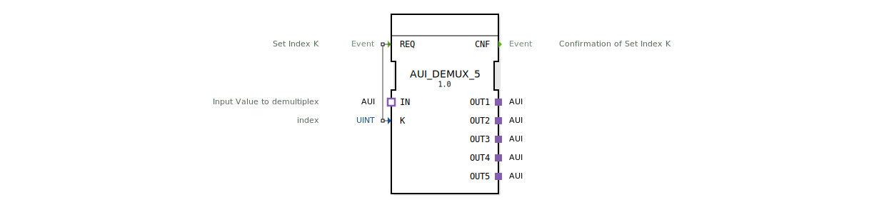

# AUI_DEMUX_5

* * * * * * * * * *
## Einleitung
Der Funktionsblock **AUI_DEMUX_5** ist ein generischer Demultiplexer für das AUI‑Adapterprotokoll (unidirektional). Er leitet einen ankommenden AUI‑Datenstrom auf einen von fünf Ausgangsadaptern weiter. Die Auswahl des Zielausgangs erfolgt über den Index `K` nach einer Anforderung am Ereigniseingang `REQ`.

## Schnittstellenstruktur
### **Ereignis-Eingänge**
| Ereignis | Datentyp | Beschreibung |
|----------|----------|--------------|
| `REQ`    | Event    | Auslöser zum Setzen des Index `K` und zur Weiterleitung des Eingangssignals auf den entsprechenden Ausgang. |

### **Ereignis-Ausgänge**
| Ereignis | Datentyp | Beschreibung |
|----------|----------|--------------|
| `CNF`    | Event    | Bestätigung, dass die Indexumschaltung und Weiterleitung abgeschlossen sind. |

### **Daten-Eingänge**
| Name | Typ  | Beschreibung |
|------|------|--------------|
| `K`  | UINT | Ganzzahliger Index (1 … 5), der den Zielausgang festlegt. |

### **Daten-Ausgänge**
Keine Datenausgänge vorhanden.

### **Adapter**
| Typ            | Richtung | Anzahl | Beschreibung |
|----------------|----------|--------|--------------|
| IN             | Socket   | 1      | Eingangsadapter vom Typ `AUI` (unidirektional). Das zu verteilende Signal gelangt hier an. |
| OUT1 … OUT5    | Plug     | 5      | Ausgangsadapter vom Typ `AUI`. Der aktuell ausgewählte Ausgang erhält das Eingangssignal. |

## Funktionsweise
1. Der FB erwartet am Socket `IN` ein eingehendes AUI‑Signal.
2. Wird der Ereigniseingang `REQ` aktiviert, liest der FB den Wert des Daten‑Eingangs `K`.
3. Entsprechend dem Wert von `K` (gültig 1 bis 5) wird das Signal vom Eingangsadapter auf den zugehörigen Ausgangsadapter (`OUT1` … `OUT5`) durchgeschaltet. Die anderen Ausgänge bleiben inaktiv oder werden zurückgesetzt (abhängig von der Implementierung im Generic‑FB).
4. Nach erfolgreicher Umschaltung wird der Ereignisausgang `CNF` gesendet.
5. Der FB ist danach bereit für eine neue Anforderung.

**Hinweis:** Bei ungültigen Werten von `K` (z. B. 0 oder >5) kann das Verhalten undefiniert sein – es wird empfohlen, den Index auf 1 … 5 zu begrenzen.

## Technische Besonderheiten
- **Generischer Typ:** Der Baustein ist als generischer Funktionsblock (`GEN_AUI_DEMUX`) definiert. In dieser Instanz ist die Anzahl der Ausgänge auf fünf festgelegt.
- **Ereignisgesteuert:** Die Umschaltung erfolgt nur bei einem `REQ`‑Ereignis. Ein kontinuierliches Durchschalten ohne Ereignis ist nicht vorgesehen.
- **Adapter‑Schnittstelle:** Der FB verwendet ausschließlich Adapterverbindungen vom Typ `AUI` (unidirektional), daher ist er für den Einsatz in modularen AUI‑basierten Systemen optimiert.
- **Keine Datenausgänge:** Der Status der Umschaltung wird ausschließlich über Ereignisse (`CNF`) signalisiert.

## Zustandsübersicht
Der FB besitzt keine explizit modellierten Zustände (ECC). Sein Verhalten entspricht einer einfachen Reaktionslogik:

- **Ruhezustand:** Warten auf ein `REQ`‑Ereignis.
- **Aktiv:** Nach `REQ` wird der Index ausgewertet, die Weiterleitung aktiviert und `CNF` gesendet. Danach kehrt der FB in den Ruhezustand zurück.

## Anwendungsszenarien
- **Modulare Sensor‑ oder Aktorverteilung:** Ein zentrales Steuergerät sendet AUI‑signale, die je nach Index an verschiedene Untermodule weitergeleitet werden.
- **Test‑ und Simulationsumgebungen:** Umschalten zwischen verschiedenen Datenquellen auf einer einzigen Verbindung.
- **Ressourcenoptimierung:** Reduzierung der Anzahl physischer Leitungen, indem dieselbe AUI‑Verbindung zeitlich gemultiplext und dann im Empfänger demultiplext wird.

## Vergleich mit ähnlichen Bausteinen
| Baustein        | Anzahl Ausgänge | Besonderheiten |
|-----------------|-----------------|----------------|
| `AUI_DEMUX_2`   | 2               | Einfacher 2‑fach Demultiplexer. |
| `AUI_DEMUX_5`   | 5               | Dieser Baustein. |
| `AUI_DEMUX_10`  | 10              | Erweiterte Version für zehn Ausgänge. |
| `AUI_MUX_5`     | 1 (Eingang)     | Multiplexer, der mehrere Eingänge auf einen Ausgang zusammenführt. |

Der `AUI_DEMUX_5` bietet einen guten Kompromiss zwischen Flexibilität und Komplexität für Systeme mit bis zu fünf Teilnehmern.

## Fazit
Der Funktionsblock `AUI_DEMUX_5` ist ein nützlicher Baustein zur gezielten Verteilung eines AUI‑Signals auf eine von fünf Leitungen. Dank des ereignisgesteuerten Index‑Eingangs und der reinen Adapter‑Schnittstelle lässt er sich einfach in größere Automatisierungs‑ oder Steuerungsprojekte einbinden. Die generische Architektur erlaubt zudem eine einfache Anpassung auf andere Ausgangsanforderungen.