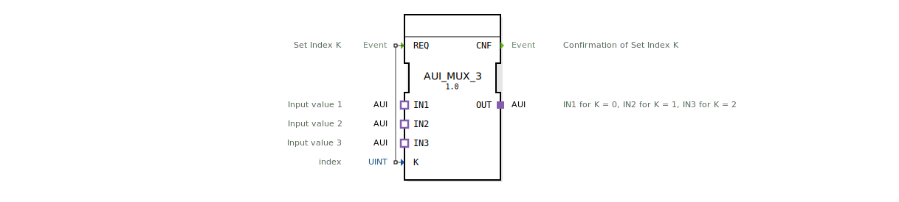

# AUI_MUX_3

* * * * * * * * * *
## Einleitung
Der Funktionsbaustein `AUI_MUX_3` ist ein generischer Multiplexer für den AUI-Datentyp (unidirektionaler Adapter). Er wählt anhand eines ganzzahligen Indexes `K` einen von drei Adapter-Eingängen (`IN1`, `IN2`, `IN3`) aus und leitet diesen an den Adapter-Ausgang `OUT` weiter. Der Auswahlvorgang wird durch ein Ereignis am Eingang `REQ` ausgelöst.

## Schnittstellenstruktur

### **Ereignis-Eingänge**

| Ereignis | Kommentar |
|----------|-----------|
| `REQ` (Event) | Setzt den Index `K` und startet die Auswahl des entsprechenden Eingangs. |

### **Ereignis-Ausgänge**

| Ereignis | Kommentar |
|----------|-----------|
| `CNF` (Event) | Bestätigt die erfolgreiche Übertragung des ausgewählten Adapters an `OUT`. |

### **Daten-Eingänge**

| Name | Typ | Kommentar |
|------|-----|-----------|
| `K` | UINT | Index, der den aktiven Eingang bestimmt (0 = IN1, 1 = IN2, 2 = IN3). |

### **Daten-Ausgänge**
Keine direkten Datenausgänge vorhanden. Die Ausgabe erfolgt über den Adapter-Ausgang `OUT`.

### **Adapter**

| Richtung | Name | Typ | Kommentar |
|----------|------|-----|-----------|
| Plug (Ausgang) | `OUT` | `adapter::types::unidirectional::AUI` | Ausgang, der den ausgewählten Eingang weiterleitet. |
| Socket (Eingang 1) | `IN1` | `adapter::types::unidirectional::AUI` | Erster Eingangswert (für K = 0). |
| Socket (Eingang 2) | `IN2` | `adapter::types::unidirectional::AUI` | Zweiter Eingangswert (für K = 1). |
| Socket (Eingang 3) | `IN3` | `adapter::types::unidirectional::AUI` | Dritter Eingangswert (für K = 2). |

## Funktionsweise
Der Baustein arbeitet ereignisgesteuert. Beim Eintreffen eines Ereignisses am Eingang `REQ` wird der aktuelle Wert des Index `K` ausgelesen. Abhängig von `K` wird einer der drei Adapter-Eingänge (`IN1`, `IN2` oder `IN3`) intern mit dem Adapter-Ausgang `OUT` verbunden. Die Verbindung wird sofort aktiv, und anschließend wird ein Bestätigungsereignis am Ausgang `CNF` gesendet.

- Falls `K = 0`: Verbinde `IN1` mit `OUT`.
- Falls `K = 1`: Verbinde `IN2` mit `OUT`.
- Falls `K = 2`: Verbinde `IN3` mit `OUT`.
- Für andere Werte von `K` (z. B. > 2) ist das Verhalten nicht definiert; der Baustein sendet dennoch ein `CNF`-Ereignis, die Auswahl bleibt jedoch undefiniert.

## Technische Besonderheiten
- **Generischer Baustein**: Der FB ist als generischer Typ (`GEN_AUI_MUX`) deklariert und kann für unterschiedliche Instanzen des `AUI`-Adapters parametrisiert werden.
- **Unidirektionale Adapter**: Alle Adapter (Eingänge und Ausgang) sind vom Typ `adapter::types::unidirectional::AUI`, was bedeutet, dass die Daten nur in eine Richtung fließen – vom ausgewählten Socket zum Plug.
- **Einfache Auswahl**: Es wird kein zusätzlicher Default-Zustand oder Timeout verwendet. Der Index wird direkt zum Zeitpunkt des `REQ`-Ereignisses ausgewertet.

## Zustandsübersicht
Der Baustein besitzt keinen expliziten internen Zustandsautomaten. Die Funktionsweise lässt sich als einzelner stabiler Zustand beschreiben:
1. **Warten auf `REQ`**: Der Baustein ist passiv, bis ein Ereignis am `REQ`-Eingang eintrifft.
2. **Auswahl ausführen**: Nach Erhalt von `REQ` wird `K` gelesen, der entsprechende Eingang mit `OUT` verbunden und `CNF` gesendet. Danach kehrt der Baustein in den Wartezustand zurück.

## Anwendungsszenarien
- **Sensorauswahl**: In einer Maschinensteuerung kann zwischen drei verschiedenen Sensorwerten (z. B. Temperatur, Druck, Durchfluss) umgeschaltet werden, ohne separate Funktionsbausteine zu verwenden.
- **Multiplexen von Steuerdaten**: Auswahl verschiedener Signalquellen (z. B. von unterschiedlichen Aktoren) für eine nachfolgende Verarbeitung.
- **Test- und Simulationsumgebungen**: Schnelles Umschalten zwischen verschiedenen Datensätzen oder Adaptern zu Testzwecken.

## Vergleich mit ähnlichen Bausteinen
- **`AUI_MUX_2`**: Ein Multiplexer mit zwei Eingängen (K = 0,1) – weniger Auswahlmöglichkeiten, aber einfacher.
- **`AUI_DEMUX`**: Ein Demultiplexer, der einen Eingang auf mehrere Ausgänge verteilt.
- **Standard `MUX`-Bausteine (für Basisdatentypen)**: Diese arbeiten meist mit elementaren Datentypen (INT, BOOL) und haben einen vergleichbaren Auswahlmechanismus, jedoch ohne Adapter-Schnittstelle.

## Fazit
Der `AUI_MUX_3` ist ein spezialisierter, aber flexibler Multiplexer für den unidirektionalen AUI-Adapter. Er ermöglicht eine saubere Ereignis-gesteuerte Auswahl aus drei Quellen und eignet sich besonders für modulare Automatisierungslösungen, die auf dem Adapter-Konzept basieren. Die einfache Handhabung und die generische Parametrierbarkeit machen ihn zu einem nützlichen Werkzeug in der 4diac-IDE.