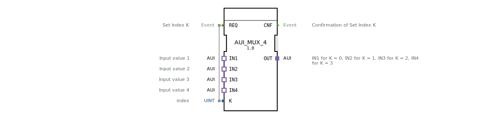

# AUI_MUX_4

* * * * * * * * * *
## Einleitung
Der Funktionsblock **AUI_MUX_4** ist ein generischer Multiplexer für AUI-Adapter (Unidirectional Application Interface). Er ermöglicht das dynamische Umschalten zwischen vier AUI-Eingängen (IN1 bis IN4) auf einen gemeinsamen AUI-Ausgang (OUT) mittels eines ganzzahligen Index.

## Schnittstellenstruktur
### **Ereignis-Eingänge**

| Ereignis | Beschreibung |
|----------|--------------|
| REQ      | Setzt den Index **K** und aktiviert die Durchschaltung. |

### **Ereignis-Ausgänge**

| Ereignis | Beschreibung |
|----------|--------------|
| CNF      | Bestätigung, dass die Auswahl gemäß **K** erfolgt ist. |

### **Daten-Eingänge**

| Variable | Typ   | Beschreibung           |
|----------|-------|------------------------|
| K        | UINT  | Auswahlindex (0 … 3)   |

### **Daten-Ausgänge**
Keine.

### **Adapter**

| Adapter | Richtung | Typ    | Beschreibung                                    |
|---------|----------|--------|-------------------------------------------------|
| OUT     | Plug     | AUI    | Ausgangsadapter (multiplexiertes Signal)        |
| IN1     | Socket   | AUI    | Datenquelle für K = 0                           |
| IN2     | Socket   | AUI    | Datenquelle für K = 1                           |
| IN3     | Socket   | AUI    | Datenquelle für K = 2                           |
| IN4     | Socket   | AUI    | Datenquelle für K = 3                           |

## Funktionsweise
Wird am Ereigniseingang **REQ** ein Signal angelegt, wird der aktuelle Wert des Eingangs **K** ausgewertet. Abhängig von **K** (0 … 3) wird einer der vier AUI-Sockets (IN1…IN4) mit dem Plug **OUT** verbunden. Der ausgewählte AUI-Pfad wird sofort aktiv geschaltet und anschließend das Ereignis **CNF** ausgegeben. Der FB arbeitet ereignisgesteuert, es findet keine zyklische Abfrage statt.

## Technische Besonderheiten
- Der FB ist als **generischer Baustein** deklariert (GenericClassName `'GEN_AUI_MUX'`) und kann daher in verschiedenen Kontexten wiederverwendet werden.
- Alle Adapter sind vom Typ `adapter::types::unidirectional::AUI` – einem unidirektionalen Schnittstellenprotokoll.
- Der Index **K** ist als `UINT` definiert; Werte außerhalb 0…3 werden nicht behandelt.
- Das Attribut `eclipse4diac::core::TypeHash` ermöglicht eine eindeutige Identifikation der Typdefinition im 4diac-Framework.

## Zustandsübersicht
Der Funktionsblock besitzt **keinen expliziten internen Zustandsautomaten** (ECC). Die Funktionalität ist rein ereignisgesteuert: Ein REQ-Ereignis löst sofort die Umschaltung und die Bestätigung CNF aus.

## Anwendungsszenarien
- **Datenquellenumschaltung** in verteilten Automatisierungssystemen, wenn mehrere AUI-konforme Sensoren oder Aktoren über einen gemeinsamen Kanal angebunden werden sollen.
- **Dynamische Pfadwahl** in AUI-basierten Kommunikationsnetzen, z. B. zur Fehlerumschaltung oder Lastverteilung.
- **Parametrierbare Konfiguration** von Geräten, bei der der Index aus einem übergeordneten Steuerprogramm gesetzt wird.

## Vergleich mit ähnlichen Bausteinen
Der **AUI_MUX_4** ist funktional identisch zu einem klassischen 4‑zu‑1‑Multiplexer, aber speziell auf den AUI-Adaptertyp zugeschnitten. Im Gegensatz zu generischen Daten-Multiplexern (z. B. MUX aus IEC 61499‑Standardbibliotheken) arbeitet er nicht mit elementaren Datentypen, sondern mit komplexen Adapterverbindungen. Dies vereinfacht die Verkabelung in AUI‑basierten Architekturen.

## Fazit
Der **AUI_MUX_4** bietet eine saubere, wiederverwendbare Lösung zur Auswahl zwischen vier AUI‑Signalen. Seine ereignisgesteuerte Arbeitsweise und die generische Typdefinition machen ihn flexibel einsetzbar, insbesondere in modularen Automatisierungslösungen auf Basis des 4diac‑Frameworks.