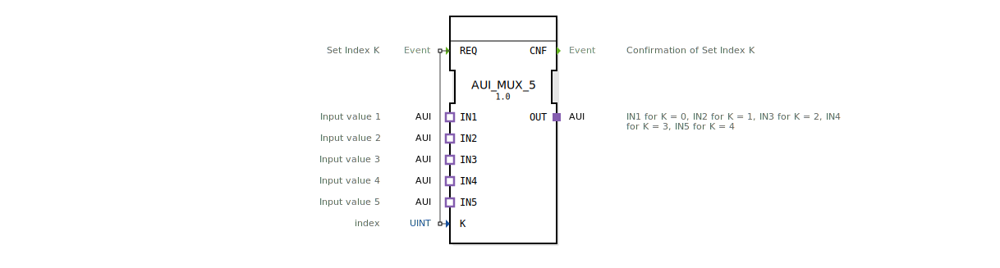

# AUI_MUX_5

* * * * * * * * * *
## Einleitung

Der Funktionsblock **AUI_MUX_5** ist ein generischer Multiplexer für fünf unidirektionale AUI-Adapter-Schnittstellen. Er wählt abhängig von einem Indexwert **K** einen der fünf Eingänge (**IN1** bis **IN5**) aus und leitet dessen Signal an den Ausgang **OUT** weiter. Die Umschaltung erfolgt ereignisgesteuert über den Eingang **REQ**.

## Schnittstellenstruktur

### **Ereignis-Eingänge**

| Ereignis | Beschreibung |
|----------|--------------|
| **REQ** | Setzt den Index **K** und löst die Durchschaltung des entsprechenden Eingangs auf den Ausgang aus. |

### **Ereignis-Ausgänge**

| Ereignis | Beschreibung |
|----------|--------------|
| **CNF** | Bestätigt, dass der Index **K** übernommen und die Durchschaltung abgeschlossen wurde. |

### **Daten-Eingänge**

| Variable | Typ   | Beschreibung |
|----------|-------|--------------|
| **K**    | UINT  | Index des auszuwählenden Eingangs (gültige Werte: 0..4). |

### **Daten-Ausgänge**

*(Keine)*

### **Adapter**

| Rolle   | Name | Typ                                      | Beschreibung |
|---------|------|------------------------------------------|--------------|
| **Plug**| OUT  | adapter::types::unidirectional::AUI      | Ausgang, der den ausgewählten Eingang durchschaltet. |
| **Socket** | IN1 | adapter::types::unidirectional::AUI    | Erster Eingang (wird bei K=0 aktiv). |
| **Socket** | IN2 | adapter::types::unidirectional::AUI    | Zweiter Eingang (wird bei K=1 aktiv). |
| **Socket** | IN3 | adapter::types::unidirectional::AUI    | Dritter Eingang (wird bei K=2 aktiv). |
| **Socket** | IN4 | adapter::types::unidirectional::AUI    | Vierter Eingang (wird bei K=3 aktiv). |
| **Socket** | IN5 | adapter::types::unidirectional::AUI    | Fünfter Eingang (wird bei K=4 aktiv). |

## Funktionsweise

Der **AUI_MUX_5** arbeitet wie ein klassischer Multiplexer: Nach einem Ereignis am Eingang **REQ** wird der aktuelle Wert des Index **K** ausgewertet. Abhängig von **K** (0..4) wird der entsprechende Adapter-Socket (**IN1** bis **IN5**) auf den Plug **OUT** durchgeschaltet. Die Durchschaltung ist unidirektional; das Signal fließt vom ausgewählten Eingang zum Ausgang. Nach erfolgreicher Umschaltung wird das Ereignis **CNF** ausgegeben.

## Technische Besonderheiten

- Der Funktionsblock ist als **generischer Typ** deklariert (GenericClassName `'GEN_AUI_MUX'`). Er kann daher je nach Anwendung parametrisiert instanziiert werden.
- Der Multiplexer unterstützt ausschließlich den unidirektionalen AUI-Adaptertyp, der für die Übertragung von Nutzsignalen in eine Richtung ausgelegt ist.
- Die Adapter-Schnittstellen sind als **Typadapter** realisiert, was eine einfache Einbindung in bestehende AUI-basierte Kommunikationsstrukturen ermöglicht.
- Die Auswahl erfolgt streng nach dem aktuellen Index **K**; außerhalb des gültigen Bereichs liegende Werte führen zu undefiniertem Verhalten (keine Plausibilitätsprüfung).

## Zustandsübersicht

Der Funktionsblock besitzt keinen expliziten endlichen Automaten. Sein Verhalten ist rein ereignisgesteuert:

1. **Warten** auf ein **REQ**-Ereignis.
2. **Auswerten** von **K** und **Durchschalten** des entsprechenden Eingangs auf den Ausgang.
3. **Senden** von **CNF** als Bestätigung.

Nach Schritt 3 kehrt der Block in den Wartezustand zurück. Mehrere **REQ**-Ereignisse werden nacheinander bearbeitet.

## Anwendungsszenarien

- **Auswahl einer von fünf AUI-Quellen**, z. B. Sensordaten oder Steuersignale in einer landwirtschaftlichen Maschinensteuerung.
- **Signalumschaltung** in modularen Automatisierungssystemen, bei denen verschiedene Peripheriegeräte an einen gemeinsamen Bus angeschlossen werden.
- **Test- und Simulationsumgebungen**, in denen zwischen unterschiedlichen Signalquellen umgeschaltet werden muss.

## Vergleich mit ähnlichen Bausteinen

- **AUI_MUX_2 / AUI_MUX_3**: Diese Bausteine bieten eine kleinere Anzahl von Eingängen (2 bzw. 3) und sind für kompaktere Anwendungen optimiert.
- **AUI_DEMUX_5**: Ein Demultiplexer, der einen Eingang auf einen von fünf Ausgängen verteilt – quasi die Umkehrfunktion.
- **Standard-MUX-Bausteine** (z. B. mit einfachen Datentypen wie INT oder BOOL): Der **AUI_MUX_5** zeichnet sich durch die spezielle Adapter-Schnittstelle und die unidirektionale Datenflussrichtung aus, was ihn besonders für AUI-basierte Architekturen geeignet macht.

## Fazit

Der **AUI_MUX_5** ist ein übersichtlicher und flexibler Multiplexer für fünf unidirektionale AUI-Adapter. Dank seiner generischen Implementierung lässt er sich problemlos in verschiedenste Automatisierungsprojekte integrieren. Die einfache ereignisgesteuerte Arbeitsweise ermöglicht eine zuverlässige Signalauswahl ohne komplexe interne Zustandslogik.