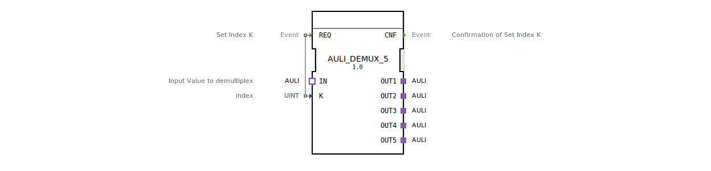

# AULI_DEMUX_5

* * * * * * * * * *
## Einleitung
Der **AULI_DEMUX_5** ist ein unidirektionaler Demultiplexer-Baustein für den AULI-Adaptertyp. Er leitet ein eingehendes AULI-Signal wahlweise an einen von fünf Ausgängen weiter. Die Auswahl des Zielausgangs erfolgt über den Index-Eingang `K`. Der Baustein ist als generischer Funktionsblock (gemäß Eclipse 4diac Generic-FB-Konzept) realisiert und wird durch das Attribut `GenericClassName` als `GEN_AULI_DEMUX` identifiziert.

## Schnittstellenstruktur
### **Ereignis-Eingänge**
| Name | Kommentar | Mit Variablen |
|------|-----------|---------------|
| REQ  | Set Index K | K |

### **Ereignis-Ausgänge**
| Name | Kommentar |
|------|-----------|
| CNF  | Bestätigung der Index-Setzung |

### **Daten-Eingänge**
| Name | Typ  | Kommentar |
|------|------|-----------|
| K    | UINT | Index zur Auswahl des Ausgangs (gültig: 1…5) |

### **Daten-Ausgänge**
Keine (die Datenweitergabe erfolgt über die AULI-Adapter).

### **Adapter**
- **Socket (Eingang):** `IN` – Typ `adapter::types::unidirectional::AULI`  
  Empfängt das zu verteilende Signal.
- **Plugs (Ausgänge):** `OUT1`…`OUT5` – jeweils Typ `adapter::types::unidirectional::AULI`  
  Die fünf möglichen Zieladapter für das Eingangssignal.

## Funktionsweise
Der Baustein arbeitet ereignisgesteuert:
1. Ein ansteigende Flanke am Ereigniseingang **REQ** löst die Verarbeitung aus.
2. Der Wert des Dateneingangs **K** wird ausgelesen. Dieser muss im Bereich 1 bis 5 liegen (das Verhalten bei Werten außerhalb ist nicht definiert).
3. Das am **IN**-Adapter anliegende AULI-Signal wird auf den durch `K` bestimmten Adapter **OUT1**…**OUT5** durchverbunden.
4. Nach erfolgreicher Umschaltung wird das Ereignis **CNF** ausgegeben.

Die Datenweitergabe erfolgt passiv über die Adapter-Schnittstelle; der Baustein selbst hält keine eigenen Datenvariablen.

## Technische Besonderheiten
- **Generische Implementierung:** Der FB ist als generischer Typ deklariert (`GenericClassName = 'GEN_AULI_DEMUX'`), was die Erzeugung abgeleiteter Varianten mit anderer Anzahl an Ausgängen erleichtert.
- **Unidirektionale Adapter:** Alle AULI-Adapter sind unidirektional (Typ `unidirectional`), sodass der Datenfluss nur vom Socket zu den Plugs erfolgt.
- **Keine Zustandsmaschine:** Die Logik des Demultiplexers ist rein kombinatorisch (Ereignis gesteuert) und benötigt keine diskreten Zustände. Ein ECC (Execution Control Chart) ist nicht erforderlich.
- **Typisierte Indizes:** `K` ist als `UINT` deklariert; es wird angenommen, dass der Anwender nur gültige Werte (1..5) übergibt. Eine Bereichsprüfung durch den FB selbst ist nicht explizit vorgesehen.

## Zustandsübersicht
Da der FB keine Zustandsmaschine besitzt, kann das Verhalten durch zwei implizite Phasen beschrieben werden:
| Zustand | Beschreibung |
|---------|--------------|
| IDLE    | Warten auf ein REQ-Ereignis; keine Verbindung aktiv. |
| ACTIVE  | Nach Empfang von REQ wird die entsprechende Verbindung hergestellt und CNF ausgelöst; danach sofort zurück in IDLE. |

Der FB ist nicht zustandsbehaftet; nach jedem REQ wird die Umschaltung sofort und ohne Verzögerung ausgeführt.

## Anwendungsszenarien
- **Signalverteilung in der Automatisierung:** Ein von einem Sensor kommendes AULI-Signal soll je nach Parameter (z. B. Betriebsmodus) an verschiedene Aktoren weitergegeben werden.
- **Test und Simulation:** Umschalten zwischen verschiedenen Datenquellen (z. B. Live-Daten vs. aufgezeichnete Daten) innerhalb eines 4diac-Systems.
- **Flexible Routing-Logik:** Kombination mit weiteren Bausteinen, um einen dynamischen Multiplexer/Demultiplexer-Aufbau zu realisieren.

## Vergleich mit ähnlichen Bausteinen
- **AULI_MUX_5 (Multiplexer):** Der umgekehrte Baustein – mehrere Eingänge auf einen Ausgang. Der Demux hier bietet die entgegengesetzte Funktionalität.
- **Standard-Daten-Demultiplexer (z. B. für ANY):** Statt AULI-Adapter arbeiten diese oft mit skalaren Datentypen (wie INT, BOOL) und haben separate Datenausgänge. Der AULI_DEMUX_5 ist speziell auf die AULI-Schnittstelle ausgelegt.
- **Adapter-Multiplexer aus anderen Bibliotheken:** Je nach Umgebung können ähnliche Bausteine existieren, die jedoch häufig bidirektionale Adapter verwenden. Der vorliegende FB ist explizit unidirektional und erwartet die AULI-Definition.

## Fazit
Der **AULI_DEMUX_5** ist ein kompakter, ereignisgesteuerter Demultiplexer für unidirektionale AULI-Adapter. Er ermöglicht eine flexible Signalweiterleitung auf fünf Zieladapter und eignet sich besonders für modulare Automatisierungslösungen, bei denen Adapter als standardisierte Schnittstelle dienen. Durch die generische Basis kann der Baustein leicht an andere Kanalzahlen angepasst werden.