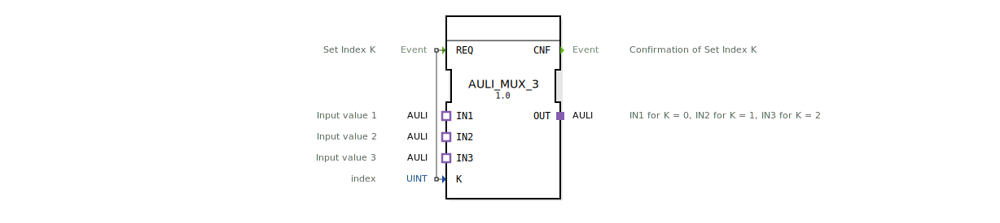

# AULI_MUX_3

* * * * * * * * * *

## Einleitung

Der Funktionsblock `AULI_MUX_3` ist ein generischer Multiplexer, der es ermöglicht, einen von drei über Adapter angeschlossenen Datenströmen auszuwählen. Er arbeitet im Rahmen der AULI-Adapter-Spezifikation (unidirektional) und eignet sich für die flexible Umschaltung zwischen verschiedenen Datenquellen in einer IEC 61499-basierten Steuerungsumgebung. Die Auswahl erfolgt über einen Index `K`, der bei einer Anfrage (`REQ`) ausgewertet wird.

## Schnittstellenstruktur

### **Ereignis-Eingänge**

| Name | Typ | Kommentar |
|------|-----|-----------|
| REQ  | Event | Set Index K. Lösen die Multiplexer-Aktion aus. |

### **Ereignis-Ausgänge**

| Name | Typ | Kommentar |
|------|-----|-----------|
| CNF  | Event | Bestätigung der Indexauswahl (nach erfolgreichem Durchschalten). |

### **Daten-Eingänge**

| Name | Typ | Kommentar |
|------|-----|-----------|
| K    | UINT | Index für die Auswahl des Eingangs (0, 1 oder 2). |

### **Daten-Ausgänge**

Der FB besitzt keine direkten Datenausgänge; die Ausgangsdaten werden über den Adapter `OUT` bereitgestellt.

### **Adapter**

- **Sockets (Eingänge):**
  - `IN1` (Typ: `adapter::types::unidirectional::AULI`) – Eingangsdaten für K = 0.
  - `IN2` (Typ: `adapter::types::unidirectional::AULI`) – Eingangsdaten für K = 1.
  - `IN3` (Typ: `adapter::types::unidirectional::AULI`) – Eingangsdaten für K = 2.
- **Plugs (Ausgang):**
  - `OUT` (Typ: `adapter::types::unidirectional::AULI`) – Ausgang, der den ausgewählten Eingang durchschaltet.

## Funktionsweise

Der `AULI_MUX_3` arbeitet ereignisgesteuert. Bei einem Ereignis am **REQ**-Eingang wird der aktuelle Wert des Daten-Eingangs `K` (unsigned integer) ausgelesen. Abhängig von diesem Wert wird der entsprechende Socket-Eingang (IN1, IN2 oder IN3) auf den Plug-Ausgang `OUT` durchgeschaltet. Der Datenfluss erfolgt über die Adapter-Schnittstellen vom Typ `AULI` (unidirektional), d.h. nach dem Umschalten wird der Datenaustausch zwischen der ausgewählten Quelle und dem Ausgang hergestellt. Nach erfolgreicher Durchschaltung wird ein Bestätigungsereignis am **CNF**-Ausgang gesendet.

Falls `K` einen ungültigen Wert außerhalb 0..2 annimmt, ist das Verhalten nicht spezifiziert – dies sollte durch die Anwendungslogik vermieden werden.

## Technische Besonderheiten

- **Generischer Typ**: Der FB ist als generisch gekennzeichnet (`GEN_AULI_MUX`), sodass er für verschiedene AULI-Datentypen oder -Strukturen verwendet werden kann, sofern die Adapterdefinition dies zulässt.
- **Unidirektionaler Adapter**: Alle Adapter sind unidirektional (`adapter::types::unidirectional::AULI`), was bedeutet, dass die Daten nur in eine Richtung fließen (vom Socket zum Plug).
- **Ereignisgesteuert**: Keine zyklische Abfrage; die Umschaltung erfolgt nur auf Anforderung.
- **Einfache Schnittstelle**: Nur ein Ereigniseingang und ein Ereignisausgang, minimiert die Komplexität der Verbindung.

## Zustandsübersicht

Der FB besitzt keine ausgeprägte Zustandsmaschine (z.B. ECC), da er rein ereignisgesteuert und ohne internen Speicher arbeitet. Der Ablauf ist:

1. Warten auf Ereignis `REQ`
2. Lesen von `K`
3. Durchschalten des entsprechenden Eingangs auf `OUT`
4. Senden von `CNF`
5. Zurück zu Schritt 1

## Anwendungsszenarien

- **Sensorauswahl**: In einer Maschinensteuerung sollen je nach Betriebsart die Daten von drei verschiedenen Sensoren (z.B. Temperatur, Druck, Drehzahl) an eine nachfolgende Verarbeitungseinheit weitergeleitet werden.
- **Redundanz**: Drei identische Datenquellen sind vorhanden; bei Ausfall einer Quelle kann über eine externe Logik der Index umgeschaltet werden, um auf eine andere Quelle zu wechseln.
- **Testumgebungen**: Zum Umschalten zwischen realen und simulierten Datenströmen während der Inbetriebnahme.

## Vergleich mit ähnlichen Bausteinen

- **Standard-MUX** (z.B. `MUX` aus IEC 61499-Bibliotheken): Diese arbeiten meist mit Dateneingängen direkt am FB und einem Ausgangsdatenwert. Der `AULI_MUX_3` verwendet dagegen Adapter, was eine lose Kopplung und den Austausch ganzer Datenstrukturen ermöglicht.
- **AULI-Splitter**: Das Gegenstück, das einen Eingang auf mehrere Ausgänge verteilt (z.B. `AULI_DISTRIBUTE`). Während der MUX viele Quellen auf einen Ausgang bündelt, verteilt der Splitter eine Quelle auf viele Ausgänge.
- **Selektor ohne Adapter**: Ein einfacher Index-basierter FB mit Daten-Eingängen (z.B. `SEL`) bietet typischerweise nur Einzelwerte, keine komplexen Adapter-Interfaces.

## Fazit

Der `AULI_MUX_3` ist ein flexibler, ereignisgesteuerter Multiplexer, der über Adapter-Schnittstellen bis zu drei Datenquellen umschaltet. Sein generischer Charakter und die Verwendung von Standard-Adaptern machen ihn ideal für modulare und wiederverwendbare Steuerungsanwendungen. Die einfache Schnittstelle mit nur einem Index und einem Bestätigungsereignis ermöglicht eine klare Einbindung in übergeordnete Logiken.