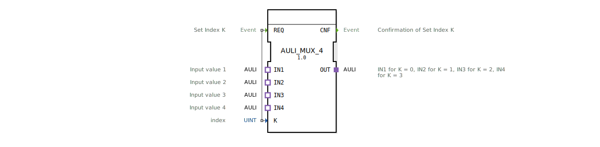

# AULI_MUX_4

* * * * * * * * * *
## Einleitung

Der Funktionsblock **AULI_MUX_4** ist ein generischer Multiplexer für die Adapter-Schnittstelle `adapter::types::unidirectional::AULI`. Er wählt anhand eines numerischen Indexes **K** genau einen von vier Eingängen (IN1 bis IN4) aus und leitet dessen Daten an den Ausgang **OUT** weiter. Der Baustein gehört zur Bibliothek der HR Agrartechnik GmbH und wurde für den Einsatz in der IEC 61499-1 Standardumgebung entwickelt.

## Schnittstellenstruktur

### **Ereignis-Eingänge**

| Ereignis | Beschreibung |
|----------|--------------|
| **REQ**  | Auslöser zum Setzen des Index **K** und zur Durchführung der Multiplex-Auswahl. |

### **Ereignis-Ausgänge**

| Ereignis | Beschreibung |
|----------|--------------|
| **CNF**  | Bestätigung, dass die Auswahl abgeschlossen und der Ausgang aktualisiert wurde. |

### **Daten-Eingänge**

| Name | Typ   | Beschreibung |
|------|-------|--------------|
| **K** | UINT  | Auswahlindex (Wertebereich 0…3). Bestimmt, welcher Eingang auf den Ausgang geschaltet wird. |

### **Daten-Ausgänge**

Keine direkten Datenausgänge. Die Ausgabe erfolgt über den **Adapter-Ausgang** (Plug).

### **Adapter**

| Kategorie | Name | Typ (Schnittstelle) | Beschreibung |
|-----------|------|---------------------|--------------|
| **Plugs** (Ausgang) | **OUT** | `adapter::types::unidirectional::AULI` | Ausgangsadapter, der den gewählten Eingang weitergibt. |
| **Sockets** (Eingänge) | **IN1** | `adapter::types::unidirectional::AULI` | Erster Eingang (wird bei K=0 ausgewählt). |
| | **IN2** | `adapter::types::unidirectional::AULI` | Zweiter Eingang (K=1). |
| | **IN3** | `adapter::types::unidirectional::AULI` | Dritter Eingang (K=2). |
| | **IN4** | `adapter::types::unidirectional::AULI` | Vierter Eingang (K=3). |

## Funktionsweise

1. Der Baustein wartet auf ein Ereignis am **REQ**-Eingang.
2. Beim Eintreffen von **REQ** wird der aktuelle Wert des Daten-Eingangs **K** gelesen.
3. Abhängig von **K** wird der entsprechende Socket-Eingang (IN1 bis IN4) auf den Plug-Ausgang **OUT** durchgeschaltet.  
   * K = 0 → IN1  
   * K = 1 → IN2  
   * K = 2 → IN3  
   * K = 3 → IN4  
4. Nach erfolgreicher Umschaltung wird das **CNF**-Ereignis gesendet, um die Ausführung zu quittieren.

## Technische Besonderheiten

- **Generischer Typ**: Der Baustein ist als generischer Funktionsblock (`GenericClassName` = `'GEN_AULI_MUX'`) deklariert und kann daher in verschiedenen Projekten mit unterschiedlichen AULI-Adapter-Instanzen wiederverwendet werden.
- **TypHash**: Enthält einen Platzhalter (`''`), der bei der konkreten Instanziierung durch die Laufzeitumgebung ersetzt wird.
- **Paketabhängigkeit**: Der Baustein importiert den Typ `eclipse4diac::core::TypeHash` und verwendet Namensräume aus `adapter::selection::unidirectional`.
- **Einfachste Ausführung**: Keine komplexe Zustandsmaschine; die Logik ist rein kombinatorisch mit ereignisgesteuerter Aktualisierung.

## Zustandsübersicht

Der AULI_MUX_4 besitzt keinen expliziten Zustandsautomaten im XML. Sein Verhalten ist ereignisgetrieben:

| Zustand (implizit) | Beschreibung |
|--------------------|--------------|
| **Idle** | Warten auf REQ-Ereignis. Die Adapter-Eingänge sind inaktiv. |
| **Auswahl** | Nach REQ wird K ausgewertet und der entsprechende Eingang auf den Ausgang geschaltet. |

Nach dem Senden von **CNF** kehrt der Baustein in den Idle-Zustand zurück.

## Anwendungsszenarien

- **Datenquellen-Umschaltung**: Auswahl zwischen vier Messwerten oder Steuersignalen, die über AULI-Adapter bereitgestellt werden.
- **Priorisierte Signalweitergabe**: Realisierung einfacher Prioritätslogik durch gezielte Indexwahl.
- **Test- und Diagnosesysteme**: Umschalten zwischen Normalbetrieb und Testsignalen.

## Vergleich mit ähnlichen Bausteinen

- **Standard-MUX (z. B. E_MUX)**: Arbeitet meist mit einfachen Datentypen (BOOL, REAL). Der AULI_MUX_4 ist speziell für die AULI-Adapter-Schnittstelle ausgelegt und ermöglicht die Übergabe komplexer strukturierter Adapterdaten.
- **DEMUX (Demultiplexer)**: Verteilt ein Signal auf mehrere Ausgänge – umgekehrte Funktionalität.
- **AULI_MUX_4** ist kompakter als ein generischer MUX mit vielen Ein-/Ausgängen, da er auf vier Kanäle beschränkt ist.

## Fazit

Der **AULI_MUX_4** ist ein schlanker, aber effektiver Funktionsblock zur Auswahl eines von vier AULI-Signalen. Seine generische Deklaration erleichtert die Wiederverwendung in verschiedenen Automatisierungsprojekten. Durch die klare ereignisgesteuerte Schnittstelle fügt er sich nahtlos in IEC 61499 Anwendungen ein und eignet sich besonders für Anwendungen, die eine flexible Umschaltung zwischen Signalquellen erfordern.