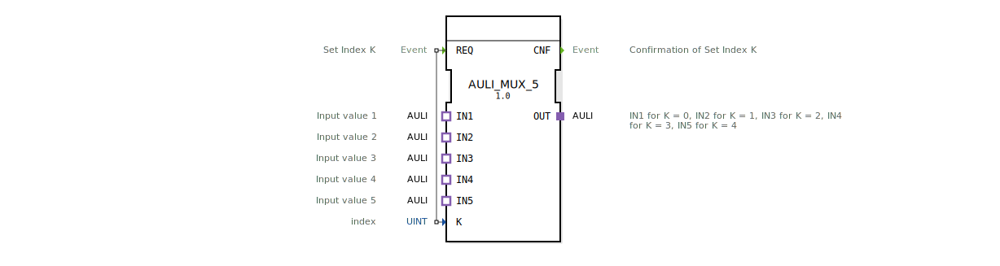

# AULI_MUX_5

* * * * * * * * * *
## Einleitung

Der Funktionsblock **AULI_MUX_5** ist ein generischer Multiplexer, der es ermöglicht, einen von fünf AULI-Adaptern (IN1 bis IN5) selektiv auf den Ausgangsadapter (OUT) durchzuschalten. Die Auswahl des aktiven Kanals erfolgt über den Eingangsparameter K (Index). Der Baustein wird durch ein Ereignis am Eingang REQ gesteuert und quittiert die Umschaltung mit einem Ereignis am Ausgang CNF.

Dieser Baustein wurde im Rahmen der Eclipse 4diac IDE als generischer Typ definiert und ist für den Einsatz in Automatisierungslösungen konzipiert, insbesondere im Kontext der HR Agrartechnik GmbH.

## Schnittstellenstruktur

### **Ereignis-Eingänge**

| Ereignis | Datentyp | Kommentar |
|----------|----------|-----------|
| REQ      | Event    | Set Index K – löst die Umschaltung des Multiplexers aus. |

### **Ereignis-Ausgänge**

| Ereignis | Datentyp | Kommentar |
|----------|----------|-----------|
| CNF      | Event    | Confirmation of Set Index K – quittiert die erfolgreiche Umschaltung. |

### **Daten-Eingänge**

| Variable | Datentyp | Kommentar |
|----------|----------|-----------|
| K        | UINT     | Index (0…4) zur Auswahl des aktiven Eingangsadapters (0 → IN1, 1 → IN2, …, 4 → IN5). |

### **Daten-Ausgänge**

Der Baustein besitzt keine expliziten Datenausgänge. Die Ausgangsdaten werden über den Adapter OUT bereitgestellt.

### **Adapter**

| Richtung | Name | Typ | Kommentar |
|----------|------|-----|-----------|
| Plug     | OUT  | adapter::types::unidirectional::AULI | Ausgangsadapter – liefert den Wert des über K ausgewählten Eingangs. |
| Socket   | IN1  | adapter::types::unidirectional::AULI | Eingangswert 1 (für K = 0) |
| Socket   | IN2  | adapter::types::unidirectional::AULI | Eingangswert 2 (für K = 1) |
| Socket   | IN3  | adapter::types::unidirectional::AULI | Eingangswert 3 (für K = 2) |
| Socket   | IN4  | adapter::types::unidirectional::AULI | Eingangswert 4 (für K = 3) |
| Socket   | IN5  | adapter::types::unidirectional::AULI | Eingangswert 5 (für K = 4) |

## Funktionsweise

Sobald ein Ereignis am Eingang **REQ** eintrifft, wird der aktuelle Wert von **K** ausgewertet. Der Baustein leitet den an dem zugehörigen Socket (IN1…IN5) anliegenden Adapter an den Ausgangsadapter **OUT** weiter. Anschließend wird das Ereignis **CNF** ausgegeben, um die erfolgreiche Durchführung zu signalisieren.

Die Zuordnung lautet:
- K = 0 → IN1
- K = 1 → IN2
- K = 2 → IN3
- K = 3 → IN4
- K = 4 → IN5

Werden andere Werte für K übergeben, ist das Verhalten nicht spezifiziert und sollte vermieden werden.

## Technische Besonderheiten

- **Generischer Baustein:** Der FB ist als generischer Typ (`GEN_AULI_MUX`) deklariert und kann in verschiedenen Ausprägungen mit unterschiedlicher Anzahl von Eingängen instanziiert werden.
- **Unidirektionale Adapter:** Alle verwendeten Adapter sind vom Typ `AULI` und unidirektional, d.h. die Daten fließen nur in eine Richtung (von den Eingängen zum Ausgang).
- **Kein interner Zustand:** Der Baustein ist zustandslos – er reagiert auf jedes REQ-Ereignis unabhängig von vorherigen Aufrufen.
- **Gültigkeitsbereich K:** Es wird erwartet, dass K im Bereich 0…4 liegt. Eine Prüfung auf andere Werte ist im Grundentwurf nicht vorgesehen.

## Zustandsübersicht

Da der Baustein keine interne Zustandsmaschine besitzt, beschreibt die einzige Zustandslogik den Ablauf eines einzelnen REQ-CNF-Zyklus:

1. **Idle:** Warten auf ein REQ-Ereignis.
2. **Processing:** Nach Eintreffen von REQ wird K ausgewertet und der entsprechende Eingang auf OUT geschaltet.
3. **Done:** Ausgabe von CNF – Rückkehr in den Idle-Zustand.

Eine detailliertere Zustandsmaschine ist nicht erforderlich, da der Baustein vollständig ereignisgesteuert und deterministisch arbeitet.

## Anwendungsszenarien

- **Sensorauswahl:** In einer Maschinensteuerung kann der Baustein verwendet werden, um zwischen verschiedenen Sensoren (z.B. fünf Temperaturfühler) umzuschalten und den aktuell relevanten Wert an eine Verarbeitungslogik weiterzugeben.
- **Signalrouting:** In Kommunikationssystemen dient der Multiplexer dazu, unterschiedliche Datenquellen (z.B. fünf Feldbusse) auf eine gemeinsame Schnittstelle zu legen.
- **Test- und Prüfstände:** Auswahl verschiedener Testsignale für eine Prüfeinrichtung.

## Vergleich mit ähnlichen Bausteinen

| Baustein | Anzahl Eingänge | Besonderheit |
|----------|----------------|--------------|
| AULI_MUX_2 | 2 | Einfacher 2-zu-1-Multiplexer |
| AULI_MUX_4 | 4 | 4-zu-1-Multiplexer |
| **AULI_MUX_5** | **5** | **Erweiterte Version für fünf Kanäle** |
| Standard-MUX (Daten) | beliebig (datenbasiert) | Arbeitet mit einfachen Datentypen statt Adaptern |

Der AULI_MUX_5 zeichnet sich durch die Verwendung von AULI-Adaptern aus, was eine saubere modulare Kapselung von Daten und Protokollen ermöglicht.

## Fazit

Der **AULI_MUX_5** ist ein flexibler und einfach einsetzbarer Funktionsblock zur Auswahl eines von fünf AULI-Signalen. Seine generische Definition erlaubt eine Wiederverwendung auch mit abweichender Eingangsanzahl. Die klare ereignisgesteuerte Schnittstelle und die Zustandslosigkeit machen ihn zu einem verlässlichen Baustein für modulare Automatisierungslösungen.

*Copyright (c) 2026 HR Agrartechnik GmbH – Veröffentlicht unter der Eclipse Public License 2.0.*