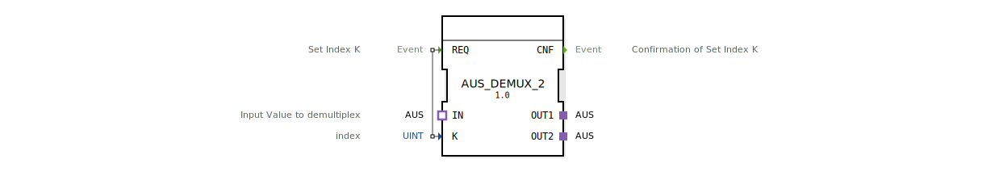

# AUS_DEMUX_2

* * * * * * * * * *

## Einleitung
Der Funktionsblock **AUS_DEMUX_2** ist ein generischer Demultiplexer für unidirektionale AUS‑Adapter. Er verteilt einen über den Socket `IN` empfangenen Wert wahlweise auf einen der beiden Ausgangsadapter `OUT1` oder `OUT2`. Die Auswahl erfolgt über den Index `K`, der durch ein REQ‑Event gesetzt wird. Der Baustein ist als generischer Typ (`GEN_AUS_DEMUX`) realisiert und kann für unterschiedliche AUS‑Datenstrukturen verwendet werden.

## Schnittstellenstruktur

### **Ereignis-Eingänge**
- **REQ**  
  Ereignis, das den Demultiplexvorgang auslöst. Der zugehörige Daten-Eingang `K` wird mit dem aktuellen Wert übernommen.

### **Ereignis-Ausgänge**
- **CNF**  
  Bestätigungssignal, das nach erfolgreicher Weiterleitung des Eingangswerts auf den ausgewählten Ausgang gesendet wird.

### **Daten-Eingänge**
- **K** (UINT)  
  Index zur Auswahl des Zielausgangs. Übliche Werte: `1` → `OUT1`, `2` → `OUT2`.

### **Daten-Ausgänge**
Keine direkten Datenausgänge – die Daten werden über Adapter weitergegeben.

### **Adapter**
- **IN** (Socket, Typ `AUS`)  
  Eingangsadapter, über den der zu demultiplexende Wert anliegt.
- **OUT1** (Plug, Typ `AUS`)  
  Erster Ausgangsadapter, der bei `K=1` den Wert von `IN` erhält.
- **OUT2** (Plug, Typ `AUS`)  
  Zweiter Ausgangsadapter, der bei `K=2` den Wert von `IN` erhält.

## Funktionsweise
1. Ein REQ‑Event wird empfangen.
2. Der aktuelle Wert des Daten-Eingangs `K` wird ausgewertet.
3. Der Wert des Socket‑Adapters `IN` wird auf den Plug‑Adapter kopiert, der dem Index `K` entspricht:
   - `K=1` → Wert wird auf `OUT1` gelegt.
   - `K=2` → Wert wird auf `OUT2` gelegt.
4. Nach Abschluss der Weiterleitung wird das CNF‑Event gesendet.

Falls `K` einen anderen Wert als `1` oder `2` annimmt, bleibt die Zuordnung ohne Effekt (kein Ausgang wird beschrieben) – das Verhalten ist dann implementierungsabhängig.

## Technische Besonderheiten
- **Generischer Baustein**  
  Das Attribut `GenericClassName` gibt den generischen Namen `'GEN_AUS_DEMUX'` vor. Damit kann der FB für verschiedene AUS‑Datentypen wiederverwendet werden, ohne die Schnittstelle anzupassen.
- **Emitter / Plug‑Adapter**  
  Die Ausgänge sind als Plugs definiert, sodass sie direkt mit entsprechenden Sockets verbunden werden können. Die Übertragung erfolgt unidirektional (nur vom FB zum angeschlossenen Socket).
- **Keine Zustandsmaschine**  
  Die XML enthält kein internes ECC; die Verarbeitung erfolgt ereignisgesteuert in einem Schritt.

## Zustandsübersicht
Der Baustein besitzt keinen expliziten Zustandsautomaten. Das Verhalten beschränkt sich auf die sofortige Reaktion auf ein REQ‑Event.

## Anwendungsszenarien
- **Sensor‑Datenverteilung:** Ein Messwert (z. B. von einem Drucksensor) soll wahlweise an eine Anzeige (`OUT1`) oder an eine Regelung (`OUT2`) weitergegeben werden.
- **Betriebsartenumschaltung:** Je nach gewähltem Modus (Index `K`) wird ein Signal an verschiedene Aktoren gelenkt.
- **Test‑/Produktions‑Routing:** In modularen Anlagen kann ein Prüfsignal entweder auf einen Testausgang oder auf den Produktionspfad geschaltet werden.

## Vergleich mit ähnlichen Bausteinen
- **MUX_BASIC** (Multiplexer) wählt aus mehreren Eingängen einen Ausgang – der AUS_DEMUX_2 macht das Gegenteil: ein Eingang wird auf mehrere Ausgänge verteilt.
- **AUS_DEMUX_N** (generisch für mehr als zwei Ausgänge) – dieser Baustein ist auf genau zwei Ausgänge beschränkt und dadurch einfacher und übersichtlicher.
- **EXTRACT** / **SELECT** – im Unterschied zu datenflussbasierten Bausteinen wird hier die Weiterleitung durch ein explizites Ereignis gesteuert.

## Fazit
Der **AUS_DEMUX_2** ist ein schlanker, generischer Demultiplexer für AUS‑Adapter, der sich durch seine klare Ereignisschnittstelle und die einfache Handhabung auszeichnet. Er eignet sich für alle Fälle, in denen ein einzelner Datenstrom ereignisgesteuert auf einen von zwei Zieladaptern umgeleitet werden muss. Die generische Auslegung erlaubt den Einsatz mit beliebigen AUS‑Datentypen – ideal für modulare und wiederverwendbare Automatisierungslösungen.