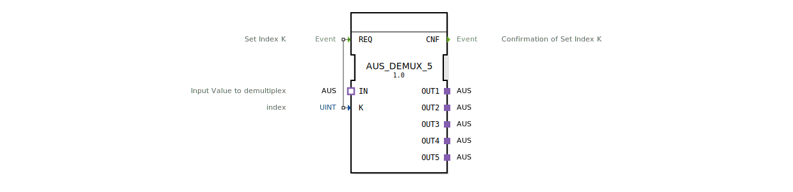

# AUS_DEMUX_5

* * * * * * * * * *

## Einleitung
Der Funktionsblock **AUS_DEMUX_5** ist ein generischer AUS-Demultiplexer. Er verteilt ein an seinem Eingang anliegendes AUS-Signal (Adapterschnittstelle) wahlweise auf einen von fünf Ausgängen. Die Auswahl des aktiven Ausgangs erfolgt über einen Index, der durch ein Ereignis gesetzt wird. Der Baustein ist für den Einsatz in verteilten Automatisierungssystemen nach IEC 61499 konzipiert.

## Schnittstellenstruktur

### **Ereignis-Eingänge**
| Name | Typ | Kommentar |
|------|-----|-----------|
| REQ  | Event | Setzt den Index K und löst die Umschaltung aus |

### **Ereignis-Ausgänge**
| Name | Typ | Kommentar |
|------|-----|-----------|
| CNF  | Event | Bestätigung der erfolgten Umschaltung |

### **Daten-Eingänge**
| Name | Typ | Kommentar |
|------|-----|-----------|
| K    | UINT | Index des zu aktivierenden Ausgangs (1..5) |

### **Daten-Ausgänge**
Keine Datenausgänge definiert.

### **Adapter**
| Rolle | Name | Typ | Kommentar |
|-------|------|-----|-----------|
| Socket (Eingang) | IN | adapter::types::unidirectional::AUS | Eingangssignal, das demultiplext werden soll |
| Plug (Ausgang)   | OUT1 | adapter::types::unidirectional::AUS | Erster Ausgang |
| Plug (Ausgang)   | OUT2 | adapter::types::unidirectional::AUS | Zweiter Ausgang |
| Plug (Ausgang)   | OUT3 | adapter::types::unidirectional::AUS | Dritter Ausgang |
| Plug (Ausgang)   | OUT4 | adapter::types::unidirectional::AUS | Vierter Ausgang |
| Plug (Ausgang)   | OUT5 | adapter::types::unidirectional::AUS | Fünfter Ausgang |

## Funktionsweise
Der Baustein arbeitet rein ereignisgesteuert. Bei jedem **REQ**-Ereignis wird der Wert des Daten-Eingangs **K** ausgelesen. Abhängig von diesem Index (1–5) wird das am Adapter-Socket **IN** anliegende AUS-Signal auf den entsprechenden Plug (OUT1 bis OUT5) durchgeschaltet. Nach erfolgreicher Umschaltung wird das Ereignis **CNF** ausgegeben. Der FB besitzt keine eigene Zustandsmaschine; die Logik wird zur Laufzeit durch die Adapterverbindungen und die Ereignisverarbeitung realisiert.

## Technische Besonderheiten
- **Generischer Typ**: Der FB ist als generischer Funktionsblock definiert (`GEN_AUS_DEMUX`) und kann daher mit verschiedenen AUS-Adaptern verwendet werden, solange die Schnittstelle kompatibel ist.
- **Unidirektionale Adapter**: Sowohl der Eingang (Socket) als auch die Ausgänge (Plugs) nutzen den unidirektionalen AUS-Adatpertyp. Eine Rückkopplung vom Ausgang zum Eingang ist nicht vorgesehen.
- **Gültigkeitsbereich von K**: Es wird angenommen, dass der Index **K** im Bereich 1 bis 5 liegt. Ein ungültiger Wert (z.B. 0 oder >5) kann zu undefiniertem Verhalten führen – eine Plausibilitätsprüfung ist nicht implementiert.
- **Keine Datenausgänge**: Die eigentlichen Nutzdaten werden ausschließlich über die Adapter-Schnittstellen übertragen. Der FB selbst besitzt keine klassischen Datenausgangsvariablen.

## Zustandsübersicht
Der Funktionsblock besitzt **keine explizite Zustandsmaschine** (kein ECC). Die gesamte Logik wird ereignisgesteuert abgearbeitet: Ein REQ-Ereignis führt unmittelbar zur Aktualisierung der Ausgangsadapter und zur Ausgabe von CNF. Es gibt keine internen Zustände oder Verzögerungen.

## Anwendungsszenarien
- **Signalverteilung in der Automatisierung**: Ein Sensorwert (z.B. ein AUS-kodiertes Messsignal) soll je nach Betriebsmodus an verschiedene Aktoren oder nachgelagerte Funktionen weitergeleitet werden.
- **Multiplex/Demultiplex in Kommunikationsstrukturen**: In industriellen Netzwerken, in denen Datenströme über Adapterverbindungen geführt werden, kann dieser FB als Demultiplexer für eine 1-zu-5-Verteilung dienen.
- **Parametrierbare Weiterleitung**: Bei Maschinen mit mehreren parallelen Prozesslinien kann über einen Index (z.B. von einem übergeordneten Steuerungsrechner) festgelegt werden, welche Linie mit Daten versorgt wird.

## Vergleich mit ähnlichen Bausteinen
- **AUS_DEMUX_5 vs. AUS_DEMUX_2** (nicht dargestellt): Beide sind gleichermaßen aufgebaut, unterscheiden sich jedoch in der Anzahl der Ausgänge (5 vs. 2). Der generische Ansatz erlaubt es, durch Anpassung des Typs die Ausgangsanzahl zu variieren.
- **AUS_DEMUX_5 vs. konventioneller DEMUX mit Datenausgängen**: Während klassische Demultiplexer oft über skalare Datenausgänge verfügen, nutzt dieser FB Adapterschnittstellen. Das ermöglicht eine engere Kopplung an andere Adapter-basierte Bausteine und erleichtert die modulare Systemgestaltung.
- **AUS_DEMUX_5 vs. MUX-Bausteine**: Der AUS_DEMUX übernimmt die entgegengesetzte Funktion eines Multiplexers (z.B. AUS_MUX), der mehrere Eingänge auf einen Ausgang zusammenführt.

## Fazit
Der **AUS_DEMUX_5** ist ein spezialisierter, generischer Funktionsblock zur unidirektionalen Signalverteilung über Adapterschnittstellen. Seine klare, ereignisgesteuerte Logik und die Verwendung von bis zu fünf Ausgängen machen ihn zu einem nützlichen Werkzeug für die modulare und flexible Automatisierung nach IEC 61499. Durch den generischen Typ lässt er sich leicht an verschiedene Adaptervarianten anpassen, was die Wiederverwendbarkeit erhöht.