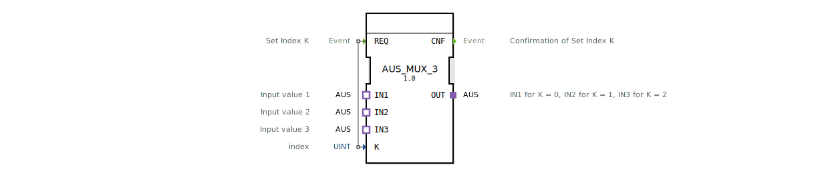

# AUS_MUX_3

* * * * * * * * * *

## Einleitung

Der Baustein **AUS_MUX_3** ist ein generischer Multiplexer für den unidirektionalen AUS-Adapter. Er wählt anhand eines Indexes `K` einen von drei gleichartigen Adapter-Eingängen (`IN1`, `IN2`, `IN3`) aus und leitet dessen Wert an den Adapter-Ausgang `OUT` weiter. Die Auswahl erfolgt ereignisgesteuert über das Ereignis `REQ`.

## Schnittstellenstruktur

### **Ereignis-Eingänge**

| Name | Typ | Kommentar |
|------|-----|-----------|
| `REQ` | Event | Set Index K – löst die Multiplexer-Auswahl aus |

### **Ereignis-Ausgänge**

| Name | Typ | Kommentar |
|------|-----|-----------|
| `CNF` | Event | Bestätigung der erfolgten Indexauswahl |

### **Daten-Eingänge**

| Name | Typ | Kommentar |
|------|-----|-----------|
| `K` | UINT | Index zur Auswahl des Eingangs (0, 1 oder 2) |

### **Daten-Ausgänge**

*Keine.*

### **Adapter**

| Rolle | Name | Typ | Kommentar |
|-------|------|-----|-----------|
| Plug | `OUT` | `adapter::types::unidirectional::AUS` | Ausgangsadapter, der den gewählten Eingang widerspiegelt |
| Socket | `IN1` | `adapter::types::unidirectional::AUS` | Erster Eingang – wird bei `K = 0` durchgeschaltet |
| Socket | `IN2` | `adapter::types::unidirectional::AUS` | Zweiter Eingang – wird bei `K = 1` durchgeschaltet |
| Socket | `IN3` | `adapter::types::unidirectional::AUS` | Dritter Eingang – wird bei `K = 2` durchgeschaltet |

## Funktionsweise

Der Baustein arbeitet ereignisgesteuert:

- Beim Eintreffen eines `REQ`-Ereignisses wird der aktuelle Wert des Daten-Eingangs `K` ausgelesen.
- Abhängig von `K` wird der entsprechende Adapter-Socket auf den Plug-Adapter `OUT` durchgeschaltet:
  - `K = 0` → `IN1` wird auf `OUT` gelegt.
  - `K = 1` → `IN2` wird auf `OUT` gelegt.
  - `K = 2` → `IN3` wird auf `OUT` gelegt.
- Nach erfolgreicher Umschaltung wird das Ereignis `CNF` ausgegeben.
- Werte von `K` außerhalb des Bereichs 0–2 führen zu keiner definierten Durchschaltung; das Verhalten ist dann implementationsabhängig (im Standard keine Fehlerbehandlung vorgesehen).

## Technische Besonderheiten

- Der Baustein ist als **generischer Funktionsbaustein** deklariert (`GenericClassName = 'GEN_AUS_MUX'`) und kann in der 4diac-IDE durch spezifischere Instanzen ersetzt werden.
- Alle Adapter-Ein- und Ausgänge verwenden den Typ `adapter::types::unidirectional::AUS`, der eine unidirektionale Datenweitergabe (z. B. für analoge oder digitale Werte) ermöglicht.
- Die Auswahl erfolgt **unmittelbar** bei jedem `REQ` – es gibt keine internen Speicher oder Zustandsmaschinen.

## Zustandsübersicht

Der Baustein besitzt **keine explizite Zustandsmaschine (ECC)**. Er verhält sich rein ereignisgesteuert und kombinatorisch: Der Ausgang `OUT` wird direkt durch den aktuellen Wert von `K` bestimmt, sobald ein `REQ` eintrifft. Ein einmal durchgeschalteter Eingang bleibt bis zum nächsten `REQ` erhalten.

## Anwendungsszenarien

- **Signalumschaltung**: Auswahl zwischen drei verschiedenen Sensoren (z. B. Temperatur, Druck, Feuchte) für eine Weiterverarbeitung.
- **Konfigurationsumschaltung**: Umschalten zwischen drei vorgegebenen Adapter-Parametern in Abhängigkeit einer Steuergröße.
- **Test- und Simulationsumgebungen**: Einblenden verschiedener Testsignale an einer gemeinsamen Schnittstelle.

## Vergleich mit ähnlichen Bausteinen

- **MUX_2 / MUX_4**: Diese Bausteine arbeiten meist mit zwei bzw. vier Eingängen und nutzen oft direkte Datenports statt Adaptern. AUS_MUX_3 ist speziell für den **AUS-Adapter-Typ** ausgelegt und bietet eine saubere adapterbasierte Kapselung der Signale.
- **SELECT / SWITCH**: Allgemeine Auswahlbausteine arbeiten typischerweise mit einfachen Datentypen; der AUS_MUX_3 hingegen überträgt gesamte Adapterverbindungen, was eine höhere Abstraktionsebene erlaubt.

## Fazit

Der **AUS_MUX_3** ist ein kompakter, generischer Baustein zur Adapter-Multiplexierung mit drei Eingängen. Dank seiner Ereignissteuerung und der Verwendung des unidirektionalen AUS-Adapters eignet er sich ideal für die flexible Signalauswahl in Automatisierungslösungen, bei denen unterschiedliche Datenquellen auf eine gemeinsame Senke geschaltet werden müssen. Die generische Auslegung erleichtert die Wiederverwendung und Anpassung in verschiedenen Projekten.