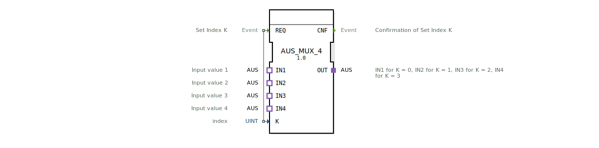

# AUS_MUX_4

* * * * * * * * * *

## Einleitung

Der AUS_MUX_4 ist ein generischer Funktionsblock (FB) nach IEC 61499, der als Multiplexer für vier AUS-Adapter-Signale dient. Über einen ganzzahligen Index K wird einer der vier Eingänge (IN1..IN4) auf den Ausgang (OUT) durchgeschaltet. Der Baustein eignet sich für modulare Steuerungsanwendungen, bei denen eine Signalauswahl ereignisgesteuert erfolgen soll.

## Schnittstellenstruktur

### **Ereignis-Eingänge**

| Ereignis | Beschreibung | Mit |
|----------|--------------|-----|
| **REQ** | Löst die Umschaltung aus; wertet den Index K aus. | K |

### **Ereignis-Ausgänge**

| Ereignis | Beschreibung |
|----------|--------------|
| **CNF** | Bestätigt die erfolgreiche Durchführung der Umschaltung. |

### **Daten-Eingänge**

| Variable | Typ | Beschreibung |
|----------|-----|--------------|
| **K** | UINT | Index zur Auswahl des Eingangs (Wertebereich 0..3). |

### **Daten-Ausgänge**

Der Baustein besitzt keine separaten Datenausgänge; die Ausgangsdaten werden über den Adapter-Plug **OUT** bereitgestellt.

### **Adapter**

| Richtung | Name | Typ | Beschreibung |
|----------|------|-----|--------------|
| Socket (Eingang) | **IN1** | adapter::types::unidirectional::AUS | Erster Eingang, aktiv bei K = 0 |
| Socket (Eingang) | **IN2** | adapter::types::unidirectional::AUS | Zweiter Eingang, aktiv bei K = 1 |
| Socket (Eingang) | **IN3** | adapter::types::unidirectional::AUS | Dritter Eingang, aktiv bei K = 2 |
| Socket (Eingang) | **IN4** | adapter::types::unidirectional::AUS | Vierter Eingang, aktiv bei K = 3 |
| Plug (Ausgang) | **OUT** | adapter::types::unidirectional::AUS | Ausgang, der den jeweils ausgewählten Eingang widerspiegelt |

## Funktionsweise

Sobald ein Ereignis am **REQ**-Eingang eintrifft, liest der FB den aktuellen Wert von **K** aus. Abhängig von **K** (0, 1, 2 oder 3) wird der entsprechende Adapter-Eingang (IN1..IN4) auf den Adapter-Ausgang **OUT** durchgeschaltet. Nach Abschluss der Umschaltung wird das **CNF**-Ereignis gesendet. Der Baustein arbeitet ereignisgesteuert und ohne interne Verzögerung; die Schaltung erfolgt direkt beim REQ-Ereignis.

## Technische Besonderheiten

- **Generischer Funktionsblock:** Der FB besitzt das Attribut `GenericClassName` mit dem Wert `'GEN_AUS_MUX'`, was eine spätere Typ-Parametrisierung oder -Spezialisierung ermöglicht.
- **Adapterbasiert:** Alle Ein- und Ausgänge verwenden den spezifischen Adaptertyp `AUS` (unidirektional). Dies fördert die Wiederverwendbarkeit und eine klare Schnittstellendefinition.
- **Standardkonform:** Implementiert nach IEC 61499-2.
- **Version 1.0,** freigegeben am 28.05.2026.

## Zustandsübersicht

Der Baustein ist als einfacher ereignisgesteuerter FB ohne explizite Zustandsmaschine realisiert (impliziter Basic-FB). Das Verhalten kann wie folgt abstrahiert werden:

- **IDLE:** Wartet auf ein REQ-Ereignis.
- **PROCESSING:** Nach Empfang von REQ wird der Index ausgewertet, die Verbindung hergestellt und sofort das CNF-Ereignis gesendet. Anschließend kehrt der FB in den IDLE-Zustand zurück.

Es gibt keine weiteren Zustände oder Verzögerungen.

## Anwendungsszenarien

- **Sensorauswahl:** Auswahl eines von vier analogen oder digitalen Sensoren in einer Maschinensteuerung.
- **Modusumschaltung:** Umschalten zwischen verschiedenen Betriebsarten (z. B. Automatik, Handbetrieb, Wartung) in der Agrartechnik.
- **Adapterbasierte Multiplexing:** Einsatz in modularen Steuerungssystemen, in denen AUS-Adapter als einheitliches Signalformat verwendet werden.

## Vergleich mit ähnlichen Bausteinen

- Gegenüber einem allgemeinen **MUX-Baustein** (z. B. für einfache boolesche oder numerische Typen) arbeitet der AUS_MUX_4 ausschließlich mit dem Adaptertyp **AUS**. Dies schränkt die Signalarten ein, bietet aber eine typsichere und modulare Schnittstelle.
- Ein **AUS_DEMUX** würde einen Eingang auf mehrere Ausgänge verteilen; der AUS_MUX_4 realisiert die umgekehrte Selektion.
- Andere Multiplexer mit mehr Kanälen (z. B. AUS_MUX_8) wären für größere Auswahlen geeignet, während dieser auf vier Kanäle spezialisiert ist.

## Fazit

Der AUS_MUX_4 ist ein spezialisierter, aber flexibler Multiplexer für die Auswahl eines von vier AUS-Signalen. Dank der Adapter-Schnittstelle und des generischen Ansatzes lässt er sich gut in modulare Automatisierungslösungen integrieren. Er eignet sich besonders für Anwendungen, die eine ereignisgesteuerte Signalselektion mit klar definierten Schnittstellen erfordern.