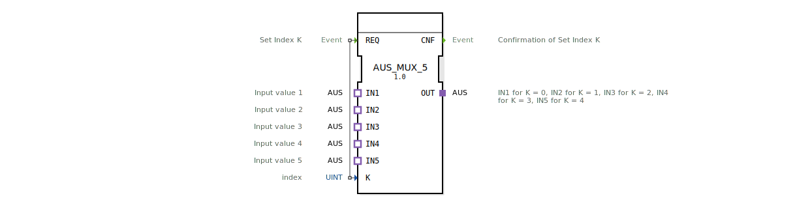

# AUS_MUX_5

* * * * * * * * * *
## Einleitung
Der Funktionsblock **AUS_MUX_5** ist ein generischer Multiplexer, der aus fünf AUS-Eingangssignalen (IN1 bis IN5) eines auswählt und an den AUS-Ausgang (OUT) weiterleitet. Die Auswahl erfolgt über einen ganzzahligen Index K (Wertebereich 0 bis 4). Der Baustein eignet sich für die dynamische Umschaltung von Ausgabewerten in Automatisierungssystemen.

## Schnittstellenstruktur
### **Ereignis-Eingänge**
| Name | Typ | Kommentar |
|------|-----|-----------|
| REQ  | Event | Setzt den Index K und löst die Multiplexer-Aktion aus. |

### **Ereignis-Ausgänge**
| Name | Typ | Kommentar |
|------|-----|-----------|
| CNF  | Event | Bestätigung, dass der Index übernommen und der entsprechende Eingang auf den Ausgang gelegt wurde. |

### **Daten-Eingänge**
| Name | Typ | Kommentar |
|------|-----|-----------|
| K    | UINT | Auswahlindex: 0 → IN1, 1 → IN2, 2 → IN3, 3 → IN4, 4 → IN5. |

### **Daten-Ausgänge**
*Keine Daten-Ausgänge vorhanden.*

### **Adapter**
| Name | Richtung | Typ | Kommentar |
|------|----------|-----|-----------|
| IN1  | Socket   | adapter::types::unidirectional::AUS | Erster Eingangswert (für K=0) |
| IN2  | Socket   | adapter::types::unidirectional::AUS | Zweiter Eingangswert (für K=1) |
| IN3  | Socket   | adapter::types::unidirectional::AUS | Dritter Eingangswert (für K=2) |
| IN4  | Socket   | adapter::types::unidirectional::AUS | Vierter Eingangswert (für K=3) |
| IN5  | Socket   | adapter::types::unidirectional::AUS | Fünfter Eingangswert (für K=4) |
| OUT  | Plug     | adapter::types::unidirectional::AUS | Ausgang, der den ausgewählten Eingang wiedergibt |

Die Adapter sind vom Typ `adapter::types::unidirectional::AUS`, einem unidirektionalen Adapter, der eine gerichtete Signalweitergabe ermöglicht.

## Funktionsweise
Ein ausgehendes Ereignis am **REQ**-Eingang bewirkt, dass der Baustein den aktuellen Wert des Daten-Eingangs **K** ausliest. Anschließend wird der entsprechende **AUS-Eingang** (IN1..IN5) auf den **OUT**-Adapter (Plug) durchgeschaltet. Sobald die Umschaltung erfolgt ist, wird ein Bestätigungsereignis am **CNF**-Ausgang gesendet. Die Auswahl erfolgt ohne interne Verzögerung und ist für jede neue REQ-Flanke gültig.

## Technische Besonderheiten
- **Generischer Baustein**: Der FB ist als generischer Typ (`GEN_AUS_MUX`) deklariert und kann durch entsprechende Attribute an spezifische Anwendungen angepasst werden.
- **Adapterbasierte Schnittstelle**: Die Ein- und Ausgänge sind als Adapter realisiert, was eine modulare Verdrahtung und Wiederverwendung in verschiedenen Kontexten erlaubt.
- **Unidirektionale Datenübertragung**: Die verwendeten AUS-Adapter sind unidirektional, d.h. sie übertragen Daten nur in eine Richtung (vom Socket zum Plug).
- **Fester Wertebereich**: Der Index K wird als `UINT` interpretiert; Werte größer als 4 führen zu undefiniertem Verhalten (im konkreten Anwendungsfall sinnvoll begrenzen).

## Zustandsübersicht
Der Baustein besitzt keine explizite Zustandsmaschine in der XML-Beschreibung. Das Verhalten ist rein ereignisgesteuert:
- Im Ruhezustand wartet der FB auf ein **REQ**-Ereignis.
- Nach Empfang von **REQ** wird sofort der Multiplex durchgeführt und **CNF** ausgegeben.

Es gibt keine internen Zustände oder Verzögerungen.

## Anwendungsszenarien
- **Auswahl von Analogwerten**: Mehrere Sensoren liefern Werte über AUS-Adapter, der Multiplexer wählt je nach Betriebsmodus den aktiven Sensor aus.
- **Parameterumschaltung**: In Steuerungsanwendungen kann zwischen verschiedenen Parametersätzen (z.B. Geschwindigkeitsprofilen) umgeschaltet werden.
- **Diagnose-Ausgabe**: Je nach Fehlercode wird ein spezifischer Diagnosewert auf den Ausgang gelegt.

## Vergleich mit ähnlichen Bausteinen
- **AUS_MUX_2**, **AUS_MUX_4**: Bausteine mit ähnlicher Funktionalität, aber geringerer Anzahl von Eingängen (2 bzw. 4). Der **AUS_MUX_5** deckt den erweiterten Bedarf für fünf Quellen ab.
- **AUS_MUX_N**: Ein generischer Multiplexer mit parametrisierbarer Kanalzahl – falls vorhanden, wäre dieser flexibler, jedoch ohne direkte Unterstützung für genau fünf Kanäle.

## Fazit
Der **AUS_MUX_5** bietet eine einfache und effiziente Möglichkeit, aus bis zu fünf AUS-Signalen eines auszuwählen. Dank seiner Adapter-Schnittstelle und generischen Struktur lässt er sich leicht in IEC 61499-basierte Steuerungssysteme integrieren. Er eignet sich besonders für Anwendungen, die eine dynamische und indexgesteuerte Signalumschaltung erfordern.