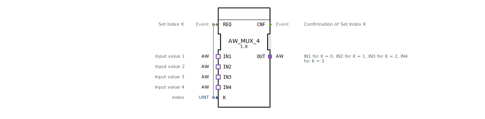

# AW_MUX_4

* * * * * * * * * *

## Einleitung

Der Baustein **AW_MUX_4** ist ein generischer Multiplexer (MUX) für den unidirektionalen Adaptertyp *AW*. Er ermöglicht die Auswahl eines von vier Adapter-Eingängen (IN1–IN4) und leitet dessen Daten an den Adapter-Ausgang (OUT) weiter. Die Auswahl erfolgesteuert durch eine Ereignis-gesteuerte Indexangabe. Der Baustein eignet sich besonders für Systeme, die eine flexible Umschaltung zwischen verschiedenen Signalen oder Datenquellen vom Typ *AW* benötigen.

## Schnittstellenstruktur

### **Ereignis-Eingänge**

| Ereignis | Typ | Beschreibung |
|----------|-----|--------------|
| `REQ`    | Event | Startet die Auswahl des angegebenen Index. Der aktuell an `K` anliegende Wert wird ausgewertet. |

### **Ereignis-Ausgänge**

| Ereignis | Typ | Beschreibung |
|----------|-----|--------------|
| `CNF`    | Event | Bestätigt die erfolgreiche Durchführung der Auswahl. |

### **Daten-Eingänge**

| Variable | Typ   | Beschreibung |
|----------|-------|--------------|
| `K`      | UINT | Index für den auszuwählenden Eingang (zulässige Werte: 0–3). |

### **Daten-Ausgänge**

Der Baustein besitzt keine eigenständigen Datenausgänge. Die Ausgabe erfolgt ausschließlich über den Adapter‑Ausgang.

### **Adapter**

| Richtung | Name | Typ | Beschreibung |
|----------|------|-----|--------------|
| Plug     | `OUT`  | `adapter::types::unidirectional::AW` | Ausgangskanal – enthält den Wert des ausgewählten Eingangs. |
| Socket   | `IN1`  | `adapter::types::unidirectional::AW` | Erster Eingang – wird bei `K = 0` durchgeschaltet. |
| Socket   | `IN2`  | `adapter::types::unidirectional::AW` | Zweiter Eingang – wird bei `K = 1` durchgeschaltet. |
| Socket   | `IN3`  | `adapter::types::unidirectional::AW` | Dritter Eingang – wird bei `K = 2` durchgeschaltet. |
| Socket   | `IN4`  | `adapter::types::unidirectional::AW` | Vierter Eingang – wird bei `K = 3` durchgeschaltet. |

## Funktionsweise

Wird das Ereignis `REQ` empfangen, löst der Baustein eine Auswahl aus: Anhand des aktuellen Werts des Dateneingangs `K` (Datentyp `UINT`) wird einer der vier Adapter‑Eingänge `IN1`…`IN4` ausgewählt und seine Daten auf den Adapter‑Ausgang `OUT` übertragen. Nachdem die Umschaltung erfolgt ist, wird das Ereignis `CNF` gesendet. Liegt `K` außerhalb des Bereichs 0…3, ist das Verhalten des Bausteins nicht spezifiziert – es sollte daher sichergestellt werden, dass nur gültige Indizes übergeben werden.

## Technische Besonderheiten

- **Generischer Baustein:** Der FB ist als generischer Typ (`GEN_AW_MUX`) deklariert, was die Verwendung in unterschiedlichen Kontexten desselben Adapterschemas erlaubt.
- **Unidirektionale Adapter:** Der verwendete Adaptertyp `adapter::types::unidirectional::AW` ist unidirektional ausgelegt; Daten fließen nur vom Socket zum Plug.
- **Lizenzierung:** Der Baustein wird unter der Eclipse Public License 2.0 bereitgestellt (SPDX-Lizenzkennung: EPL‑2.0).
- **Typ-Hash:** Zur Identifikation der exakten Implementierung ist ein `TypeHash`‑Attribut vorgesehen.

## Zustandsübersicht

Der Baustein besitzt eine einfache, ereignisgesteuerte Zustandslogik:

1. **Initial / Idle:** Warten auf das Ereignis `REQ`.
2. **Auswahl:** Beim Eintreffen von `REQ` wird der Index `K` gelesen und die entsprechende Verbindung zwischen einem der vier Eingänge und dem Ausgang hergestellt.
3. **Bestätigung:** Nach erfolgreicher Umschaltung wird das Ereignis `CNF` gesendet. Der Baustein kehrt in den Idle‑Zustand zurück.

Eine parallel laufende Zustandsmaschine innerhalb des FB ist nicht explizit modelliert – die Abfolge ist implizit durch die Ereignissteuerung gegeben.

## Anwendungsszenarien

- **Auswahl von Sensordaten:** In einer Maschinensteuerung stehen vier AW‑Sensoren zur Verfügung. Über einen Index (z.B. über eine HMI oder einen Programm‑Zähler) wird der gewünschte Sensor ausgewählt und dessen Wert an die weitere Verarbeitung (OUT) durchgereicht.
- **Betriebsartenumschaltung:** Vier verschiedene Betriebsmodi sind über AW‑Adapter realisiert – der Multiplexer schaltet dynamisch zwischen den Modi um.
- **Test‑ und Simulationsumgebungen:** In Kombination mit virtuellen AW‑Adapter‑Quellen können verschiedene Signale simuliert und über den Index umgeschaltet werden.

## Vergleich mit ähnlichen Bausteinen

Standard‑IEC‑61499‑MUX‑Bausteine arbeiten in der Regel mit reinen Datentypen (z.B. `ANY`) und haben separate Daten‑Ein‑ und Ausgänge. Der **AW_MUX_4** hingegen kapselt die Daten in einem spezifischen Adaptertyp (`AW`). Dies erlaubt eine einfachere Verdrahtung und typsichere Kopplung innerhalb einer AW‑basierten Adapterlandschaft. Nachteilig ist die Abhängigkeit von diesem speziellen Adapter, was die Wiederverwendbarkeit in Umgebungen ohne AW‑Typen einschränkt.

## Fazit

Der `AW_MUX_4` ist ein kompakter, generischer Multiplexer für AW‑Adapter. Er bietet eine klare, ereignisgesteuerte Auswahl zwischen vier Eingängen und gibt das ausgewählte Signal über einen einzigen Ausgang weiter. Die Einfachheit der Schnittstelle und die EPL‑Lizenzierung machen ihn zu einem praktischen Werkzeug in AW‑Adapter‑basierten Steuerungsanwendungen, bei denen eine flexible Signalumschaltung erforderlich ist.