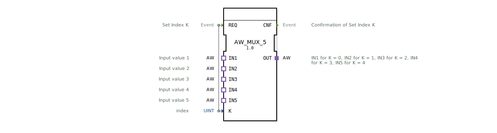

# AW_MUX_5

* * * * * * * * * *
## Einleitung
Der AW_MUX_5 ist ein generischer Multiplexer-Funktionsblock, der auf Basis eines ganzzahligen Indexes (K) einen von fünf unidirektionalen Adaptereingängen (IN1–IN5) auf einen gemeinsamen Adapterausgang (OUT) durchschaltet. Er dient der flexiblen Quellenauswahl in Automatisierungslösungen, bei denen Signale über Adapter anstelle von direkten Datenports transportiert werden.

## Schnittstellenstruktur
### **Ereignis-Eingänge**
| Name | Typ | Kommentar |
|------|-----|-----------|
| REQ  | Event | Setzt den Index K und löst die Umschaltung aus (verbunden mit K) |

### **Ereignis-Ausgänge**
| Name | Typ | Kommentar |
|------|-----|-----------|
| CNF  | Event | Bestätigt die erfolgreiche Umschaltung auf den gewählten Eingang |

### **Daten-Eingänge**
| Name | Typ | Kommentar |
|------|-----|-----------|
| K    | UINT | Auswahlindex (Wertebereich 0–4) |

### **Daten-Ausgänge**
Keine Datenausgänge vorhanden.

### **Adapter**
**Plug (Ausgang):**
- **OUT** – Typ: `AW` (unidirektionaler Adapter)  
  Liefert den Wert des durch K ausgewählten Eingangs.

**Sockets (Eingänge):**
| Name | Typ | Kommentar |
|------|-----|-----------|
| IN1  | AW  | Eingangswert für K = 0 |
| IN2  | AW  | Eingangswert für K = 1 |
| IN3  | AW  | Eingangswert für K = 2 |
| IN4  | AW  | Eingangswert für K = 3 |
| IN5  | AW  | Eingangswert für K = 4 |

## Funktionsweise
Der Funktionsblock arbeitet ereignisgesteuert:
1. Ein Ereignis am Eingang **REQ** triggert die Verarbeitung.
2. Der aktuelle Wert des Index **K** wird ausgewertet.
3. Je nach K (0–4) wird der entsprechende Adaptersocket (IN1–IN5) auf den Adapterplug **OUT** durchgeschaltet.
4. Nach erfolgreicher Umschaltung wird das Ereignis **CNF** ausgegeben.

Bei einem Index außerhalb des gültigen Bereichs (z. B. K > 4) bleibt der Ausgang unverändert oder nimmt einen undefinierten Zustand an; die Spezifikation des FB liefert hierzu keine Vorgabe.

## Technische Besonderheiten
- **Generischer Typ:** Der FB ist als generischer Funktionsblock deklariert (`GenericClassName = 'GEN_AW_MUX'`), d. h. er kann in verschiedenen Adaptionen wiederverwendet werden.
- **Reine Adapter-Schnittstelle:** Es werden keine direkten Datenports (außer K) verwendet. Alle Signale werden über unidirektionale Adapter des Typs `AW` übergeben.
- **Einfaches Index-Mapping:** Feste Zuordnung K=0→IN1 bis K=4→IN5.
- **Ereignisgesteuert:** Die Umschaltung erfolgt nur bei einem REQ-Ereignis, nicht kontinuierlich.

## Zustandsübersicht
Der FB besitzt keine expliziten Zustände in der XML-Definition. Das implizite Verhalten lässt sich wie folgt beschreiben:

| Zustand | Beschreibung |
|---------|--------------|
| IDLE | Warten auf ein REQ-Ereignis |
| SELECT | Auswerten von K und Durchschalten des entsprechenden Eingangs |
| DONE | Senden von CNF, Rückkehr zu IDLE |

Diese Zustände sind rein internal und vom Anwender nicht direkt steuerbar.

## Anwendungsszenarien
- **Signalquellenumschaltung:** In einer Steuerung kann zwischen fünf verschiedenen Sensoren (z. B. Temperatur, Druck, Füllstand) gewählt werden, die über Adapter angebunden sind.
- **Test- und Simulationsaufgaben:** Umschalten zwischen realen und simulierten Datenquellen.
- **Betriebsartwahl:** Ein- und Ausgangskonfiguration in Abhängigkeit von einer Betriebsartkennzahl (Index).
- **Adapterbasierte Multiplexer:** Universell einsetzbar, wo anstelle von Standard-Datentypen Adapter verwendet werden (z. B. in objektorientierten IEC-61499-Komponenten).

## Vergleich mit ähnlichen Bausteinen
- **Standard-MUX in IEC 61499:** Ein herkömmlicher MUX verwendet direkte Datenports (z. B. ANY‑Typ) und einen Index. Der AW_MUX_5 ist speziell für den unidirektionalen Adapter `AW` ausgelegt, was eine stärkere Kapselung der Datenstruktur ermöglicht.
- **Mehrkanalige Umschalter (z. B. MUX_2, MUX_4):** Diese bieten eine kleinere Anzahl von Eingängen. Der AW_MUX_5 deckt mit fünf Eingängen einen mittleren Bedarf ab.
- **Generische Multiplexer:** Einige Implementierungen erlauben eine variable Anzahl von Eingängen über Parameter. Der AW_MUX_5 ist hingegen auf genau fünf festgelegt, bietet aber den Vorteil der klaren Adapter‑Schnittstelle.

## Fazit
Der AW_MUX_5 ist ein kompakter, ereignisgesteuerter Multiplexer-Funktionsblock für unidirektionale Adapter vom Typ `AW`. Er ermöglicht die einfache Auswahl einer von fünf Signalquellen und eignet sich besonders für modulare, adapterbasierte Steuerungsarchitekturen. Die klare Index-Zuordnung, die generische Auslegung und die Integration als EPL-2.0‑Lizenz machen ihn zu einem nützlichen Baustein in der 4diac‑IDE‑Umgebung.