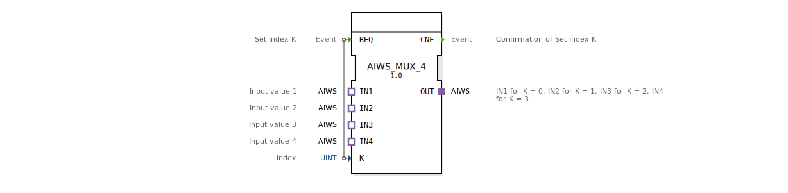

# AIWS_MUX_4

* * * * * * * * * *

## Einleitung
Der Baustein **AIWS_MUX_4** ist ein Multiplexer für vier unidirektionale AIWS‑Adapter. Er wählt anhand eines Indexwerts **K** einen der vier Eingänge (IN1 bis IN4) aus und leitet dessen Daten an den Ausgang **OUT** weiter. Die Realisierung erfolgt als generischer Funktionsblock (Generic FB) auf Basis der IEC 61499‑Norm.

## Schnittstellenstruktur

### **Ereignis-Eingänge**
| Ereignis | Beschreibung |
|----------|--------------|
| **REQ**  | Startet die Umschaltung. Der Wert von **K** wird ausgelesen und der entsprechende Eingang auf den Ausgang geschaltet. |

### **Ereignis-Ausgänge**
| Ereignis | Beschreibung |
|----------|--------------|
| **CNF**  | Quittierung: Die Umschaltung wurde durchgeführt. |

### **Daten-Eingänge**
| Variable | Typ   | Beschreibung |
|----------|-------|--------------|
| **K**    | UINT  | Index des auszuwählenden Eingangs (Wertebereich 0 … 3). |

### **Daten-Ausgänge**
Keine.

### **Adapter**
| Name | Typ                                           | Richtung | Beschreibung |
|------|-----------------------------------------------|----------|--------------|
| IN1  | adapter::types::unidirectional::AIWS          | Socket   | Erster Eingang (K = 0). |
| IN2  | adapter::types::unidirectional::AIWS          | Socket   | Zweiter Eingang (K = 1). |
| IN3  | adapter::types::unidirectional::AIWS          | Socket   | Dritter Eingang (K = 2). |
| IN4  | adapter::types::unidirectional::AIWS          | Socket   | Vierter Eingang (K = 3). |
| OUT  | adapter::types::unidirectional::AIWS          | Plug     | Ausgang (übernimmt die Daten des selektierten Eingangs). |

## Funktionsweise
1. Ein Ereignis **REQ** wird empfangen.
2. Der aktuelle Wert von **K** wird ausgewertet.
3. Je nach Wert (0, 1, 2 oder 3) wird der jeweilige Socket (IN1 … IN4) durchgeschaltet und seine Daten an den Plug **OUT** weitergeleitet.
4. Nach erfolgreicher Umschaltung wird das Ereignis **CNF** ausgegeben.

Die Auswahl erfolgt ohne zusätzliche Zwischenspeicherung; die Daten werden **transparent** vom gewählten Eingang auf den Ausgang kopiert.

## Technische Besonderheiten
- Der Baustein ist als **Generic FB** gekennzeichnet (Attribut `GenericClassName` = `'GEN_AIWS_MUX'`), was eine spätere Typ‑Spezialisierung oder Wiederverwendung erlaubt.
- Die Verbindung zu den Eingängen und zum Ausgang erfolgt ausschließlich über **unidirektionale Adapter** (Typ `AIWS`), was eine saubere Trennung von Daten‑ und Steuerfluss ermöglicht.
- Es werden keine Datenschnittstellen jenseits des Index **K** benötigt – die gesamte Informationsübertragung läuft über die Adapter‑Schnittstellen.

## Zustandsübersicht
Der Baustein besitzt **keine expliziten Zustände**, da er als reiner Funktionsblock ohne Zustandsmaschine (ECC) implementiert ist. Die Reaktion auf **REQ** erfolgt streng deterministisch: nach der Ereignisverarbeitung wird sofort **CNF** gesendet.

## Anwendungsszenarien
- **Auswahl eines Sensorsignals** aus mehreren AIWS‑kompatiblen Quellen (z. B. Temperatur‑, Druck‑ oder Füllstandssensoren).
- **Umschaltung zwischen redundanten Messwerten** in sicherheitskritischen Steuerungen.
- **Multiplexen von Messdaten** in einem zentralen Datenstrom für die Weiterverarbeitung oder Visualisierung.

## Vergleich mit ähnlichen Bausteinen
Der **AIWS_MUX_4** ist speziell auf den unidirektionalen AIWS‑Adaptertyp zugeschnitten. Ein allgemeiner Multiplexer für andere Adaptertypen (z. B. für Byte‑ oder Bool‑Daten) unterscheidet sich in der Schnittstellendefinition, während die grundlegende Logik (Index basierte Auswahl) identisch ist. Durch die generische Auslegung kann der Baustein leicht an andere Adapter‑Typen angepasst werden.

## Fazit
Der **AIWS_MUX_4** ist ein kompakter, generischer Multiplexer für vier unidirektionale AIWS‑Adapter. Er bietet eine einfache, ereignisgesteuerte Umschaltung mit klarem Schnittstellenkonzept und eignet sich besonders für Anwendungen, in denen mehrere AIWS‑Quellen selektiv an einen gemeinsamen Ausgang gelegt werden müssen.