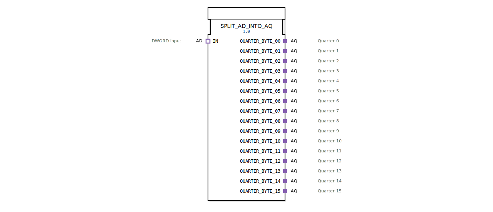

# SPLIT_AD_INTO_AQ

* * * * * * * * * *
## Einleitung
Der Funktionsbaustein `SPLIT_AD_INTO_AQ` zerlegt einen eingehenden AD-Adapter (DWORD) in 16 einzelne AQ-Adapter (QUARTER). Er dient als Schnittstelle, um einen breiten Datenwert (32 Bit) in seine 2-Bit-Quarter-Bestandteile aufzuteilen und diese an separate Ausgabe-Adapter weiterzuleiten. Der Baustein ist als Composite-FB realisiert und nutzt intern einen `SPLIT_DWORD_INTO_QUARTERS`-Baustein sowie 16 Flip-Flops (`E_D_FF_ANY`) zur synchronen Weitergabe.

## Schnittstellenstruktur
### **Ereignis-Eingänge**
Der FB besitzt keine eigenständigen Ereignis-Eingänge. Das Ereignis wird über die Adapter-Schnittstelle `IN.E1` empfangen und intern weiterverarbeitet.

### **Ereignis-Ausgänge**
Der FB besitzt keine eigenständigen Ereignis-Ausgänge. Die Ereignisausgabe erfolgt über die AQ-Adapter-Plugs (jeweils über `QUARTER_BYTE_xx.E1`).

### **Daten-Eingänge**
Der FB besitzt keine eigenständigen Daten-Eingänge. Die Daten werden über die Adapter-Schnittstelle `IN.D1` bereitgestellt.

### **Daten-Ausgänge**
Der FB besitzt keine eigenständigen Daten-Ausgänge. Die aufgeteilten Daten werden über die AQ-Adapter-Plugs (jeweils über `QUARTER_BYTE_xx.D1`) ausgegeben.

### **Adapter**
| Name | Typ | Richtung | Beschreibung |
|------|-----|----------|--------------|
| `IN` | `adapter::types::unidirectional::AD` | Socket (Eingang) | DWORD-Eingangsadapter (32 Bit). Über `E1` und `D1` werden Ereignis und Daten empfangen. |
| `QUARTER_BYTE_00` bis `QUARTER_BYTE_15` | `adapter::types::unidirectional::AQ` | Plug (Ausgang) | 16 Ausgangsadapter, die jeweils ein Quarter (2 Bit) des ursprünglichen DWORDs bereitstellen. Jeder Adapter besitzt einen Ereignisausgang `E1` und einen Datenausgang `D1`. |

## Funktionsweise
Der Baustein arbeitet rein intern auf Basis eines Composite-Netzwerks. Sobald über den `IN`-Adapter ein Ereignis (`E1`) eintrifft, wird dieses an den internen Baustein `SPLIT_DWORD_INTO_QUARTERS` weitergeleitet. Dieser zerlegt den angelegten DWORD-Wert (`IN.D1`) in 16 separate Quarter-Bytes (jeweils 2 Bit).

Nach Abschluss der Zerteilung signalisiert `SPLIT_DWORD_INTO_QUARTERS.CNF` einen Taktimpuls, der gleichzeitig an alle 16 Flip-Flops (`E_D_FF_ANY_00` bis `E_D_FF_ANY_15`) geschickt wird. Die Flip-Flops übernehmen sodann die jeweiligen Quarter-Daten an ihrem Dateneingang (von `SPLIT_DWORD_INTO_QUARTERS.QUARTER_BYTE_xx`) und geben diese an ihrem Ausgang `Q` aus. Gleichzeitig feuern sie ein Ereignis an ihrem Ausgangsanschluss `EO`, welches an den entsprechenden AQ-Adapter-Plug (`QUARTER_BYTE_xx.E1`) weitergeleitet wird. Dadurch wird der ausgegebene Datenwert (`Q`) über den Adapter-Datenpfad (`D1`) zum Zielbaustein transportiert.

Die Verarbeitung erfolgt streng synchron: alle 16 Quarter-Werte werden im selben Takt aktualisiert.

## Technische Besonderheiten
- **Composite-Architektur**: Der FB nutzt andere Bausteine (`SPLIT_DWORD_INTO_QUARTERS` und `E_D_FF_ANY`) zur Realisierung der Zerlegung und Synchronisation.
- **Keine eigenständigen Ein-/Ausgänge**: Die gesamte Kommunikation erfolgt ausschließlich über Adapter. Dies ermöglicht eine saubere Kapselung und Wiederverwendung in adapterbasierten Architekturen.
- **Synchronisation**: Alle 16 AQ-Ausgänge werden durch einen gemeinsamen Takt (vom `SPLIT_DWORD_INTO_QUARTERS.CNF`) gleichzeitig aktualisiert. Somit ist gewährleistet, dass die aufgeteilten Daten konsistent zum gleichen Zeitpunkt anliegen.
- **Skalierbarkeit**: Der FB ist auf 16 Quarter (entsprechend 32 Bit) ausgelegt. Eine Anpassung auf andere Bitbreiten wäre durch Änderung der internen Struktur möglich.

## Zustandsübersicht
Als Composite-FB besitzt `SPLIT_AD_INTO_AQ` keinen eigenen Zustandsautomaten. Die interne Datenverarbeitung ist bestimmt durch:
- **Warten auf Ereignis**: Im Leerlauf wird kein internes Ereignis erzeugt.
- **Verarbeitung**: Beim Eintreffen von `IN.E1` werden Split und Aktualisierung der Flip-Flops durchgeführt.
- **Ausgabe**: Unmittelbar nach dem Takt liegen alle AQ-Ausgänge an.

## Anwendungsszenarien
- **Datenaufteilung in Steuerungssystemen**: Wenn ein Sensor oder ein Kommunikationsmodul ein 32-Bit-Datenwort (z.B. Encoder-Position, Messwert) liefert, das auf 16 separate 2-Bit-Signale (z.B. Helligkeitssensoren, Schaltzustände) aufgeteilt werden muss.
- **Adapter-basierte Kommunikation**: Einsatz in der 4diac-IDE, wenn Adapter nach IEC 61499 genutzt werden, um Daten zwischen verschiedenen Komponenten zu verteilen.
- **Parallelverarbeitung von Teilinformationen**: Zerlegung eines DWORDs für nachgelagerte Bausteine, die jeweils nur 2 Bit des Originals benötigen.

## Vergleich mit ähnlichen Bausteinen
| Baustein | Beschreibung | Unterschied zu `SPLIT_AD_INTO_AQ` |
|----------|--------------|-----------------------------------|
| `SPLIT_DWORD_INTO_QUARTERS` | Zerlegt einen DWORD in 16 Quarter-Werte und gibt diese als direkte Datenausgänge aus. | `SPLIT_AD_INTO_AQ` kapselt diese Zerlegung zusätzlich in Adapter-Schnittstellen und fügt eine Flip-Flop-Synchronisation hinzu. |
| `SPLIT_INT_INTO_BITS` | Teilt ein Integer in einzelne Bits auf. | Arbeitet auf Bit-Ebene und nicht auf 2-Bit-Quarters; Ausgabe erfolgt typischerweise als boolesche Werte. |
| Manuelle Aufteilung mit `MUX` oder `DEMUX` | Könnte verwendet werden, um eine Datenaufteilung ohne Adapter zu realisieren. | `SPLIT_AD_INTO_AQ` ist speziell für die Adapter-Kommunikation optimiert und bietet eine gebündelte, synchronisierte Lösung. |

## Fazit
`SPLIT_AD_INTO_AQ` ist ein nützlicher Baustein zur Aufteilung eines DWORDs (AD-Adapter) in 16 2-Bit-Quarter-Adapter (AQ). Seine composite Architektur mit interner Synchronisation sorgt für eine konsistente Datenweitergabe und erleichtert die modulare, adapterbasierte Programmierung in der 4diac-IDE. Besonders geeignet ist er für Anwendungen, die eine parallele Verarbeitung von Teilinformationen erfordern, ohne dass die Details der Aufteilung im übergeordneten Netzwerk sichtbar werden müssen.