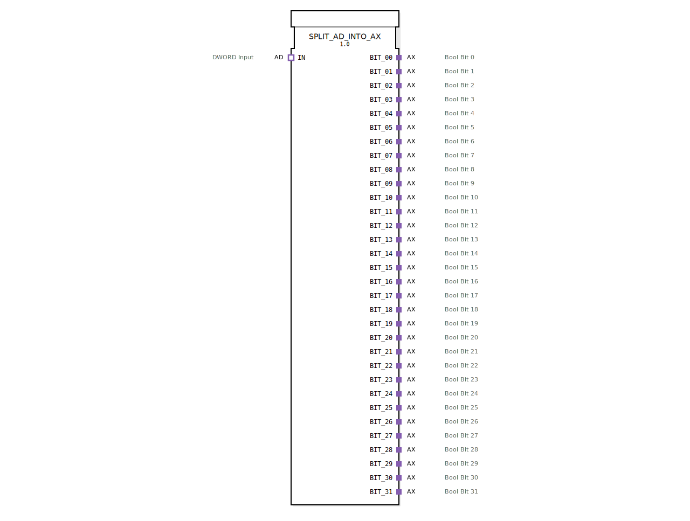

# SPLIT_AD_INTO_AX

* * * * * * * * * *
## Einleitung
Der Funktionsblock SPLIT_AD_INTO_AX dient dazu, ein über einen AD-Adapter (DWORD) eingehendes 32‑Bit‑Datenwort in 32 separate AX‑Adapter (BOOL) aufzutrennen. Jeder AX‑Adapter repräsentiert dabei ein einzelnes Bit des ursprünglichen DWORD‑Wertes. Der Baustein kapselt die erforderliche Ereignissteuerung und Datenspeicherung in einem modularen, einfach nutzbaren Funktionsblock.

## Schnittstellenstruktur
### **Ereignis-Eingänge**
Keine. Die Ereignissteuerung erfolgt indirekt über den Adapter‑Socket.

### **Ereignis-Ausgänge**
Keine. Die Ausgabe erfolgt über die Adapter‑Plugs, deren internes Ereignisverhalten durch die verwendeten Typen (AX) definiert wird.

### **Daten-Eingänge**
| Bezeichnung | Typ   | Kommentar              |
|-------------|-------|------------------------|
| IN          | AD    | DWORD Input (32 Bit)   |

Die Daten werden über den Adapter‑Socket IN empfangen. Der AD‑Adapter stellt einen DWORD‑Wert sowie ein zugehöriges Ereignis (E1) bereit.

### **Daten-Ausgänge**
| Bezeichnung | Typ   | Kommentar           |
|-------------|-------|---------------------|
| BIT_00      | AX    | Bool Bit 0          |
| BIT_01      | AX    | Bool Bit 1          |
| …           | …     | …                   |
| BIT_31      | AX    | Bool Bit 31         |

Alle 32 Ausgangsadapter sind vom Typ AX (unidirektionaler BOOL‑Adapter). Jeder Ausgang gibt den Zustand des entsprechenden Bits des eingehenden DWORD aus.

### **Adapter**
- **Socket**: `IN` (Typ `adapter::types::unidirectional::AD`) – dient dem Empfang des DWORD‑Werts und des zugehörigen Ereignisses.
- **Plugs**: 32 Adapter `BIT_00` … `BIT_31` (Typ `adapter::types::unidirectional::AX`) – stellen die einzelnen Bits als boolesche Signale an die verbundene Logik bereit.

## Funktionsweise
Der interne Ablauf des FBs gliedert sich in zwei Schritte:

1. **Aufteilung des DWORD in Bool‑Werte**  
   Ein interner FB `SPLIT_DWORD_INTO_BOOLS` empfängt den DWORD über die Datenverbindung `IN.D1`. Er teilt die 32 Bit in einzelne boolesche Signale (`BIT_00` … `BIT_31`) auf.

2. **Synchronisation und Speicherung**  
   Das Ereignis `IN.E1` triggert den Eingang `REQ` des Splitters. Nach vollständiger Verarbeitung sendet dieser das Bestätigungsereignis `CNF`. Dieses Ereignis wird an die Takteingänge (CLK) von 32 Flip‑Flops (Typ `E_D_FF`) weitergeleitet. Die Flip‑Flops übernehmen gleichzeitig die von `SPLIT_DWORD_INTO_BOOLS` bereitgestellten Bool‑Werte auf ihren Dateneingängen `D`.  
   Die Ausgänge `Q` der Flip‑Flops sind fest mit den Daten‑Eingängen `D1` der zugehörigen AX‑Adapter verbunden, sodass die gespeicherten Bitwerte unmittelbar an die Ausgangsadapter weitergegeben werden.

Somit wird nach jedem Ereignis am Eingangsadapter der gesamte 32‑Bit‑Wert parallel auf die 32 Ausgangsadapter übertragen und dort bis zum nächsten Ereignis gehalten.

## Technische Besonderheiten
- **Parallele Verarbeitung**: Alle 32 Bits werden gleichzeitig durch die Flip‑Flops übernommen, was eine konsistente Momentaufnahme des DWORD gewährleistet.
- **Modularer Aufbau**: Der FB nutzt vorhandene Standardbausteine (`SPLIT_DWORD_INTO_BOOLS` und `E_D_FF`), was Wartbarkeit und Wiederverwendung erleichtert.
- **Adapterbasierte Kommunikation**: Die gesamte Ein‑ und Ausgabe erfolgt über Adapter, sodass der FB nahtlos in adapterbasierte Anwendungen integriert werden kann.
- **Keine externen Ereignisse**: Der FB besitzt keine eigenen Ereignis‑Ein‑/Ausgänge, da die Ereignissteuerung vollständig über die Adapter abgewickelt wird.

## Zustandsübersicht
Der FB selbst ist zustandslos – seine Funktionalität wird durch die inneren Flip‑Flops realisiert. Jeder `E_D_FF` besitzt einen internen Speicherzustand (0 oder 1), der durch das Taktereignis aktualisiert wird. Nach dem Start befinden sich alle Flip‑Flops im initialen Zustand (0), bis das erste Ereignis am Eingang eintrifft.

## Anwendungsszenarien
- **Digitale Signalverarbeitung**: Zerlegung eines 32‑Bit‑Datenworts in einzelne boolesche Steuersignale, z. B. für Status‑ oder Freigabebits.
- **Schnittstellenanpassung**: Verbindung einer DWORD‑Quelle (z. B. Bussystem, Register) mit diskreten digitalen Ein‑/Ausgängen.
- **Test und Simulation**: Gezielte Analyse einzelner Bits eines Datenworts ohne aufwändige Bit‑Manipulation im Anwendungscode.

## Vergleich mit ähnlichen Bausteinen
- **SPLIT_WORD_INTO_BOOLS / SPLIT_BYTE_INTO_BOOLS**: Diese Bausteine arbeiten auf 16‑ bzw. 8‑Bit‑Ebene und sind für kleinere Datenwortbreiten optimiert. SPLIT_AD_INTO_AX ist speziell für 32‑Bit‑Wörter ausgelegt und nutzt Adapter statt direkter Datenports.
- **Direkte Bit‑Extraktion mit Adaptern**: Alternativ könnte man den `SPLIT_DWORD_INTO_BOOLS` direkt in einer Applikation einsetzen und die Ausgänge über Konnektoren verbinden. Der vorliegende FB kapselt jedoch die gesamte Synchronisation und stellt eine einheitliche adapterbasierte Schnittstelle bereit, was die Wiederverwendung vereinfacht.

## Fazit
SPLIT_AD_INTO_AX ist ein praktischer Funktionsblock zur Aufteilung eines 32‑Bit‑Datenworts in 32 einzelne boolesche Adaptersignale. Durch den modularen Aufbau, die parallele Verarbeitung und die adapterbasierte Kommunikation eignet er sich hervorragend für den Einsatz in komplexen Automatisierungslösungen, bei denen Bit‑Informationen aus einem kompakten Datenwort in getrennte logische Pfade aufgelöst werden müssen.