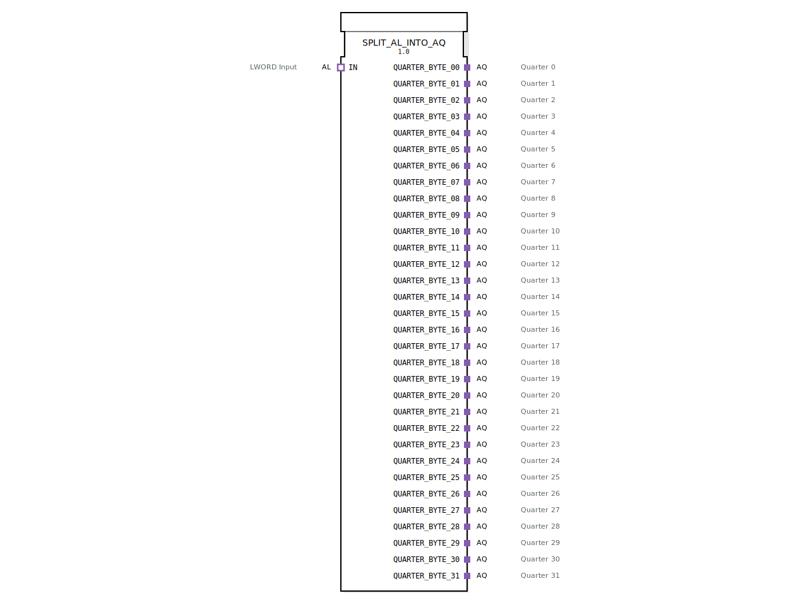

# SPLIT_AL_INTO_AQ

* * * * * * * * * *
## Einleitung

Der Funktionsblock **SPLIT_AL_INTO_AQ** ist ein zusammengesetzter Baustein (Composite-FB), der einen eingehenden LWORD-Wert (über einen `AL`-Adapter) in 32 separate 2‑Bit‑Werte aufteilt und diese jeweils über einen eigenen `AQ`-Adapter (Quarter-Byte) ausgibt. Die Aufteilung erfolgt synchron zu einem Ereignis, das über den Eingangsadapter bereitgestellt wird. Der Baustein dient als Schnittstelle zwischen einem breiten Datenwort und mehreren schmalen, ereignisgesteuerten Teilsegmenten.

## Schnittstellenstruktur

### **Ereignis-Eingänge**
Keine direkten Ereignis-Eingänge. Das auslösende Ereignis wird über den eingehenden Adapter `IN.E1` bereitgestellt.

### **Ereignis-Ausgänge**
Keine direkten Ereignis-Ausgänge. Die Ausgabeereignisse werden über die ausgehenden Adapter `QUARTER_BYTE_xx.E1` weitergegeben.

### **Daten-Eingänge**
Keine direkten Daten-Eingänge. Der LWORD-Datenwert wird über den eingehenden Adapter `IN.D1` eingelesen.

### **Daten-Ausgänge**
Keine direkten Daten-Ausgänge. Die 2‑Bit‑Datenwerte werden über die ausgehenden Adapter `QUARTER_BYTE_xx.D1` ausgegeben.

### **Adapter**

| Richtung | Name | Typ | Kommentar |
|----------|------|-----|-----------|
| Socket (Eingang) | `IN` | `adapter::types::unidirectional::AL` | LWORD‑Eingang (64 Bit) |
| Plug (Ausgang) | `QUARTER_BYTE_00` … `QUARTER_BYTE_31` | `adapter::types::unidirectional::AQ` | 32 Ausgänge, jeder liefert einen 2‑Bit‑Wert (Quarter) |

Jeder Adapter verfügt über je einen Ereignis‑ und einen Datenkanal (`E1`, `D1`).  
- Der `AL`-Adapter stellt ein Ereignis (`E1`) und den LWORD-Datenwert (`D1`) bereit.  
- Die `AQ`-Adapter empfangen ein Ereignis (`E1`) und den zugehörigen 2‑Bit‑Wert (`D1`).

## Funktionsweise

Der Baustein arbeitet in folgenden Schritten:

1. **Ereignisempfang**: Ein Ereignis am Eingangsadapter `IN.E1` triggert die interne Verarbeitung.
2. **Aufteilung**: Die interne Instanz `SPLIT_LWORD_INTO_QUARTERS` zerlegt den eingehenden LWORD (64 Bit) in 32 aufeinanderfolgende 2‑Bit‑Segmente (Quarter-Byte 0 bis 31). Jedes Segment wird an den Dateneingang eines von 32 `E_D_FF_ANY`‑Flipflops weitergeleitet. Gleichzeitig wird das Ereignis an den Takteingang (`CLK`) aller Flipflops verteilt.
3. **Ausgabe**: Mit der steigenden Flanke des Taktes übernehmen die Flipflops die 2‑Bit‑Werte. Die Flipflops geben dann über ihre Ausgänge (`Q` und `EO`) die Daten und ein Ausgangsereignis an die entsprechenden `AQ`-Adapter weiter. Damit stehen an den 32 Ausgängen parallel die segmentierten Werte zur Verfügung.

Der gesamte Ablauf erfolgt streng ereignisgesteuert – ein neues Eingangsereignis aktualisiert alle Ausgänge gleichzeitig.

## Technische Besonderheiten

- **Verwendung von D‑Flipflops**: Die `E_D_FF_ANY`-Bausteine gewährleisten, dass die Ausgabedaten erst nach dem Taktereignis stabil anliegen und nicht durch Zwischenwerte gestört werden.
- **Parallelisierung**: Alle 32 Teilwerte werden in einem Schritt berechnet und ausgegeben. Der Baustein ist damit deterministisch und benötigt keine Schleifen oder sequentielle Abarbeitung.
- **Adapterbasierte Schnittstelle**: Der FB kommuniziert ausschließlich über IEC‑61499‑Adapterschnittstellen. Dies ermöglicht eine saubere Trennung von Ereignis‑ und Datenflüssen und erleichtert die Wiederverwendung in unterschiedlichen Kontexten.
- **Einsatz von 32‑fach‑Verkettung**: Die vertikale Anordnung der Flipflops und Adapter im Netzwerk zeigt eine systematische, aber sehr ausgedehnte Struktur – bei der Implementierung ist auf ausreichende Performance (z. B. Laufzeit des gemeinsamen Taktsignals) zu achten.

## Zustandsübersicht

Der Baustein enthält keinen eigenen Zustandsautomaten. Die interne Funktionalität ergibt sich aus der Kombination von:
- **einem** `SPLIT_LWORD_INTO_QUARTERS` (kombinatorische Aufteilung)
- **32** `E_D_FF_ANY` (speichernde Elemente mit den Zuständen gesetzt/rückgesetzt)

Jedes Flipflop speichert den letzten geladenen 2‑Bit‑Wert. Ein neues Eingangsereignis überschreibt alle 32 Werte gleichzeitig.

## Anwendungsszenarien

- **Aufschlüsselung eines Feldbus‑Datentelegramms**: Ein LWORD enthält mehrere Status‑ oder Steuerbits, die auf separate Aktoren oder Sensoren verteilt werden müssen.
- **Parallelisierung von 2‑Bit‑Signalen**: In der Anbindung von BCD‑ oder Quadratur‑Encodern können mehrere 2‑Bit‑Informationen kompakt übertragen und dann getrennt weiterverarbeitet werden.
- **Bridge zwischen breitem und schmalem Datenbus**: Wenn ein System mit 64‑Bit‑Wörtern arbeitet, die Zielkomponenten aber nur 2‑Bit‑Schnittstellen besitzen, bietet der Baustein eine einfache Aufteilung.

## Vergleich mit ähnlichen Bausteinen

| Baustein | Ausgabeformat | Anzahl Ausgänge | Synchronisation |
|----------|---------------|----------------|-----------------|
| `SPLIT_AL_INTO_AQ` | 2‑Bit‑AQ‑Adapter | 32 | Gemeinsames Ereignis |
| `SPLIT_LWORD_INTO_BYTES` (hypothetisch) | 8‑Bit‑Adapter | 8 | Ereignis |
| `SPLIT_LWORD_INTO_WORDS` (hypothetisch) | 16‑Bit‑Adapter | 4 | Ereignis |

Der vorliegende Baustein ist speziell für die feine Granularität von 2‑Bit‑Segmenten optimiert und setzt dabei auf die ereignisgetriebene IEC‑61499‑Adaptertechnik. Der Hauptunterschied zu einfacheren Split‑Bausteinen liegt in der Zahl der Ausgänge (32 statt typischen 4 oder 8) sowie der Verwendung von Flipflops zur stabilen Ausgabe.

## Fazit

Der `SPLIT_AL_INTO_AQ`‑Funktionsblock bietet eine effiziente, parallelisierte Aufteilung eines 64‑Bit‑LWORD in 32 separate 2‑Bit‑Kanäle. Dank der strengen Ereignissteuerung und der Speicherung durch D‑Flipflops sind deterministische und zeitlich präzise Ausgaben gewährleistet. Der Baustein eignet sich besonders für Anwendungen, bei denen viele schmale Datenströme aus einem kompakten Datenwort abgeleitet werden müssen. Die adapterbasierte Schnittstelle macht ihn flexibel einsetzbar und gut in bestehende IEC‑61499‑Systeme integrierbar.