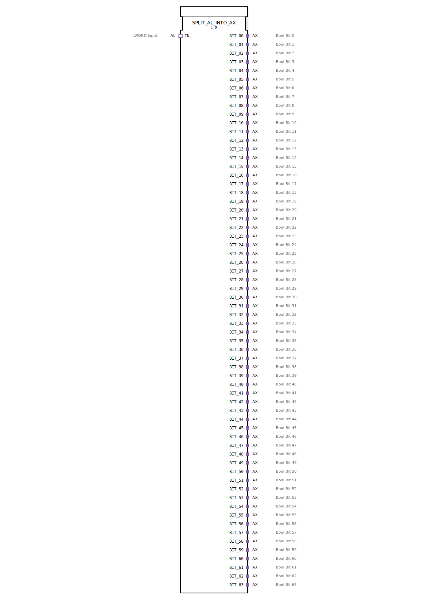

# SPLIT_AL_INTO_AX

* * * * * * * * * *

## Einleitung
Der Funktionsblock **SPLIT_AL_INTO_AX** zerlegt einen als LWORD (64 Bit) kodierten Wert in 64 einzelne BOOL-Signale. Der Eingangswert wird über einen **AL-Adapter** (Analog-Longword) bereitgestellt, die Ausgabe erfolgt über 64 separate **AX-Adapter** (Analog-Bit). Jeder Ausgangsadapter liefert den Status eines Bits zusammen mit einem zugehörigen Ereignis. Der Baustein eignet sich besonders für die Aufbereitung digitaler Signale aus einem kompakten Datenwort, z. B. zur parallelen Ansteuerung von 64 diskreten Ausgängen.

## Schnittstellenstruktur
### **Ereignis-Eingänge**
- **IN.E1** (im IN-Adapter): Startet die Verarbeitung, sobald ein neuer LWORD-Wert am Adapter anliegt.

### **Ereignis-Ausgänge**
Jeder AX-Adapter stellt einen Ereignisausgang bereit:
- **BIT_00.E1** .. **BIT_63.E1** (in den entsprechenden Adaptern): Wird ausgelöst, sobald das zugehörige Bit im internen Flipflop aktualisiert wurde.

### **Daten-Eingänge**
- **IN.D1** (LWORD): Der zu zerlegende 64‑Bit‑Datensatz.

### **Daten-Ausgänge**
- **BIT_00.D1** .. **BIT_63.D1** (BOOL): Der Zustand des jeweiligen Bits (0 oder 1).

### **Adapter**
- **IN** (Socket, Typ: `adapter::types::unidirectional::AL`): Liefert den LWORD-Wert und das Startereignis.
- **BIT_00** .. **BIT_63** (Plugs, Typ: `adapter::types::unidirectional::AX`): Geben jeweils ein BOOL-Signal (Bitwert) und ein zugehöriges Ereignis aus.

## Funktionsweise
1. Ein eingehender LWORD-Wert über den AL-Adapter **IN** löst über das Ereignis **E1** die Verarbeitung aus.
2. Der interne Baustein **SPLIT_LWORD_INTO_BOOLS** extrahiert alle 64 Bits aus dem LWORD.
3. Jedes Bit wird auf den Dateneingang **D** eines zugehörigen **E_D_FF** (Edge‑Triggered D‑Flipflop) gelegt.
4. Gleichzeitig erhalten alle 64 Flipflops über das Ereignis **CNF** des Splitters den Taktimpuls **CLK**. Damit werden alle Bits gleichzeitig in die Flipflops übernommen.
5. Die Flipflops geben den gespeicherten Wert an ihrem Ausgang **Q** aus, welcher über den Datenausgang **D1** des jeweiligen AX-Adapters bereitgestellt wird.
6. Jedes Flipflop erzeugt am Ausgang **EO** ein Ereignis, das an den Ereigniseingang **E1** des entsprechenden AX-Adapters weitergeleitet wird.

## Technische Besonderheiten
- **Synchronisation**: Sämtliche Bits werden durch ein gemeinsames Ereignis (CNF von SPLIT_LWORD_INTO_BOOLS) zeitgleich in die Flipflops übernommen. So entsteht ein konsistenter Ausgangszustand ohne Wettlaufsituationen.
- **Speicherung**: Die Verwendung von **E_D_FF** bewirkt, dass der Ausgangszustand erhalten bleibt, bis ein neuer LWORD-Wert verarbeitet wird. Der Baustein arbeitet somit als „Sample & Hold“ für alle 64 Bits.
- **Große Anzahl von Ausgängen**: Der FB bietet 64 unabhängige BOOL-Ausgänge, die in der 4diac‑IDE auf viele Geräteadapter abgebildet werden können.
- **Adapter‑basierte Schnittstelle**: Ein‑ und Ausgänge sind als unidirektionale Adapter realisiert, was die modulare Kapselung und Wiederverwendung erleichtert.

## Zustandsübersicht
Der FB besitzt keinen eigenen expliziten Zustandsautomaten. Der innere Zustand wird durch die 64 **E_D_FF** repräsentiert:
- **Initial**: Alle Flipflops stehen auf FALSE (0).
- **Nach einer Verarbeitung**: Jedes Flipflop speichert den aktuellen Bitwert des zuletzt empfangenen LWORD. Die Zustandsänderung erfolgt nur bei einem neuen Ereignis auf **IN.E1**.

## Anwendungsszenarien
- **Parallele Ausgabe von digitalen Signalen** aus einem seriellen oder paketierten Datenwort, z. B. aus einem Bussystem oder einer Kommunikationsschnittstelle.
- **Maskierte Steuerung**: Kombination mit logischen Bausteinen, um einzelne Bits eines Statusworts gezielt auszuwerten.
- **Test‑ und Diagnose‑Interfaces**: Aufbereitung eines 64‑Bit‑Fehlerworts für die Anzeige auf separaten Leuchten oder in Visualisierungen.
- **Schrittstelle zu diskreten Aktoren**: Jeder AX-Adapter kann direkt mit einer digitalen Ausgangsbaugruppe verbunden werden.

## Vergleich mit ähnlichen Bausteinen
- **SPLIT_LWORD_INTO_BOOLS** (rein funktionaler Splitter ohne Speicher): Liefert die Bits nur während der Verarbeitung, hält den Wert nicht. **SPLIT_AL_INTO_AX** ergänzt die Speicherfunktion und stellt einen stabilen Ausgang bis zur nächsten Aktualisierung bereit.
- **Typkonverter wie DWORD_TO_BOOL_ARRAY**: Arbeiten meist auf Arrays und nicht auf Adapterniveau; der vorliegende Baustein ist speziell auf die 4diac‑Adapter‑Schnittstelle zugeschnitten.
- **Flipflop‑basierte Lösungen mit je einem eigenen F_TRIG o. Ä.:** Der FB vereinfacht die Konfiguration, da alle 64 Bits in einem einzigen Baustein zusammengefasst sind.

## Fazit
**SPLIT_AL_INTO_AX** ist ein leistungsfähiger, adapterbasierter Funktionsblock zur Aufteilung eines LWORD-Datensatzes in 64 diskrete BOOL-Signale. Durch die integrierten Flipflops bleibt der Ausgangszustand bis zur nächsten Aktualisierung erhalten. Die große Anzahl von Ausgängen und die synchrone Verarbeitung machen ihn ideal für Anwendungen, die eine parallele, zeitlich konsistente Signalerzeugung erfordern. Der Einsatz von unidirektionalen Adaptern sorgt für eine klare Schnittstellendefinition und erleichtert die Integration in bestehende 4diac‑Projekte.