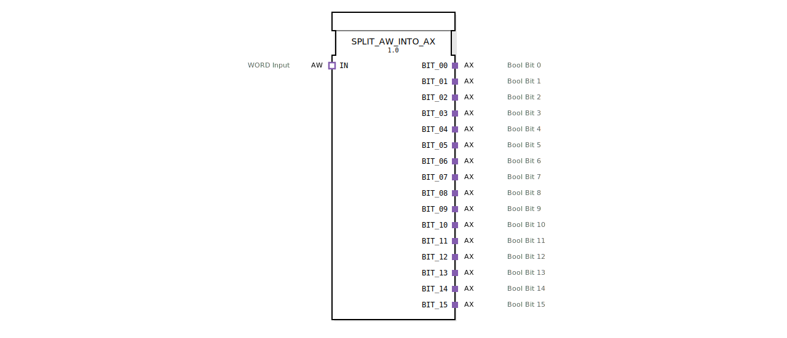

# SPLIT_AW_INTO_AX

* * * * * * * * * *
## Einleitung

Der Funktionsblock `SPLIT_AW_INTO_AX` dient dazu, ein 16‑Bit Wort (Typ `AW`) in 16 einzelne Binärsignale (Typ `AX`) aufzuteilen. Jeder der 16 Ausgänge repräsentiert ein Bit des eingehenden Wortes und wird als eigenständiger Adapter mit Ereignis- und Datenleitung bereitgestellt. Die Aufteilung erfolgt synchron bei Eintreffen eines Ereignisses am Eingangsadapter.

## Schnittstellenstruktur

### **Ereignis-Eingänge**
Der Baustein besitzt keine eigenständigen Ereignis-Eingänge auf der Fassade. Das initiale Ereignis wird über den Socket-Adapter `IN` (siehe Adapter) empfangen.

### **Ereignis-Ausgänge**
Der Baustein besitzt keine eigenständigen Ereignis-Ausgänge auf der Fassade. Die Ausgangsereignisse werden über die Plug-Adapter `BIT_00` … `BIT_15` (siehe Adapter) abgegeben.

### **Daten-Eingänge**
Der Baustein besitzt keine eigenständigen Daten-Eingänge auf der Fassade. Der zu verarbeitende 16‑Bit Wert wird über den Socket-Adapter `IN` (siehe Adapter) als Datenwert `D1` (Typ `WORD`) bereitgestellt.

### **Daten-Ausgänge**
Der Baustein besitzt keine eigenständigen Daten-Ausgänge auf der Fassade. Die 16 extrahierten Binärwerte werden über die Plug-Adapter `BIT_00` … `BIT_15` als Datenwert `D1` (Typ `BOOL`) ausgegeben.

### **Adapter**

| Richtung | Name | Typ | Kommentar |
|----------|------|-----|-----------|
| **Socket** (Eingang) | `IN` | `adapter::types::unidirectional::AW` | 16‑Bit Wort als Eingang, Ereignis-Eingang `E1`, Daten-Eingang `D1` |
| **Plug** (Ausgang) | `BIT_00` … `BIT_15` | `adapter::types::unidirectional::AX` | Jeweils ein Bit des Wortes, Ereignis-Ausgang `E1`, Daten-Ausgang `D1` |

## Funktionsweise

1. Ein externes Ereignis am Socket `IN.E1` löst die Verarbeitung aus.
2. Der aktuelle Wert von `IN.D1` (Typ `WORD`, 16 Bit) wird ausgelesen.
3. Der intern eingebettete Baustein `SPLIT_WORD_INTO_BOOLS` zerlegt das Wort in 16 einzelne Boolesche Werte (`BIT_00` … `BIT_15`).
4. Diese 16 Werte werden taktgleich an jeweils ein `E_D_FF` (D‑Flipflop) übergeben. Die Flipflops übernehmen die Daten mit jedem Takt (hier dem Ereignis `CNF` von `SPLIT_WORD_INTO_BOOLS`).
5. Jedes Flipflop gibt seinen gespeicherten Wert über den zugehörigen Plug-Adapter `BIT_xx.D1` sowie ein Ereignis über `BIT_xx.E1` aus.

Dadurch wird der gesamte Wortwert in einem Zyklus auf die 16 Ausgangsadapter verteilt und dort bis zum nächsten Ereignis gehalten.

## Technische Besonderheiten

- **Ereignissynchrone Aufteilung:** Die gesamte Aufteilung erfolgt innerhalb eines einzigen Ereigniszyklus – alle 16 Ausgänge werden gleichzeitig aktualisiert.
- **Speicherung:** Jeder Bitwert wird durch ein eigenes `E_D_FF` gehalten, sodass die Ausgänge auch ohne ständig wiederholte Ereignisse stabil bleiben.
- **Adapter‑basierte Ein‑/Ausgabe:** Der Baustein kommuniziert ausschließlich über Adapter – er kann daher nahtlos in 4diac‑Systeme eingebunden werden, die unidirektionale Adapter für Wort‑ oder Boolsignale nutzen.
- **Keine eigenen Ereignis‑/Dateneingänge:** Die gesamte Schnittstelle wird über die Adapter abgebildet; eine direkte Verkabelung auf der Fassade entfällt.

## Zustandsübersicht

Der Baustein besitzt keinen eigenen Zustandsautomaten auf oberster Ebene. Der interne Zustand wird durch die 16 D‑Flipflops (`E_D_FF_00` … `E_D_FF_15`) bestimmt:

- Jedes Flipflop kann sich in einem der beiden Zustände `Q = 0` oder `Q = 1` befinden.
- Der Zustand wird nur bei einem Takt (d.h. bei jedem neu eintreffenden Ereignis am Eingang) aktualisiert.
- Im Ruhezustand zwischen Ereignissen bleibt der jeweils zuletzt gespeicherte Wert erhalten.

## Anwendungsszenarien

- **Steuerungsaufgaben:** Ein übergeordneter Regler oder eine SPS sendet ein 16‑Bit Wort (z.B. als Steuerwort) – der Baustein wandelt es in 16 einzelne binäre Ansteuersignale um (z.B. für Relais, Ventile oder Anzeigeelemente).
- **Protokollkonvertierung:** Eingangssignale aus einem Bussystem liegen als Wort vor und müssen auf diskrete Ausgänge verteilt werden.
- **Test und Simulation:** Darstellung eines Wortes als 16 Boolesche Kanäle zur Visualisierung oder Fehlersuche.

## Vergleich mit ähnlichen Bausteinen

- **`SPLIT_WORD_INTO_BOOLS`** – Dieser Baustein teilt ein Wort ebenfalls in Boolesche Werte auf, jedoch ohne Adapter und ohne ereignisgesteuerte Ausgabe. Er dient als interne Komponente des vorliegenden Bausteins.
- **`SPLIT_AW_INTO_AX`** – Erweitert die reine Datenteilung um Adapter und Ereignisausgabe, sodass die einzelnen Bits als vollwertige AX‑Schnittstellen (mit eigenem Ereignis und Daten) zur Verfügung stehen. Dadurch ist eine direkte Verschaltung mit anderen 4diac‑Bausteinen, die AX‑Adapter erwarten, möglich.
- **Alternative Eigenentwicklung:** Theoretisch könnte man 16 separate `SLICE`‑Bausteine verwenden, um Bits aus einem Wort zu extrahieren – dies wäre jedoch aufwändiger und würde nicht die synchrone Ereignisausgabe bieten.

## Fazit

`SPLIT_AW_INTO_AX` ist ein kompakter, aber leistungsfähiger Konverter, der ein 16‑Bit Wort zuverlässig und ereignissynchron auf 16 einzelne Binärausgänge aufteilt. Durch die Verwendung von Adaptern und Flipflops ist er besonders gut geeignet für den Einsatz in modularen IEC 61499‑Anwendungen, bei denen eine saubere Trennung von Wort‑ und Bitschnittstellen gefordert wird. Er vereinfacht die Schnittstellenanpassung und erhöht die Lesbarkeit und Wartbarkeit des Applikationsnetzwerks.