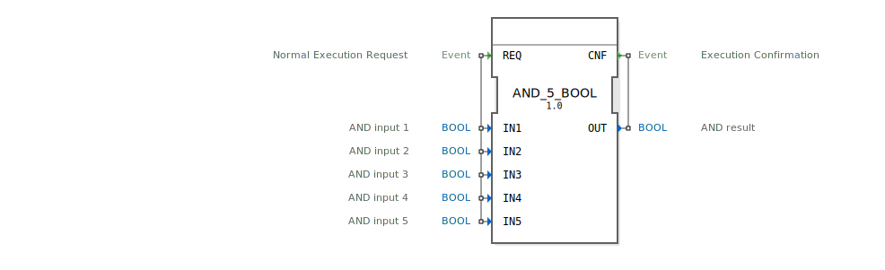

# AND_5_BOOL

```{index} single: AND_5_BOOL
```


* * * * * * * * * *
## Einleitung
Der Funktionsblock `AND_5_BOOL` ist ein Standard-Baustein zur Berechnung der logischen UND-Verknüpfung. Er führt eine bitweise UND-Operation über fünf separate boolesche Eingangswerte aus. Der Block folgt dem Echtzeit- und Ereignisverarbeitungsmodell von IEC 61499, bei dem die Berechnung durch ein eingehendes Ereignis ausgelöst und mit einem ausgehenden Ereignis bestätigt wird.



## Schnittstellenstruktur
### **Ereignis-Eingänge**
*   **REQ**: Löst die Ausführung des Funktionsblocks aus. Bei Eintreffen dieses Ereignisses werden alle fünf Eingänge (`IN1` bis `IN5`) gelesen und die UND-Operation berechnet.

### **Ereignis-Ausgänge**
*   **CNF**: Bestätigt die abgeschlossene Ausführung. Dieses Ereignis wird nach der Berechnung des Ergebnisses ausgegeben und liefert den berechneten Wert `OUT` mit.

### **Daten-Eingänge**
*   **IN1**: Boolescher Eingang 1 für die UND-Operation.
*   **IN2**: Boolescher Eingang 2 für die UND-Operation.
*   **IN3**: Boolescher Eingang 3 für die UND-Operation.
*   **IN4**: Boolescher Eingang 4 für die UND-Operation.
*   **IN5**: Boolescher Eingang 5 für die UND-Operation.

### **Daten-Ausgänge**
*   **OUT**: Das boolesche Ergebnis der UND-Verknüpfung aller fünf Eingänge. Der Ausgang ist nur `TRUE`, wenn **alle** Eingänge `IN1` bis `IN5` den Wert `TRUE` haben.

### **Adapter**
Dieser Funktionsblock verwendet keine Adapter.

## Funktionsweise
Die Funktionsweise ist deterministisch und ereignisgesteuert:
1.  Das eingehende Ereignis `REQ` aktiviert den Block.
2.  Die aktuellen Werte aller fünf booleschen Dateneingänge (`IN1` bis `IN5`) werden eingelesen.
3.  Die logische UND-Operation wird berechnet: `OUT = IN1 AND IN2 AND IN3 AND IN4 AND IN5`.
4.  Das Ergebnis wird am Datenausgang `OUT` bereitgestellt.
5.  Das Ausgangsereignis `CNF` wird zusammen mit dem neuen Wert von `OUT` ausgelöst, um den Abschluss der Operation zu signalisieren.

## Technische Besonderheiten
*   **Generischer Baustein**: Der Block ist als Instanz eines generischen UND-Bausteins (`GEN_AND`) implementiert, der für eine variable Anzahl von Eingängen parametrisiert werden kann. Diese spezielle Instanz ist für genau fünf Eingänge festgelegt.
*   **Ereigniskette**: Die Abarbeitung folgt strikt dem REQ/CNF-Pattern, was eine einfache Integration in ereignisgesteuerte Steuerungsabläufe ermöglicht.
*   **Kein interner Zustand**: Der Block ist speicherfrei (kombinatorisch). Das Ausgangssignal hängt ausschließlich von den aktuellen Eingangswerten zum Zeitpunkt der `REQ`-Anforderung ab.

## Zustandsübersicht
Der Funktionsblock besitzt keinen persistenten internen Zustand. Sein Verhalten ist rein kombinatorisch und wird vollständig durch die Schnittstellenereignisse und -daten beschrieben. Der "Zustand" ist der Übergang von wartend (`REQ` abwarten) zu aktiv (Berechnung durchführen und `CNF` auslösen).

## Anwendungsszenarien
Typische Anwendungen sind Sicherheits- und Freigabeketten in der Automatisierungstechnik, bei denen mehrere Bedingungen gleichzeitig erfüllt sein müssen:
*   Überwachung, ob alle Schutzgitter einer Maschine geschlossen sind.
*   Prüfung, ob alle erforderlichen Medien (Druck, Vakuum, Kühlung) verfügbar sind, bevor ein Prozess gestartet wird.
*   Verknüpfung mehrerer Sensor- oder Schalterzustände zu einer gemeinsamen Freigabelogik.

## ⚖️ Vergleich mit ähnlichen Bausteinen
*   **`AND_2_BOOL` / `AND_3_BOOL` etc.**: Grundlegende UND-Bausteine mit zwei, drei oder vier Eingängen. `AND_5_BOOL` erweitert diese Logik auf fünf Eingänge, ohne dass mehrere Blöcke verkettet werden müssen. Siehe: [AND_5](../../../StandardLibraries/iec61131-3/bitwiseOperators/AND_5.md)
*   **`GEN_AND`**: Der zugrundeliegende generische Baustein. `AND_5_BOOL` ist eine vorkonfigurierte, nicht veränderbare Instanz davon mit fester Eingangsanzahl.
*   **OR-Bausteine**: Führen eine logische ODER-Verknüpfung durch. Während `AND_5_BOOL` nur bei allen `TRUE`-Eingängen ein `TRUE` ausgibt, geben OR-Bausteine bereits bei einem `TRUE`-Eingang ein `TRUE` aus.

## Fazit
Der `AND_5_BOOL` ist ein robuster und einfach zu verwendender Standardbaustein für logische Verknüpfungen mit fünf Eingängen. Seine ereignisgesteuerte, zustandslose Architektur macht ihn gut vorhersagbar und einfach in komplexere IEC 61499-Applikationen zu integrieren. Für Anwendungen, die genau fünf Bedingungen verknüpfen müssen, bietet er eine optimale und lesbare Lösung.