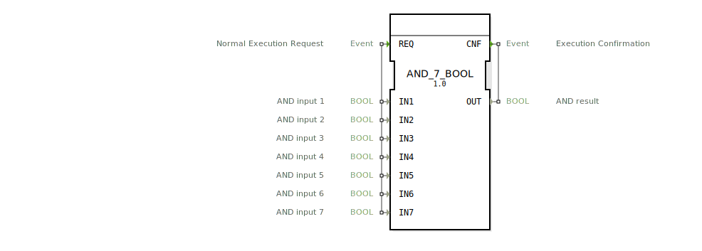

# AND_7_BOOL

```{index} single: AND_7_BOOL
```


* * * * * * * * * *
## Einleitung
Der Funktionsblock `AND_7_BOOL` ist ein generischer Baustein zur Berechnung der logischen UND-Verknüpfung. Er führt eine bitweise UND-Operation über sieben separate BOOL-Eingänge durch und gibt das Ergebnis auf einem einzigen BOOL-Ausgang aus. Der Block folgt dem ECC-Ausführungsmodell, bei dem eine Berechnung durch ein ankommendes Ereignis ausgelöst und mit einem ausgehenden Ereignis bestätigt wird.



## Schnittstellenstruktur

### **Ereignis-Eingänge**
*   **REQ**: Löst die Berechnung der UND-Verknüpfung aus. Beim Eintreffen dieses Ereignisses werden alle Daten-Eingänge (`IN1` bis `IN7`) ausgelesen und verarbeitet.

### **Ereignis-Ausgänge**
*   **CNF**: Bestätigt die abgeschlossene Ausführung. Dieses Ereignis wird nach der Berechnung generiert und liefert das Ergebnis `OUT` mit.

### **Daten-Eingänge**
*   **IN1**: UND-Eingang 1 (BOOL)
*   **IN2**: UND-Eingang 2 (BOOL)
*   **IN3**: UND-Eingang 3 (BOOL)
*   **IN4**: UND-Eingang 4 (BOOL)
*   **IN5**: UND-Eingang 5 (BOOL)
*   **IN6**: UND-Eingang 6 (BOOL)
*   **IN7**: UND-Eingang 7 (BOOL)

### **Daten-Ausgänge**
*   **OUT**: Ergebnis der UND-Verknüpfung (BOOL). Der Ausgang ist nur `TRUE`, wenn **alle** sieben Eingänge (`IN1` bis `IN7`) den Wert `TRUE` haben. In allen anderen Fällen ist der Ausgang `FALSE`.

### **Adapter**
Dieser Funktionsblock verfügt über keine Adapter-Schnittstellen.

## Funktionsweise
Die Funktionsweise ist deterministisch und folgt der booleschen Algebra. Bei jedem Eintreffen des Ereignisses `REQ` wird die folgende Operation ausgeführt:
`OUT := IN1 AND IN2 AND IN3 AND IN4 AND IN5 AND IN6 AND IN7`

Unmittelbar nach der Berechnung des Ergebnisses wird das Bestätigungsereignis `CNF` zusammen mit dem aktuellen Wert von `OUT` ausgegeben.

## Technische Besonderheiten
*   **Generischer Baustein**: Der Block ist als generischer Baustein gekennzeichnet (`GEN_AND`). Dies bedeutet, dass er als Vorlage für die automatische Generierung ähnlicher Blöcke mit einer anderen Anzahl von Eingängen dienen kann.
*   **Ereignisgesteuert**: Die Operation wird nur bei Bedarf durch ein Ereignis ausgeführt, was Ressourcen schont und eine klare Ablaufsteuerung ermöglicht.
*   **Feste Eingangsanzahl**: Dieser spezifische Block hat eine feste Anzahl von sieben Eingängen. Für eine andere Anzahl von Operanden muss ein entsprechender Block (z.B. `AND_2_BOOL`, `AND_4_BOOL`) verwendet oder ein generischer Block instanziiert werden.

## Zustandsübersicht
Der Block besitzt keinen internen Zustand im Sinne eines Speichers. Sein Verhalten ist rein kombinatorisch und ereignisgesteuert:
1.  **Ruhezustand**: Wartet auf das Ereignis `REQ`.
2.  **Ausführungszustand**: Bei `REQ` werden alle Eingänge gelesen, die UND-Operation berechnet und das Ergebnis `OUT` gesetzt.
3.  **Bestätigungszustand**: Das Ereignis `CNF` wird sofort gesendet, danach kehrt der Block in den Ruhezustand zurück.

## Anwendungsszenarien
*   **Sicherheitskette**: Verknüpfung mehrerer Sicherheitsschalter (z.B. Not-Aus, Schutzgitter, Lichtschranke), wobei eine Maschine nur starten darf, wenn alle Schalter geschlossen (TRUE) sind.
*   **Mehrfachbedingung**: Prüfung, ob mehrere parallele Prozessschritte erfolgreich abgeschlossen wurden, bevor ein Folgeprozess gestartet wird.
*   **Steuerungslogik**: Implementierung von komplexen UND-Bedingungen in Ablaufsteuerungen oder Verknüpfungssteuerungen.

## Vergleich mit ähnlichen Bausteinen
*   **`AND_n_BOOL`-Familie**: Es existieren Blöcke mit identischer Funktion, aber unterschiedlicher Anzahl von Eingängen (z.B., `AND_2_BOOL`, `AND_8_BOOL`). `AND_7_BOOL` füllt die Lücke für Anwendungen, die genau sieben Bedingungen benötigen. Siehe: [AND_7](../../../StandardLibraries/iec61131-3/bitwiseOperators/AND_7.md)
*   **`&` (Bit-AND) Operator**: Während `AND_7_BOOL` nur mit BOOL-Datentypen arbeitet und ereignisgesteuert ist, kann der `&`-Operator in Structured Text (ST) auch auf Byte-, Wort- oder DWORD-Datentypen angewendet werden und wird zyklisch oder anweisungsgesteuert ausgewertet.
*   **Serielle UND-Verknüpfung**: Das gleiche Ergebnis könnte durch die serielle Verkettung mehrerer `AND_2_BOOL`-Blöcke erreicht werden. `AND_7_BOOL` bietet eine kompaktere und übersichtlichere Lösung.

## Fazit
Der `AND_7_BOOL` ist ein spezialisierter, zuverlässiger und einfach zu verwendender Funktionsblock für die logische UND-Verknüpfung von sieben booleschen Signalen. Seine ereignisgesteuerte Architektur macht ihn ideal für die Integration in steuerungstypische Ablaufstrukturen innerhalb der 4diac-IDE. Für Anwendungen mit einer anderen Anzahl von Eingängen sollte auf die entsprechende Variante der `AND_n_BOOL`-Familie zurückgegriffen werden.