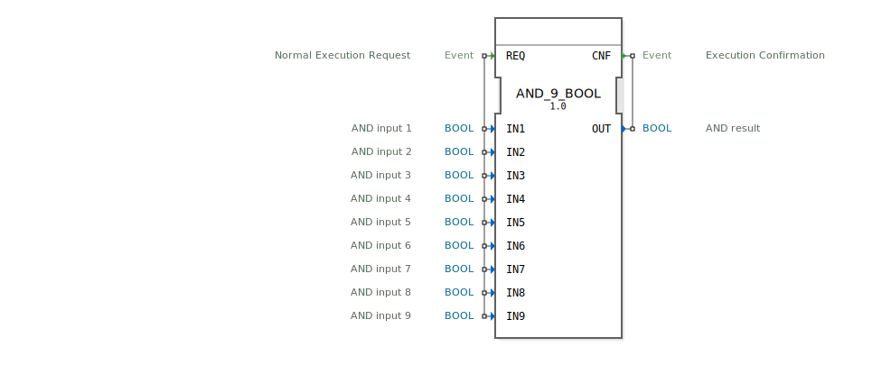

# AND_9_BOOL

```{index} single: AND_9_BOOL
```


* * * * * * * * * *
## Einleitung
Der Funktionsblock `AND_9_BOOL` ist ein Standardbaustein zur Berechnung der logischen UND-Verknüpfung. Er führt eine bitweise UND-Operation über neun separate boolesche Eingänge durch. Der Block folgt dem IEC 61131-3 Standard und ist für den Einsatz in der 4diac-IDE konzipiert.



## Schnittstellenstruktur
Der Block besitzt ein ereignisgesteuertes Ein-/Ausgangsmodell.

### **Ereignis-Eingänge**
*   **REQ (Normal Execution Request):** Löst die Berechnung der UND-Verknüpfung aus. Bei diesem Ereignis werden alle Daten-Eingänge (`IN1` bis `IN9`) ausgelesen und das Ergebnis berechnet.

### **Ereignis-Ausgänge**
*   **CNF (Execution Confirmation):** Wird nach Abschluss der Berechnung ausgelöst und signalisiert, dass das Ergebnis am Daten-Ausgang `OUT` bereitsteht.

### **Daten-Eingänge**
*   **IN1 (BOOL):** UND-Eingang 1.
*   **IN2 (BOOL):** UND-Eingang 2.
*   **IN3 (BOOL):** UND-Eingang 3.
*   **IN4 (BOOL):** UND-Eingang 4.
*   **IN5 (BOOL):** UND-Eingang 5.
*   **IN6 (BOOL):** UND-Eingang 6.
*   **IN7 (BOOL):** UND-Eingang 7.
*   **IN8 (BOOL):** UND-Eingang 8.
*   **IN9 (BOOL):** UND-Eingang 9.

### **Daten-Ausgänge**
*   **OUT (BOOL):** Ergebnis der UND-Verknüpfung. Der Ausgang ist nur `TRUE`, wenn **alle** neun Eingänge (`IN1` bis `IN9`) den Wert `TRUE` aufweisen. In allen anderen Fällen ist der Ausgang `FALSE`.

### **Adapter**
Dieser Funktionsblock verwendet keine Adapter.

## Funktionsweise
Bei Eintreffen eines Ereignisses am Eingang `REQ` liest der Block die aktuellen Werte aller neun booleschen Eingänge (`IN1` bis `IN9`) ein. Anschließend wird die logische UND-Verknüpfung über alle neun Werte berechnet. Das Ergebnis dieser Operation wird unmittelbar am Datenausgang `OUT` ausgegeben. Gleichzeitig wird ein Bestätigungsereignis am Ausgang `CNF` generiert, um den erfolgreichen Abschluss der Operation zu signalisieren.

Die logische Funktion lässt sich wie folgt beschreiben:
`OUT = IN1 AND IN2 AND IN3 AND IN4 AND IN5 AND IN6 AND IN7 AND IN8 AND IN9`

## Technische Besonderheiten
*   **Generischer Baustein:** Der Block ist als Instanz eines generischen UND-Bausteins (`GEN_AND`) implementiert, der für eine feste Anzahl von Eingängen (hier 9) spezialisiert wurde.
*   **Ereignisgesteuert:** Die Operation wird nur bei einem eingehenden `REQ`-Ereignis ausgeführt, was eine ressourcenschonende und deterministische Abarbeitung ermöglicht.
*   **Feste Eingangsanzahl:** Im Gegensatz zu variablen Funktionen arbeitet dieser Block exakt mit neun Eingängen.

## Zustandsübersicht
Der Block besitzt keinen internen Zustand im Sinne eines Speichers. Sein Verhalten ist kombinatorisch und ausschließlich von den aktuellen Werten der Eingänge zum Zeitpunkt des `REQ`-Ereignisses abhängig. Der Ausgang `OUT` behält seinen Wert bis zum nächsten Ausführungszyklus.

## Anwendungsszenarien
*   **Sicherheitskette:** Verknüpfung mehrerer Sicherheitsschalter (z.B. Not-Aus, Schutzgitter, Zwei-Hand-Bedienung), die alle geschlossen sein müssen, um eine Maschine zu starten.
*   **Mehrfachbedingung:** Prüfung, ob mehrere Voraussetzungen in einem Prozessschritt gleichzeitig erfüllt sind.
*   **Verkettung von Logik:** Als Teil einer größeren logischen Schaltung, wo das Ergebnis von neun Quellen gemeinsam ausgewertet werden muss.

## ⚖️ Vergleich mit ähnlichen Bausteinen
*   **`AND` (2 Eingänge):** Der Standard-UND-Baustein mit nur zwei Eingängen. `AND_9_BOOL` ist eine spezielle, erweiterte Version für genau neun Eingänge. Siehe: [AND_9](../../../StandardLibraries/iec61131-3/bitwiseOperators/AND_9.md)
*   **`GEN_AND`:** Der zugrunde liegende generische Baustein, der mit einer konfigurierbaren Anzahl von Eingängen instanziiert werden kann. `AND_9_BOOL` ist eine vordefinierte Instanz davon.
*   **`OR_*` / `XOR_*` Bausteine:** Führen andere logische Grundoperationen (ODER, exklusives ODER) mit einer festen Anzahl von Eingängen durch.

## Fazit
Der `AND_9_BOOL` ist ein robuster und einfach zu verwendender Standardbaustein für Anwendungen, die eine logische UND-Verknüpfung über genau neun boolesche Signale erfordern. Seine ereignisgesteuerte Natur und die klare Schnittstelle machen ihn gut integrierbar in 4diac-basierte Steuerungsanwendungen. Für eine andere Anzahl von Eingängen sollten die entsprechenden spezialisierten (`AND_2_BOOL`, `AND_3_BOOL`, etc.) oder der generische `GEN_AND`-Block verwendet werden.