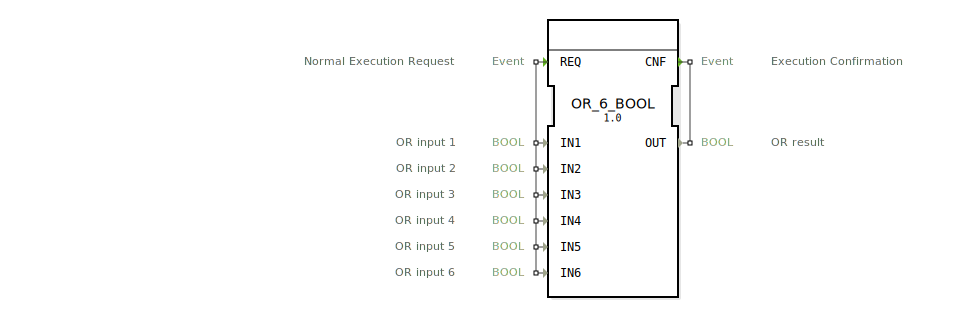

# OR_6_BOOL

```{index} single: OR_6_BOOL
```


* * * * * * * * * *
## Einleitung
Der Funktionsblock `OR_6_BOOL` ist ein generischer Baustein zur Berechnung der logischen ODER-Verknüpfung. Er führt eine ODER-Operation über sechs separate BOOL-Eingänge durch und gibt das Ergebnis auf einem einzigen Ausgang aus. Der Baustein folgt dem IEC 61131-3 Standard und ist für den Einsatz in Steuerungsanwendungen konzipiert, in denen mehrere Bedingungen kombiniert werden müssen, um eine Aktion auszulösen.



## Schnittstellenstruktur
### **Ereignis-Eingänge**
*   **REQ (Normal Execution Request):** Dieses Ereignis löst die Berechnung der ODER-Funktion aus. Es ist mit allen sechs Dateneingängen (`IN1` bis `IN6`) verknüpft.

### **Ereignis-Ausgänge**
*   **CNF (Execution Confirmation):** Dieses Ereignis signalisiert den Abschluss der Berechnung. Es wird zusammen mit dem berechneten Ergebnis am Datenausgang `OUT` ausgegeben.

### **Daten-Eingänge**
*   **IN1 (BOOL):** ODER-Eingang 1.
*   **IN2 (BOOL):** ODER-Eingang 2.
*   **IN3 (BOOL):** ODER-Eingang 3.
*   **IN4 (BOOL):** ODER-Eingang 4.
*   **IN5 (BOOL):** ODER-Eingang 5.
*   **IN6 (BOOL):** ODER-Eingang 6.

### **Daten-Ausgänge**
*   **OUT (BOOL):** Ergebnis der ODER-Verknüpfung aller sechs Eingänge. Der Ausgang ist `TRUE`, wenn mindestens einer der Eingänge `TRUE` ist.

### **Adapter**
Dieser Funktionsblock verfügt über keine Adapterschnittstellen.

## Funktionsweise
Die Funktionsweise ist deterministisch und ereignisgesteuert. Bei jedem Eintreffen des Eingangsereignisses `REQ` werden die aktuellen Werte aller sechs BOOL-Eingänge (`IN1` bis `IN6`) ausgelesen. Anschließend wird die logische ODER-Verknüpfung dieser Werte berechnet. Das Ergebnis dieser Operation wird unmittelbar am Datenausgang `OUT` gesetzt und gleichzeitig wird das Bestätigungsereignis `CNF` ausgelöst, um den Abschluss der Operation an nachfolgende Blöcke zu signalisieren.

Die logische Operation entspricht der Formel: `OUT = IN1 OR IN2 OR IN3 OR IN4 OR IN5 OR IN6`

## Technische Besonderheiten
*   **Generischer Baustein:** Der Block ist als generischer Baustein gekennzeichnet (`GEN_OR`). Dies bedeutet, dass er als Basis für die Erstellung ähnlicher Blöcke mit einer anderen Anzahl von Eingängen dienen kann.
*   **Ereignisgesteuerte Ausführung:** Die Berechnung erfolgt nur bei Anforderung durch ein Ereignis, was eine effiziente und bedarfsgerechte Abarbeitung im Steuerungssystem ermöglicht.
*   **Feste Eingangsanzahl:** Diese spezielle Instanz ist für genau sechs Eingänge festgelegt.

## Zustandsübersicht
Der Funktionsblock besitzt keinen internen Zustand oder Speicher. Sein Verhalten ist rein kombinatorisch und hängt ausschließlich von den aktuellen Werten der Eingänge zum Zeitpunkt des `REQ`-Ereignisses ab. Nach der Ausgabe von `CNF` verharrt der Block in einem wartenden Zustand bis zum nächsten `REQ`.

## Anwendungsszenarien
Typische Anwendungen sind Überwachungs- und Sicherheitslogiken, bei denen eine Aktion ausgelöst werden soll, wenn eine von mehreren möglichen Bedingungen erfüllt ist.
*   **Not-Aus Logik:** Der Block kann genutzt werden, um mehrere Not-Aus-Taster zu überwachen. Wenn irgendeiner der Taster gedrückt wird (`TRUE`), wird ein Abschaltsignal (`OUT = TRUE`) generiert.
*   **Alarmaggregation:** Mehrere Sensoren, die jeweils einen Fehlerzustand detektieren können, werden zusammengeschaltet. Ein allgemeiner Alarm wird aktiviert, sobald mindestens ein Sensor einen Fehler meldet.
*   **Mehrfachbedienung:** In einer Maschine können mehrere Bedienstationen einen Prozess starten. Der Block kombiniert alle Startbefehle zu einem gemeinsamen Startsignal.

## Vergleich mit ähnlichen Bausteinen
*   **AND_6_BOOL:** Führt eine logische UND-Verknüpfung durch. Das Ergebnis ist nur `TRUE`, wenn **alle** Eingänge `TRUE` sind. Im Gegensatz dazu benötigt `OR_6_BOOL` nur **einen** wahren Eingang.
*   **XOR_BOOL:** Führt eine exklusiv-ODER (XOR) Verknüpfung durch. Das Ergebnis ist `TRUE`, wenn eine ungerade Anzahl an Eingängen `TRUE` ist. `OR_6_BOOL` unterscheidet nicht zwischen einer oder mehreren wahren Bedingungen. Siehe: [OR_6](../../../StandardLibraries/iec61131-3/bitwiseOperators/OR_6.md)
*   **Blöcke mit variabler Eingangsanzahl:** Es existieren ODER-Blöcke mit zwei (`OR`) oder einer anderen Anzahl von Eingängen. `OR_6_BOOL` bietet eine feste, für bestimmte Anwendungen optimierte Schnittstelle mit sechs Eingängen.

## Fazit
Der `OR_6_BOOL` Funktionsblock ist ein einfacher, robuster und standardkonformer Baustein zur logischen Signalverknüpfung. Seine Stärke liegt in der klaren, ereignisgesteuerten Schnittstelle und der festen Anzahl von sechs Eingängen, die ihn ideal für Anwendungen macht, die genau diese Anzahl an zu kombinierenden Bedingungen erfordern. Als generischer Baustein unterstützt er zudem die Wiederverwendung und Anpassung innerhalb der 4diac-IDE.