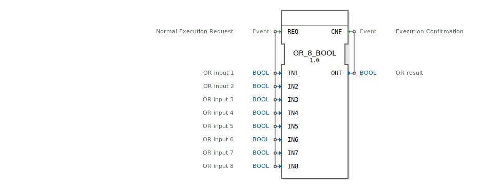

# OR_8_BOOL

```{index} single: OR_8_BOOL
```


* * * * * * * * * *
## Einleitung
Der Funktionsblock `OR_8_BOOL` ist ein standardisierter Baustein zur Berechnung der logischen ODER-Verknüpfung. Er führt die ODER-Operation über acht separate boolesche Eingangswerte aus und liefert das Ergebnis auf einem einzelnen booleschen Ausgang. Dieser Baustein ist Teil der IEC 61131-3-konformen Bibliothek für bitweise Operationen und dient der einfachen und strukturierten Logikverarbeitung in Steuerungsanwendungen.



## Schnittstellenstruktur
### **Ereignis-Eingänge**
*   **REQ** (Normal Execution Request): Dieses Ereignis löst die Ausführung des Funktionsblocks aus. Bei seinem Eintreffen werden alle acht Daten-Eingänge (`IN1` bis `IN8`) ausgelesen und die ODER-Operation berechnet.

### **Ereignis-Ausgänge**
*   **CNF** (Execution Confirmation): Dieses Ereignis signalisiert den Abschluss der Berechnung. Es wird zusammen mit dem berechneten Ergebnis am Datenausgang `OUT` ausgegeben.

### **Daten-Eingänge**
*   **IN1** (BOOL): ODER-Eingang 1.
*   **IN2** (BOOL): ODER-Eingang 2.
*   **IN3** (BOOL): ODER-Eingang 3.
*   **IN4** (BOOL): ODER-Eingang 4.
*   **IN5** (BOOL): ODER-Eingang 5.
*   **IN6** (BOOL): ODER-Eingang 6.
*   **IN7** (BOOL): ODER-Eingang 7.
*   **IN8** (BOOL): ODER-Eingang 8.

### **Daten-Ausgänge**
*   **OUT** (BOOL): Ergebnis der ODER-Verknüpfung aller acht Eingänge. Der Ausgang ist `TRUE` (1), wenn mindestens einer der Eingänge `IN1` bis `IN8` den Wert `TRUE` hat. Andernfalls ist der Ausgang `FALSE` (0).

### **Adapter**
Dieser Funktionsblock verwendet keine Adapter-Schnittstellen.

## Funktionsweise
Die Funktionsweise ist ereignisgesteuert und folgt einem einfachen Request-Confirm-Zyklus:
1.  Das Eintreffen des Ereignisses `REQ` startet die Ausführung.
2.  Der Block liest die aktuellen Werte aller acht booleschen Eingänge (`IN1` bis `IN8`) ein.
3.  Es wird die logische ODER-Verknüpfung über alle acht Eingänge berechnet: `OUT = IN1 OR IN2 OR IN3 OR IN4 OR IN5 OR IN6 OR IN7 OR IN8`.
4.  Das Ergebnis wird am Datenausgang `OUT` bereitgestellt und gleichzeitig wird das Bestätigungsereignis `CNF` ausgelöst, um den erfolgreichen Abschluss der Operation zu signalisieren.

## Technische Besonderheiten
*   **Generischer Baustein:** Der Block ist als generischer Baustein (`GEN_OR`) gekennzeichnet, was bedeutet, dass er als Basis für die Erstellung ähnlicher ODER-Bausteine mit einer anderen Anzahl von Eingängen dienen kann.
*   **Standardkonform:** Er ist gemäß der Norm IEC 61131-3 klassifiziert und implementiert eine standardisierte boolesche Funktion.
*   **Deterministisches Verhalten:** Die Ausführung ist deterministisch und führt zu keiner internen Zustandsspeicherung zwischen den Aufrufen.

## Zustandsübersicht
Der Funktionsblock `OR_8_BOOL` ist zustandslos (kombinatorische Logik). Er besitzt keinen internen Speicher. Die Ausgabe `OUT` ist zu jedem Zeitpunkt ausschließlich eine direkte Funktion der aktuellen Eingangswerte, die mit dem letzten `REQ`-Ereignis eingelesen wurden.

## Anwendungsszenarien
Typische Anwendungen sind:
*   **Überwachungslogik:** Zusammenfassen mehrerer Fehler- oder Warnsignale (z.B. von verschiedenen Sensoren oder Teilsystemen) zu einem gemeinsamen Alarmausgang.
*   **Freigabelogik:** Prüfen, ob mindestens eine von mehreren möglichen Freigabebedingungen (z.B. "Manuell freigegeben" ODER "Automatik freigegeben") erfüllt ist.
*   **Verknüpfung von Tastereingaben:** In Bedienpanels, um eine Aktion auszulösen, wenn einer von mehreren Tastern gedrückt wird.

## Vergleich mit ähnlichen Bausteinen
*   **`OR_2_BOOL`, `OR_4_BOOL`:** Dies sind baugleiche Funktionsblöcke, die jedoch nur zwei bzw. vier Eingänge verknüpfen. `OR_8_BOOL` bietet eine höhere Eingangsanzahl, ohne mehrere Instanzen von Blöcken mit weniger Eingängen kaskadieren zu müssen. Siehe: [OR_8](../../../StandardLibraries/iec61131-3/bitwiseOperators/OR_8.md)
*   **`AND_n_BOOL`:** Führt die logische UND-Verknüpfung durch. Das Ergebnis ist nur `TRUE`, wenn *alle* Eingänge `TRUE` sind, während bei der ODER-Verknüpfung bereits ein einziger `TRUE`-Eingang ausreicht.
*   **`XOR_n_BOOL`:** Führt die exklusive ODER-Verknüpfung (XOR) durch. Das Ergebnis ist `TRUE`, wenn eine ungerade Anzahl an Eingängen `TRUE` ist, was sich von der inklusiven ODER-Logik unterscheidet.

## Fazit
Der `OR_8_BOOL` Funktionsblock ist ein grundlegender, zuverlässiger und einfach anzuwendender Baustein für die boolesche Logikverarbeitung. Seine Stärke liegt in der klaren, normkonformen Schnittstelle und der effizienten Verarbeitung von bis zu acht Signalen zu einer gemeinsamen Aussage. Für Anwendungen, die eine inklusive ODER-Verknüpfung über mehrere Signale benötigen, ist er die erste Wahl.