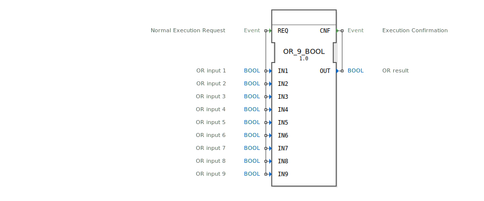

# OR_9_BOOL

```{index} single: OR_9_BOOL
```


* * * * * * * * * *
## Einleitung
Der Funktionsblock `OR_9_BOOL` ist ein standardisierter Baustein gemäß IEC 61131-3 zur Berechnung der logischen ODER-Verknüpfung. Er führt die ODER-Operation über neun separate boolesche Eingänge aus. Der Block folgt dem ereignisgesteuerten Ausführungsmodell der 4diac-IDE: Die Berechnung wird durch ein eingehendes Ereignis ausgelöst, und das Ergebnis wird zusammen mit einem Bestätigungsereignis ausgegeben.



## Schnittstellenstruktur
### **Ereignis-Eingänge**
*   **REQ**: Löst die Ausführung des Funktionsblocks aus. Bei Eintreffen dieses Ereignisses werden alle neun Eingangswerte (`IN1` bis `IN9`) gelesen und die ODER-Operation berechnet.

### **Ereignis-Ausgänge**
*   **CNF**: Dieses Ereignis wird nach Abschluss der Berechnung erzeugt. Es signalisiert, dass das Ergebnis am Datenausgang `OUT` gültig und verfügbar ist.

### **Daten-Eingänge**
*   **IN1** (BOOL): ODER-Eingang 1.
*   **IN2** (BOOL): ODER-Eingang 2.
*   **IN3** (BOOL): ODER-Eingang 3.
*   **IN4** (BOOL): ODER-Eingang 4.
*   **IN5** (BOOL): ODER-Eingang 5.
*   **IN6** (BOOL): ODER-Eingang 6.
*   **IN7** (BOOL): ODER-Eingang 7.
*   **IN8** (BOOL): ODER-Eingang 8.
*   **IN9** (BOOL): ODER-Eingang 9.

### **Daten-Ausgänge**
*   **OUT** (BOOL): Ergebnis der logischen ODER-Verknüpfung aller neun Eingänge. Der Ausgang ist `TRUE` (1), wenn mindestens einer der Eingänge `TRUE` ist. Er ist nur `FALSE` (0), wenn alle neun Eingänge `FALSE` sind.

### **Adapter**
Dieser Funktionsblock verfügt über keine Adapterschnittstellen.

## Funktionsweise
Der `OR_9_BOOL`-Block arbeitet nach folgendem Algorithmus:
1.  **Auslösung**: Das eingehende Ereignis `REQ` aktiviert den Block.
2.  **Eingabesammlung**: Die aktuellen Werte aller neun booleschen Eingänge (`IN1` bis `IN9`) werden eingelesen.
3.  **Berechnung**: Die logische ODER-Funktion wird auf die Eingangswerte angewendet. Die Operation kann als `OUT = IN1 OR IN2 OR IN3 OR IN4 OR IN5 OR IN6 OR IN7 OR IN8 OR IN9` beschrieben werden.
4.  **Ausgabe**: Das berechnete Ergebnis wird am Datenausgang `OUT` gesetzt.
5.  **Bestätigung**: Unmittelbar nach dem Setzen des Ausgangs wird das Bestätigungsereignis `CNF` erzeugt, um nachgelagerte Blöcke über die Verfügbarkeit des neuen Ergebnisses zu informieren.

## Technische Besonderheiten
*   **Generischer Funktionsblock**: Der Block ist als generischer Baustein implementiert (Attribut `eclipse4diac::core::GenericClassName` ist auf `'GEN_OR'` gesetzt). Dies bedeutet, dass er als Basis für die Ableitung ähnlicher ODER-Blöcke mit einer anderen Anzahl von Eingängen dienen kann.
*   **Standardkonformität**: Er ist explizit als standardisierte boolesche Funktion nach IEC 61131-3 klassifiziert.
*   **Deterministisches Verhalten**: Die Ausführungszeit ist konstant und vorhersehbar, da es sich um eine einfache logische Operation handelt.

## Zustandsübersicht
Der Block besitzt keinen internen Zustand oder Speicher. Sein Verhalten ist rein kombinatorisch und ausschließlich von den aktuellen Eingangswerten zum Zeitpunkt des `REQ`-Ereignisses abhängig. Vorherige Berechnungen haben keinen Einfluss auf das aktuelle Ergebnis.

## Anwendungsszenarien
*   **Überwachungslogik**: Kombination mehrerer Fehler- oder Statusmeldungen (z.B. von neun Sensoren), wobei bereits eine einzige Meldung (`TRUE`) zu einer Gesamtalarmmeldung (`OUT = TRUE`) führt.
*   **Freigabelogik**: In Sicherheitsschaltungen, wo eine von mehreren möglichen Freigabebedingungen ausreicht, um einen Prozessschritt zu starten.
*   **Vereinfachung von Verknüpfungsnetzen**: Ersetzt mehrere hintereinandergeschaltete Zwei-Eingangs-ODER-Gatter, was die Übersichtlichkeit in einem Funktionsbaustein-Diagramm (FBD) erhöht.

## Vergleich mit ähnlichen Bausteinen
*   **`OR_2_BOOL`, `OR_4_BOOL` etc.**: Diese Blöcke bieten die gleiche ODER-Funktionalität, jedoch für eine geringere Anzahl von Eingängen (2, 4, ...). `OR_9_BOOL` ist für Anwendungen mit speziell neun zu verknüpfenden Signalen optimiert. Siehe: [OR_9](../../../StandardLibraries/iec61131-3/bitwiseOperators/OR_9.md)
*   **`AND_9_BOOL`**: Führt die logische UND-Verknüpfung durch. Das Ergebnis ist nur `TRUE`, wenn *alle* Eingänge `TRUE` sind, im Gegensatz zum ODER, wo *mindestens ein* Eingang `TRUE` sein muss.
*   **`XOR_9_BOOL`**: Berechnet das exklusive ODER (Antivalenz). Das Ergebnis ist `TRUE`, wenn eine ungerade Anzahl an Eingängen `TRUE` ist.

## Fazit
Der `OR_9_BOOL` ist ein robuster und einfach zu verwendender Standardbaustein für die logische ODER-Verknüpfung von neun booleschen Signalen. Seine ereignisgesteuerte, zustandslose Architektur macht ihn zu einem zuverlässigen und effizienten Bestandteil für Steuerungs- und Überwachungslogik in 4diac-basierten Automatisierungssystemen. Die Verwendung dieses spezialisierten Blocks anstelle einer Kaskade von Grundgattern verbessert die Lesbarkeit und Wartbarkeit des Applikationscodes.